# Knock CRM Management System - 완전 분석 문서

## 1. 파일 개요

### 기본 정보
- **파일명**: Knock_CRM_mng_v.1.69_2_KLS_v2_master.xlsm
- **버전**: v.1.69_2_KLS_v2
- **파일 타입**: Excel Macro-Enabled Workbook (OpenXML)
- **총 코드 라인**: 11,107 줄
- **개발 도구**: VBA (Visual Basic for Applications)

### 시스템 목적
치과 CRM(Customer Relationship Management) 시스템으로, 다음 핵심 기능을 제공합니다:
- **DB 관리**: 고객 데이터베이스 입력, 배포, 조회
- **TM(Telemarketer) 관리**: 텔레마케터별 DB 배포 및 콜 로그 관리
- **DentWeb 연동**: 치과 예약 시스템과의 데이터 동기화
- **통계 분석**: TM 성과, 예약율, 내원율 등 통계 분석
- **DB 업체 결제**: 외부 DB 업체와의 결제 관리

### 대상 사용자
- **관리자(Manager)**: 전체 시스템 관리, DB 배포, 통계 조회
- **TM(Telemarketer)**: 배정된 DB 조회 및 콜 로그 입력
- **운영자**: 시스템 설정, 코드 관리

---

## 2. 전체 구조

### 2.1 모듈 구성

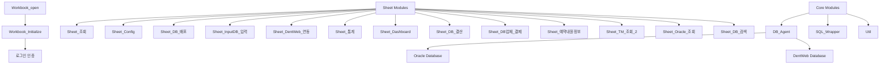

### 2.2 주요 클래스 및 모듈

| 구분 | 이름 | 설명 |
|------|------|------|
| **클래스** | DB_Agent.cls | 데이터베이스 연결 및 쿼리 실행 클래스 |
| **클래스** | ThisWorkbook.cls | 워크북 초기화 및 이벤트 처리 |
| **모듈** | Workbook_open.bas | 사용자 로그인 및 워크북 초기화 |
| **모듈** | SQL_Wrapper.bas | SQL 파라미터 바인딩 유틸리티 |
| **모듈** | Util.bas | 공통 유틸리티 함수 |
| **시트** | Sheet_조회.bas | 다양한 조회 기능 제공 |
| **시트** | Sheet_DB_배포.bas | DB 배포 관리 |
| **시트** | Sheet_InputDB_입력.bas | DB 입력 기능 |
| **시트** | Sheet_DentWeb_연동.bas | DentWeb 시스템 연동 |
| **시트** | Sheet_통계.bas | 통계 조회 및 분석 |
| **시트** | Sheet_Dashboard.bas | 대시보드 조회 |
| **시트** | Sheet_DB_결산.bas | DB 결산 조회 |

---

## 3. 모든 Sub/Function 목록

### 3.1 Workbook 및 초기화

| 함수명 | 타입 | 위치 | 설명 |
|--------|------|------|------|
| Workbook_open | Sub | ThisWorkbook.cls | 워크북 열릴 때 초기화 호출 |
| Workbook_Initialize | Sub | Workbook_open.bas | 사용자 로그인 및 초기화 |

### 3.2 DB_Agent 클래스 (데이터베이스 관리)

| 함수명 | 타입 | 반환값 | 설명 |
|--------|------|--------|------|
| Connect_DB | Function | Boolean | DB 연결 |
| Close_DB | Function | Boolean | DB 연결 종료 |
| Select_DB | Function | Boolean | SELECT 쿼리 실행 |
| Insert_update_DB | Function | Boolean | INSERT/UPDATE 쿼리 실행 |
| Begin_Trans | Function | Boolean | 트랜잭션 시작 |
| Commit_Trans | Function | Boolean | 트랜잭션 커밋 |
| Rollback_Trans | Function | Boolean | 트랜잭션 롤백 |
| DB_connect_str | Property | String | 연결 문자열 get/set |
| DB_SQL_str | Property | String | SQL 문자열 get/set |
| DB_result_recordset | Property | ADODB.Recordset | 결과 레코드셋 get |

### 3.3 SQL_Wrapper 모듈

| 함수명 | 타입 | 반환값 | 설명 |
|--------|------|--------|------|
| make_SQL | Function | String | SQL 파라미터 바인딩 (:param01, :param02 등을 실제 값으로 치환) |

### 3.4 Sheet_조회 모듈

| 함수명 | 타입 | 설명 |
|--------|------|------|
| Sheet_조회_Query | Sub | 조회 타입에 따라 분기 처리 |
| Sheet_조회_INPUT_DB_source별_입력시간_조회 | Sub | INPUT DB 채널별 입력시간 조회 |
| Sheet_조회_DB_배포_내역_조회 | Sub | DB 배포 내역 조회 |
| Sheet_조회_INPUT_DB_내역_조회 | Sub | INPUT DB 내역 조회 |
| Sheet_조회_Call_Log_조회 | Sub | Call Log 조회 |
| Sheet_조회_연락처_history_전체_조회 | Sub | 특정 전화번호의 전체 이력 조회 (Input DB, DB 배포, Call Log, DB 회수, 덴트웹 정보, MNG_결번 정보) |
| Sheet_조회_DB_회수_내역_조회 | Sub | DB 회수 내역 조회 |

### 3.5 Sheet_Config 모듈

| 함수명 | 타입 | 설명 |
|--------|------|------|
| Sheet_Config_Intialize | Sub | 코드 및 사용자 정보 초기화 |

### 3.6 Sheet_DB_배포 모듈

| 함수명 | 타입 | 설명 |
|--------|------|------|
| Sheet_DB_배포_Clear | Sub | 화면 데이터 초기화 |
| Sheet_DB_배포_Query | Sub | 배포 대상 조회 |
| Sheet_DB_배포_추가배포_Query | Sub | 추가 배포 대상 조회 |
| Sheet_DB_배포_DB_Upload | Sub | DB 배포 업로드 (트랜잭션 처리) |
| Sheet_DB_배포_회수자_점검 | Sub | 회수자 점검 |

### 3.7 Sheet_InputDB_입력 모듈

| 함수명 | 타입 | 설명 |
|--------|------|------|
| Sheet_InputDB_입력_Clear | Sub | 화면 데이터 초기화 |
| Sheet_InputDB_입력_DB_Upload | Sub | INPUT DB 업로드 |
| Sheet_InputDB_입력_PreCheck | Sub | 업로드 전 검증 |

### 3.8 Sheet_DentWeb_연동 모듈

| 함수명 | 타입 | 설명 |
|--------|------|------|
| Sheet_DentWeb_연동_Clear | Sub | 화면 데이터 초기화 |
| Sheet_DentWeb_연동_Query | Sub | DentWeb 누락 데이터 조회 |
| Sheet_DentWeb_연동_DB_Upload | Sub | DentWeb 데이터 업로드 (신규, 취소, 누락 처리) |

### 3.9 Sheet_통계 모듈

| 함수명 | 타입 | 설명 |
|--------|------|------|
| Sheet_통계_조회 | Sub | 통계 타입에 따라 분기 |
| Sheet_통계_TM별_일일_통계_조회 | Sub | TM별 일일 통계 조회 |
| Sheet_통계_내원환자_리스트_내원일_조회 | Sub | 내원환자 리스트 (내원일 기준) |
| Sheet_통계_내원환자_리스트_배포일_조회 | Sub | 내원환자 리스트 (배포일 기준) |
| Sheet_통계_내원환자_리스트_inputdate_조회 | Sub | 내원환자 리스트 (input date 기준) |
| Sheet_통계_TM별_DB업체별_Performance_조회 | Sub | TM별 DB업체별 성과 분석 |
| Sheet_통계_TM별_DB업체별_Performance_inputdate조회 | Sub | TM별 DB업체별 성과 분석 (input date 기준) |
| Sheet_통계_Clear | Sub | 화면 데이터 초기화 |

### 3.10 Sheet_Dashboard 모듈

| 함수명 | 타입 | 설명 |
|--------|------|------|
| Sheet_Dashboard_Query | Sub | 대시보드 조회 (Input DB, DB 배포, Call Log, 중복 검사, 덴트웹 누락, DB업체 점검, 예약중복 점검, 내원여부 점검 등) |
| GetMissingCall | Sub | 콜 누락 체크 |

### 3.11 Sheet_DB_결산 모듈

| 함수명 | 타입 | 설명 |
|--------|------|------|
| Sheet_DB_결산_Clear | Sub | 화면 데이터 초기화 |
| Sheet_DB_결산_Query | Sub | DB 결산 조회 |

### 3.12 Sheet_DB업체_결제 모듈

| 함수명 | 타입 | 설명 |
|--------|------|------|
| Sheet_DB업체_결제_Clear | Sub | 화면 데이터 초기화 |
| Sheet_DB업체_결제_Query | Sub | DB업체 결제 조회 (빅크래프트, 가치브라더) |

### 3.13 Sheet_예약내원정보 모듈

| 함수명 | 타입 | 설명 |
|--------|------|------|
| Sheet_예약내원정보_Clear | Sub | 화면 데이터 초기화 |
| Sheet_예약내원정보_Query | Sub | 예약 내원 정보 조회 |
| Sheet_예약내원정보_DB_Update | Sub | 내원 여부 업데이트 |

### 3.14 Sheet_TM_조회_2 모듈

| 함수명 | 타입 | 설명 |
|--------|------|------|
| Sheet_TM_조회_2_Clear | Sub | 화면 데이터 초기화 |
| Sheet_TM_조회_2_Query | Sub | TM 과거 콜 로그 조회 |

### 3.15 Sheet_Oracle_조회 모듈

| 함수명 | 타입 | 설명 |
|--------|------|------|
| Sheet_Oracle_조회_Clear | Sub | 화면 데이터 초기화 |
| Sheet_Oracle_조회_Query | Sub | Oracle 테이블 직접 조회 |
| Sheet_TM_CALL_LOG_DENTWEB_조회 | Sub | TM_CALL_LOG와 DentWeb 조인 조회 |

### 3.16 Sheet_DB_검색 모듈

| 함수명 | 타입 | 설명 |
|--------|------|------|
| Sheet_DB_검색_Clear | Sub | 화면 데이터 초기화 |
| Sheet_DB_검색_구DB_참고자료만_조희 | Sub | 구 DB 참고 자료 조회 |

### 3.17 Util 모듈

| 함수명 | 타입 | 반환값 | 설명 |
|--------|------|--------|------|
| ADD_Date | Function | Date | 날짜 계산 (영업일 기준) |
| Find_index_from_Collection | Function | Integer | 컬렉션에서 아이템 인덱스 찾기 |
| Cnvt_to_Date | Function | Date | 문자열을 날짜로 변환 |
| File_Exists | Function | Boolean | 파일 존재 여부 확인 |
| Get_Row_by_Find | Function | Integer | 시트에서 특정 값의 행 찾기 |
| Get_Row_num | Function | Integer | 시트의 데이터 행 수 |
| 목록리스트_추가 | Sub | N/A | 셀에 드롭다운 리스트 추가 |
| 이름_지정하기 | Sub | N/A | 범위 이름 지정 |
| 복호화 | Sub | N/A | 파일 복사 (복호화용) |
| SET_PRINT_AREA | Sub | N/A | 인쇄 영역 설정 |
| 사용자용_파일_배포 | Sub | N/A | 사용자용 파일 생성 |

---

## 4. 주요 상수 및 전역 변수

### 4.1 시트별 상수

```vba
' Sheet_조회
Const This_Sheet_Name As String = "조회"
Public Const START_ROW_NUM As Integer = 8
Const MAX_ROW_NUM As Integer = 10000

' Sheet_DB_배포
Const This_Sheet_Name As String = "DB_배포"
Public Const START_ROW_NUM As Integer = 11
Const MAX_ROW_NUM As Integer = 15000

' Sheet_InputDB_입력
Const This_Sheet_Name As String = "InputDB_입력"
Public Const START_ROW_NUM As Integer = 7
Const MAX_ROW_NUM As Integer = 3000

' Sheet_DentWeb_연동
Const This_Sheet_Name As String = "DentWeb_연동"
Public Const START_ROW_NUM As Integer = 8
Const MAX_ROW_NUM As Integer = 10000
```

### 4.2 DB 연결 정보

```vba
' DB_Agent 클래스 초기화
connect_str = "DSN=knock_crm_real;uid=knock_crm;pwd=kkptcmr!@34"

' DentWeb 연동 시
select_db_agent.DB_connect_str = "Provider=SQLOLEDB;" & _
                                  "Data Source=192.168.0.245,1436;" & _
                                  "Initial Catalog=DentWeb;" & _
                                  "User ID=kkpt;" & _
                                  "Password=kkpt12#$;"
```

---

## 5. DB 스키마 정보

### 5.1 주요 테이블 구조

#### INPUT_DB (입력 DB 테이블)
```
컬럼명               타입      설명
────────────────────────────────────────
REF_DATE            VARCHAR   기준일자 (yyyyMMdd)
REF_SEQ             NUMBER    기준 순번
SEQ_NO              NUMBER    순번
DB_SRC_1            VARCHAR   DB 출처 1 (방송DB, 홈페이지, 모두닥 등)
DB_SRC_2            VARCHAR   DB 출처 2 (세부 업체명)
EVENT_TYPE          VARCHAR   이벤트 유형
CLIENT_NAME         VARCHAR   고객명
PHONE_NO            VARCHAR   전화번호
DB_INPUT_DATE       VARCHAR   입력 날짜
DB_INPUT_TIME       VARCHAR   입력 시간
AGE                 VARCHAR   나이
GENDER              VARCHAR   성별
DB_MEMO_1           VARCHAR   메모 1
DB_MEMO_2           VARCHAR   메모 2
DB_MEMO_3           VARCHAR   메모 3
QUAL_MNG            VARCHAR   관리 품질 (무효, 중복 등)
QUAL_TM             VARCHAR   TM 품질
DUPL_CNT_1          NUMBER    중복 건수 1
DUPL_CNT_2          NUMBER    중복 건수 2
DUPL_LAST_DATE_1    VARCHAR   마지막 중복 날짜 1
DUPL_LAST_DATE_2    VARCHAR   마지막 중복 날짜 2
DUPL_LAST_DB_SRC_1  VARCHAR   마지막 중복 DB 출처 1
ALT_DATE            VARCHAR   수정 날짜
ALT_TIME            VARCHAR   수정 시간
ALT_USER_NO         VARCHAR   수정자 번호
```

#### DB_DIST_HIS (DB 배포 이력 테이블)
```
컬럼명               타입      설명
────────────────────────────────────────
REF_DATE            VARCHAR   배포 기준일
REF_SEQ             NUMBER    배포 순번
DB_SRC_1            VARCHAR   DB 출처 1
DB_SRC_2            VARCHAR   DB 출처 2
PHONE_NO            VARCHAR   전화번호
ASSIGNED_TM_NO      VARCHAR   배정 TM 번호
ASSIGNED_TM_NAME    VARCHAR   배정 TM 이름
CLIENT_NAME         VARCHAR   고객명
EVENT_TYPE          VARCHAR   이벤트 유형
DB_INPUT_DATE       VARCHAR   DB 입력 날짜
DB_INPUT_TIME       VARCHAR   DB 입력 시간
AGE                 VARCHAR   나이
GENDER              VARCHAR   성별
DB_MEMO_1           VARCHAR   메모 1
DB_MEMO_2           VARCHAR   메모 2
DB_MEMO_3           VARCHAR   메모 3
ASSIGNED_STATUS     VARCHAR   배정 상태 (배포완료, 배포안함, 배포예정)
INPUT_DB_QUAL       VARCHAR   입력 DB 품질
IS_OLD_DB           VARCHAR   구 DB 여부
FOLLOWING_DB_SRC    VARCHAR   후속 DB 출처
MNG_MEMO            VARCHAR   관리 메모
ALT_DATE            VARCHAR   수정 날짜
ALT_TIME            VARCHAR   수정 시간
ALT_USER_NO         VARCHAR   수정자 번호
INPUTDB_REF_DATE    VARCHAR   입력 DB 기준일
INPUTDB_REF_SEQ     NUMBER    입력 DB 순번
INPUTDB_SEQ_NO      NUMBER    입력 DB 일련번호
```

#### TM_CALL_LOG (TM 콜 로그 테이블)
```
컬럼명               타입      설명
────────────────────────────────────────
REF_DATE            VARCHAR   기준일
TM_NO               VARCHAR   TM 번호
TM_NAME             VARCHAR   TM 이름
DB_SRC_1            VARCHAR   DB 출처 1
DB_SRC_2            VARCHAR   DB 출처 2
PHONE_NO            VARCHAR   전화번호
SEQ_NO              NUMBER    순번
CALL_DATE           VARCHAR   콜 날짜
CALL_TIME           VARCHAR   콜 시간
CALL_RESULT         VARCHAR   콜 결과 (예약, 부재, 결번 등)
CLIENT_NAME         VARCHAR   고객명
DB_MEMO             VARCHAR   DB 메모
MNG_MEMO            VARCHAR   관리 메모
CALL_LOG            VARCHAR   콜 로그
CALL_LOG_DETAIL     VARCHAR   콜 로그 상세
RESERVATION_DATE    VARCHAR   예약 날짜
RESERVATION_TIME    VARCHAR   예약 시간
VISITED_YN          VARCHAR   내원 여부 (Y/N)
CHART_NO            VARCHAR   차트 번호
ALT_DATE            VARCHAR   수정 날짜
ALT_TIME            VARCHAR   수정 시간
ALT_USER_NO         VARCHAR   수정자 번호
DB_DIST_DATE        VARCHAR   DB 배포 날짜
```

#### DB_WITHDRAW_HIS (DB 회수 이력 테이블)
```
컬럼명               타입      설명
────────────────────────────────────────
REF_DATE            VARCHAR   회수 기준일
PHONE_NO            VARCHAR   전화번호
TM_NO               VARCHAR   TM 번호
TM_NAME             VARCHAR   TM 이름
CLIENT_NAME         VARCHAR   고객명
DB_SRC_1            VARCHAR   DB 출처 1
DB_SRC_2            VARCHAR   DB 출처 2
WITHDRAW_REASON     VARCHAR   회수 사유
ALT_DATE            VARCHAR   수정 날짜
ALT_TIME            VARCHAR   수정 시간
ALT_USER_NO         VARCHAR   수정자 번호
```

#### DENTWEB_RESERVATION (덴트웹 예약 테이블)
```
컬럼명               타입      설명
────────────────────────────────────────
NID                 NUMBER    예약 ID
예약날짜             VARCHAR   예약 날짜
예약시각             VARCHAR   예약 시각
작성날짜             VARCHAR   작성 날짜
작성시각             VARCHAR   작성 시각
N환자ID             NUMBER    환자 ID
환자이름             VARCHAR   환자 이름
환자전화번호         VARCHAR   전화번호
차트번호             VARCHAR   차트 번호
N소요시간           NUMBER    소요 시간
N예약종류           NUMBER    예약 종류
N이행현황           NUMBER    이행 현황 (1:예약, 2:취소, 3:미도래 등)
N담당의사           NUMBER    담당 의사 코드
N담당직원           NUMBER    담당 직원 코드
SZ예약내용          VARCHAR   예약 내용
SZ메모              VARCHAR   메모
T최종수정날짜       VARCHAR   최종 수정 날짜
T최종수정시각       VARCHAR   최종 수정 시각
ALT_USER_NO         VARCHAR   수정자 번호
```

#### MNG_결번_관리 (결번 관리 테이블)
```
컬럼명               타입      설명
────────────────────────────────────────
PHONE_NO            VARCHAR   전화번호
CLIENT_NAME         VARCHAR   고객명
MEMO                VARCHAR   메모
ALT_DATE            VARCHAR   등록 날짜
ALT_TIME            VARCHAR   등록 시간
ALT_USER_NO         VARCHAR   등록자 번호
```

#### USER_INFO (사용자 정보 테이블)
```
컬럼명               타입      설명
────────────────────────────────────────
USER_NO             VARCHAR   사용자 번호
USER_NAME           VARCHAR   사용자 이름
USER_PASSWORD       VARCHAR   비밀번호
USER_TYPE           VARCHAR   사용자 유형 (TM, 관리자 등)
```

#### CODE_INFO (코드 정보 테이블)
```
컬럼명               타입      설명
────────────────────────────────────────
CODE_TYPE           VARCHAR   코드 타입
CODE                VARCHAR   코드
CODE_NAME           VARCHAR   코드명
CODE_DESC           VARCHAR   코드 설명
SORT_ORDER          NUMBER    정렬 순서
```

### 5.2 테이블 관계도

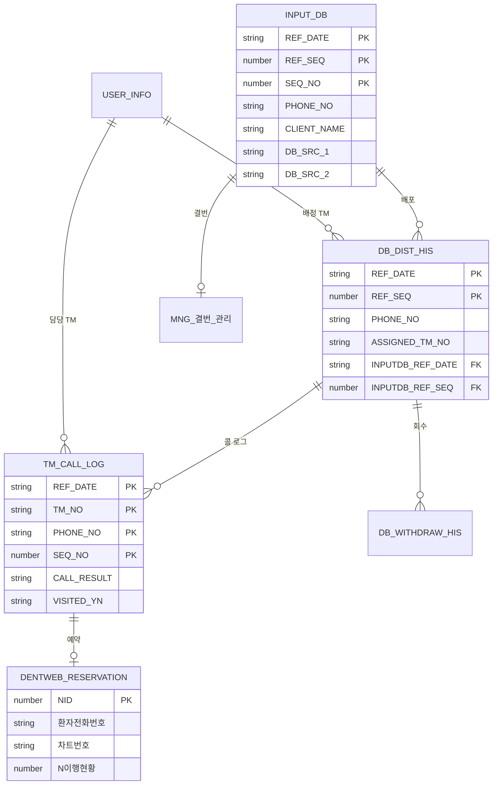

---

## 6. 핵심 비즈니스 로직 설명

### 6.1 사용자 로그인 프로세스

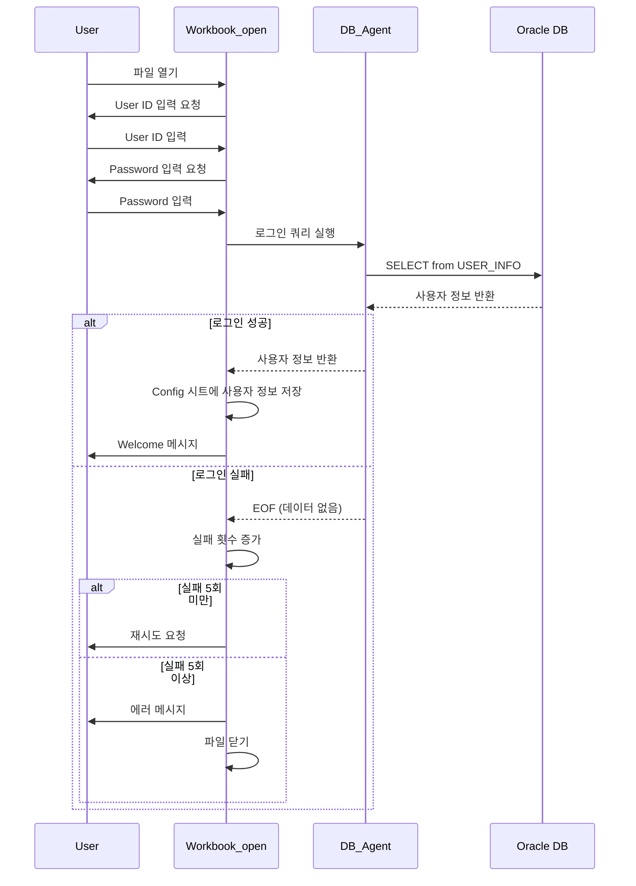

**로그인 프로세스 상세**:
1. 워크북 열기 시 `Workbook_open` 이벤트 발생
2. `Workbook_Initialize` 함수 호출
3. InputBox를 통해 사용자 ID, Password 입력 받음
4. DB_Agent를 통해 USER_INFO 테이블 조회
5. 최대 5회까지 재시도 가능
6. 성공 시 Config 시트에 사용자 정보 저장 (USER_NO, USER_NAME)
7. 실패 시 파일 자동 종료

### 6.2 DB 입력 프로세스 (INPUT_DB)

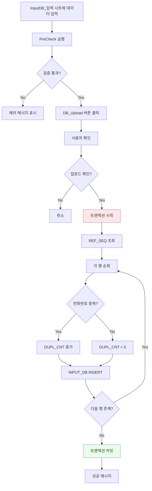

**DB 입력 프로세스 상세**:

1. **사전 검증 (PreCheck)**
   - 필수 컬럼 검증: DB_SRC_1, DB_SRC_2, CLIENT_NAME, PHONE_NO
   - 전화번호 형식 검증 (하이픈 포함)
   - 중복 검증 (동일 시트 내)

2. **DB 업로드**
   - REF_DATE: 현재 날짜 (yyyyMMdd)
   - REF_SEQ: 당일 최대 SEQ + 1
   - SEQ_NO: 행 순번
   - DUPL_CNT_1: 동일 전화번호의 INPUT_DB 전체 건수
   - DUPL_CNT_2: 동일 전화번호 + 이름의 INPUT_DB 건수
   - QUAL_MNG: 품질 관리 (무효, 중복 등)

3. **트랜잭션 관리**
   - Begin_Trans로 시작
   - 모든 INSERT 성공 시 Commit_Trans
   - 에러 발생 시 Rollback_Trans

4. **중복 체크 로직**
   ```sql
   -- DUPL_CNT_1: 전화번호만 체크
   SELECT COUNT(*) FROM INPUT_DB WHERE PHONE_NO = :phone_no

   -- DUPL_CNT_2: 전화번호 + 이름 체크
   SELECT COUNT(*) FROM INPUT_DB
   WHERE PHONE_NO = :phone_no AND CLIENT_NAME = :client_name
   ```

### 6.3 DB 배포 프로세스

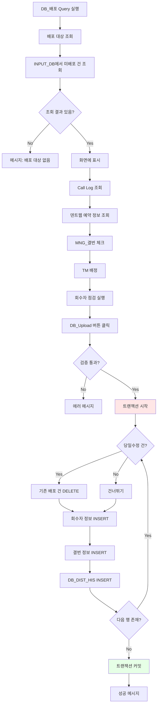

**DB 배포 프로세스 상세**:

1. **배포 대상 조회**
   ```sql
   -- 주요 조건
   WHERE a.ref_date = :ref_date
     AND a.qual_mng NOT IN ('무효', '중복', '이전배포')
     AND NOT EXISTS (
         SELECT 1 FROM db_dist_his b
         WHERE b.inputdb_ref_date = a.ref_date
           AND b.inputdb_ref_seq = a.ref_seq
           AND b.inputdb_seq_no = a.seq_no
     )
   ```

2. **TM 배정 규칙**
   - 배정 유형:
     - `배포완료`: 특정 TM 배정
     - `배포예정`: 임시 배정 (T)
     - `배포안함`: 배포하지 않음 (N)
   - 동일 전화번호 중복 체크
   - 회수자 우선 배정

3. **회수자 점검**
   - DB_WITHDRAW_HIS 테이블에서 회수 내역 조회
   - 회수자가 있으면 우선 배정
   - 회수자가 여러 명일 경우 콤마(,)로 구분하여 표시

4. **Call Log 연동**
   - 이전 콜 기록 조회 및 표시
   - 콜 결과(예약, 부재, 결번 등) 표시
   - 최근 MNG_MEMO 표시 (콜 기록 없을 시)

5. **덴트웹 예약 연동**
   - DENTWEB_RESERVATION 테이블 조회
   - 이행 현황 표시 (예약, 취소, 미도래, 이행)
   - 취소 건은 다음 예약 건 확인

6. **DB_DIST_HIS INSERT**
   ```sql
   INSERT INTO DB_DIST_HIS (
       REF_DATE,
       REF_SEQ,
       DB_SRC_1,
       DB_SRC_2,
       PHONE_NO,
       ASSIGNED_TM_NO,  -- TM 번호 또는 'N'(배포안함), 'T'(배포예정)
       ASSIGNED_TM_NAME,
       ASSIGNED_STATUS,  -- '배포완료', '배포안함', '배포예정'
       INPUTDB_REF_DATE,
       INPUTDB_REF_SEQ,
       INPUTDB_SEQ_NO,
       ...
   ) VALUES (...)
   ```

### 6.4 DentWeb 연동 프로세스

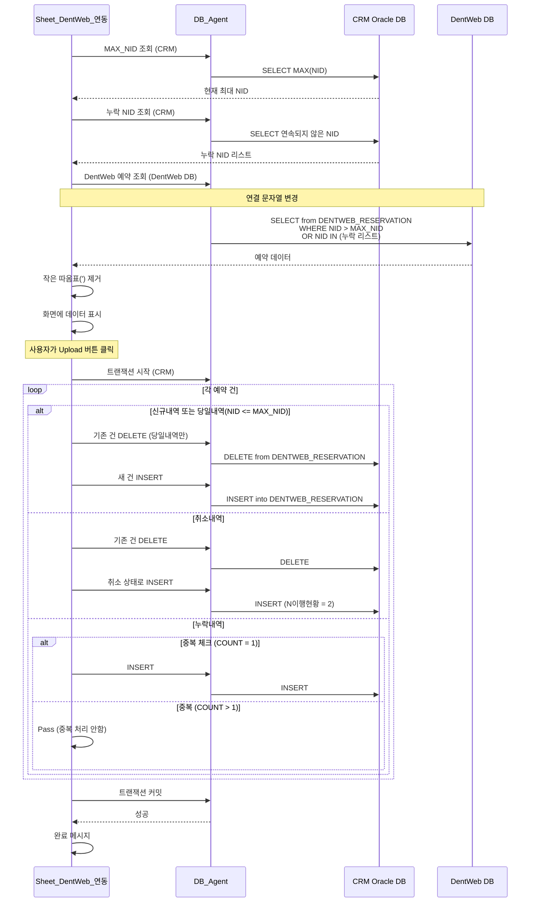

**DentWeb 연동 프로세스 상세**:

1. **누락 NID 탐지**
   ```sql
   -- 연속되지 않은 NID 찾기
   SELECT
       RANGE_CNT,
       MIN_NID,
       MAX_NID
   FROM (
       SELECT
           NID - ROW_NUMBER() OVER (ORDER BY NID) AS GRP,
           COUNT(*) AS RANGE_CNT,
           MIN(NID) AS MIN_NID,
           MAX(NID) AS MAX_NID
       FROM DENTWEB_RESERVATION
       WHERE 예약날짜 >= :ref_date_1
       GROUP BY NID - ROW_NUMBER() OVER (ORDER BY NID)
   )
   WHERE RANGE_CNT >= 2  -- 2건 이상 누락
   ```

2. **DentWeb 데이터 조회**
   - 연결 문자열 변경: 192.168.0.245,1436 (DentWeb DB)
   - NID > MAX_NID: 신규 예약
   - NID IN (누락 리스트): 누락 예약

3. **데이터 정제**
   - 작은 따옴표(') 제거: SQL 인젝션 방지
   - 전화번호 형식 통일
   - 날짜/시간 형식 변환

4. **INSERT 로직**
   - **신규내역**: 단순 INSERT
   - **당일내역**: 기존 건 DELETE 후 INSERT (수정 사항 반영)
   - **취소내역**: 취소 상태(N이행현황=2)로 INSERT
   - **누락내역**: 중복 체크 후 INSERT

5. **컬럼 매핑**
   ```
   NID -> NID
   예약날짜 -> 예약날짜 (yyyyMMdd)
   예약시각 -> 예약시각 (hh:mm:ss)
   환자전화번호 -> 환자전화번호 (공백 시 "_")
   N이행현황 -> N이행현황 (1:예약, 2:취소, 3:미도래)
   ```

### 6.5 통계 조회 프로세스

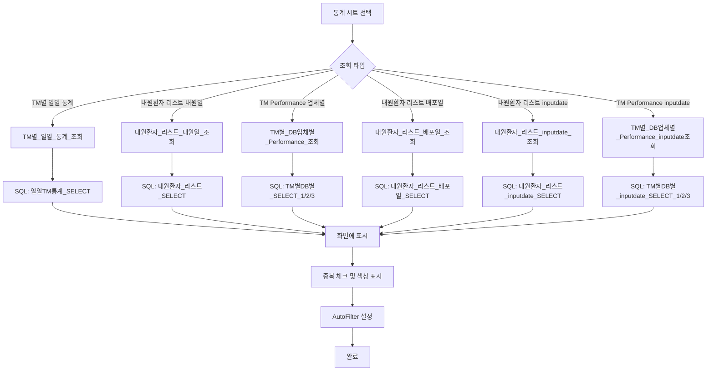

**통계 조회 프로세스 상세**:

1. **TM별 일일 통계**
   - 집계 항목:
     - 예약 (당일DB)
     - 예약 (이전DB)
     - 부재
     - 타치과치료/상담거부
     - 상담완료/재연락
     - 결번
     - 중복
     - 본인아님/신청안함
     - 당일내원수
   - 예약율 계산: 예약 / 당일DB개수

2. **내원환자 리스트**
   - 기준일:
     - 내원일 (RESERVATION_DATE)
     - 배포일 (REF_DATE)
     - Input Date (DB_INPUT_DATE)
   - 중복 체크:
     - 동일 전화번호 내원 중복
     - 타TM의 동일 전화번호 내원 중복
     - 차트번호 중복
   - 중복 건 색상 표시 (노란색)

3. **TM별 DB업체별 Performance**
   - 집계 레벨:
     - DB업체별 (DB_SRC_2)
     - TM별
     - 전체 합계
   - 지표:
     - 배포DB수
     - 예약수
     - 예약율 (예약수/배포DB수)
     - 내원수
     - 내원율 (내원수/예약수)

4. **SQL 쿼리 예시**
   ```sql
   -- TM별 일일 통계
   SELECT
       REF_DATE,
       TM_NO,
       TM_NAME,
       SUM(CASE WHEN CALL_RESULT = '예약' AND IS_OLD_DB = '' THEN 1 ELSE 0 END) AS 예약_당일DB,
       SUM(CASE WHEN CALL_RESULT = '예약' AND IS_OLD_DB = 'Y' THEN 1 ELSE 0 END) AS 예약_이전DB,
       SUM(CASE WHEN CALL_RESULT = '부재' THEN 1 ELSE 0 END) AS 부재,
       ...
       COUNT(*) AS 당일DB_개수,
       ROUND(SUM(CASE WHEN CALL_RESULT = '예약' THEN 1 ELSE 0 END) / COUNT(*) * 100, 2) AS 예약율
   FROM TM_CALL_LOG
   WHERE REF_DATE BETWEEN :ref_date_1 AND :ref_date_2
   GROUP BY REF_DATE, TM_NO, TM_NAME
   ```

### 6.6 Dashboard 조회 프로세스

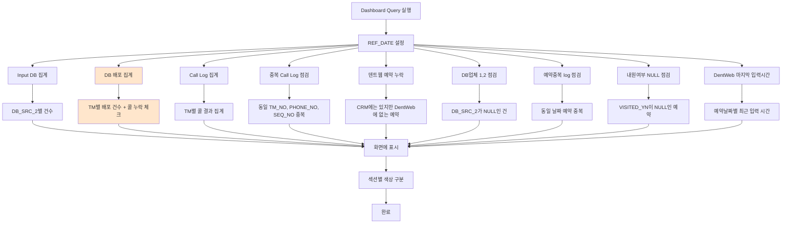

**Dashboard 주요 점검 항목**:

1. **Input DB 집계**
   - DB_SRC_2별 입력 건수
   - 합계 표시

2. **DB 배포 집계**
   - TM별 배포 건수
   - **콜 누락 체크**: 배포는 됐지만 콜 로그가 없는 건 조회
   ```sql
   SELECT
       B.ASSIGNED_TM_NO,
       B.ASSIGNED_TM_Name,
       B.CLIENT_NAME,
       B.PHONE_NO
   FROM TM_CALL_LOG A
   RIGHT OUTER JOIN DB_DIST_HIS B
       ON A.DB_DIST_DATE = B.REF_DATE
       AND A.TM_NO = B.ASSIGNED_TM_NO
       AND A.DB_SRC_2 = B.DB_SRC_2
       AND A.PHONE_NO = B.PHONE_NO
   WHERE B.REF_DATE = :ref_date
       AND A.ALT_DATE IS NULL  -- 콜 로그가 없는 건
       AND B.ASSIGNED_TM_NAME IS NOT NULL
   ```

3. **Call Log 집계**
   - TM별, 콜 결과별 건수 집계
   - 교차 집계 (Pivot) 형태
   - 체크 컬럼: 전체 콜 수 = 각 결과의 합

4. **중복 Call Log 점검**
   - 동일한 TM_NO, PHONE_NO, SEQ_NO를 가진 중복 건
   ```sql
   SELECT
       REF_DATE, TM_NO, PHONE_NO, SEQ_NO, COUNT(*)
   FROM TM_CALL_LOG
   WHERE REF_DATE = :ref_date
   GROUP BY REF_DATE, TM_NO, PHONE_NO, SEQ_NO
   HAVING COUNT(*) > 1
   ```

5. **덴트웹 예약 누락**
   - CRM에 예약 정보가 있지만 DentWeb에 없는 건
   - 연동 오류 체크

6. **DB업체 1,2 점검**
   - DB_SRC_1과 DB_SRC_2가 매칭되지 않는 건
   - 데이터 정합성 체크

7. **예약중복 log 점검**
   - 동일 날짜에 동일 전화번호로 여러 예약이 있는 건

8. **내원여부 NULL 점검**
   - 예약은 있지만 VISITED_YN이 NULL인 건
   - 내원 여부 미입력 체크

---

## 7. Mermaid 다이어그램

### 7.1 전체 시스템 아키텍처

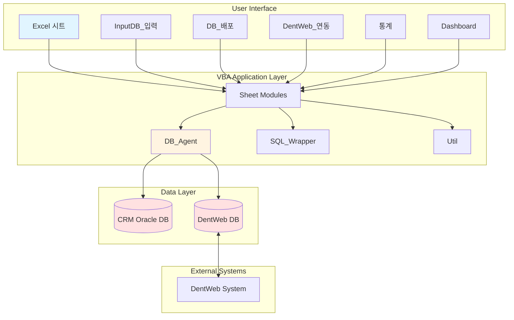

### 7.2 데이터 흐름도

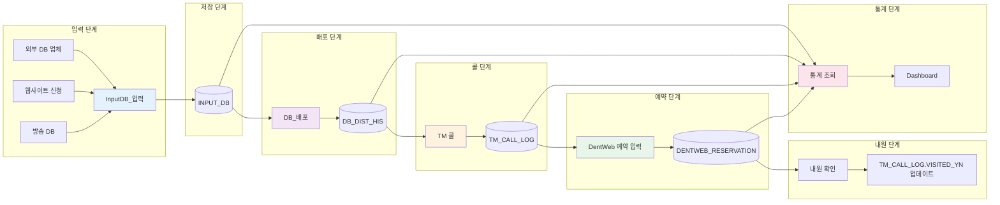

### 7.3 DB 입력 프로세스 순서도

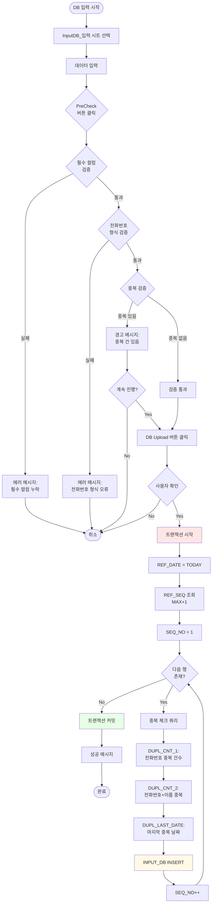

### 7.4 DB 배포 프로세스 순서도

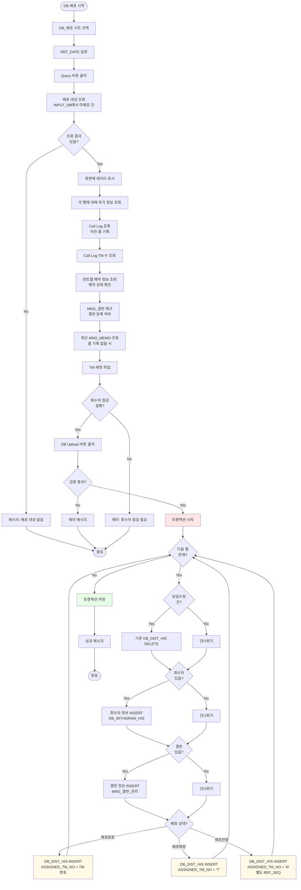

### 7.5 DentWeb 연동 프로세스 순서도

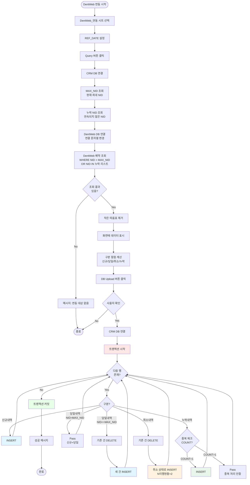

### 7.6 함수 호출 관계도

```mermaid
graph TB
    subgraph "Workbook 초기화"
        A[Workbook_open] --> B[Workbook_Initialize]
        B --> C[DB_Agent.Select_DB]
        C --> D[make_SQL]
    end

    subgraph "DB 입력"
        E[Sheet_InputDB_입력_PreCheck] --> F[검증 로직]
        G[Sheet_InputDB_입력_DB_Upload] --> H[DB_Agent.Begin_Trans]
        H --> I[DB_Agent.Insert_update_DB]
        I --> J[make_SQL]
        I --> K[DB_Agent.Commit_Trans]
    end

    subgraph "DB 배포"
        L[Sheet_DB_배포_Query] --> M[DB_Agent.Select_DB]
        M --> N[make_SQL]
        O[Sheet_DB_배포_회수자_점검] --> M
        P[Sheet_DB_배포_DB_Upload] --> Q[DB_Agent.Begin_Trans]
        Q --> R[DB_Agent.Insert_update_DB]
        R --> S[make_SQL]
        R --> T[DB_Agent.Commit_Trans]
    end

    subgraph "DentWeb 연동"
        U[Sheet_DentWeb_연동_Query] --> V[DB_Agent.Select_DB]
        V --> W[make_SQL]
        X[Sheet_DentWeb_연동_DB_Upload] --> Y[DB_Agent.Begin_Trans]
        Y --> Z[DB_Agent.Insert_update_DB]
        Z --> AA[make_SQL]
        Z --> AB[DB_Agent.Commit_Trans]
    end

    subgraph "통계 조회"
        AC[Sheet_통계_조회] --> AD{조회 타입}
        AD --> AE[Sheet_통계_TM별_일일_통계_조회]
        AD --> AF[Sheet_통계_내원환자_리스트_조회]
        AE --> AG[DB_Agent.Select_DB]
        AF --> AG
        AG --> AH[make_SQL]
    end

    subgraph "유틸리티"
        AI[Cnvt_to_Date] --> AJ[날짜 변환]
        AK[ADD_Date] --> AL[WorksheetFunction.WorkDay]
    end

    style B fill:#e3f2fd
    style H fill:#f3e5f5
    style Q fill:#f3e5f5
    style Y fill:#f3e5f5
    style M fill:#fff9e6
    style V fill:#fff9e6
    style AG fill:#fff9e6
```

---

## 8. 다른 파일들과의 차별점

이 파일은 Knock CRM 시스템의 **마스터 버전 (v.1.69_2_KLS_v2)**으로, 다음과 같은 특징을 가집니다:

### 8.1 완전한 기능 구현
- **모든 CRM 기능 통합**: DB 입력, 배포, 연동, 통계, 대시보드 등 모든 기능 포함
- **다중 데이터베이스 연결**: CRM Oracle DB와 DentWeb DB를 동시에 관리
- **복잡한 비즈니스 로직**: 중복 체크, 회수자 관리, 누락 체크 등 고급 기능

### 8.2 엔터프라이즈급 트랜잭션 관리
- **ACID 트랜잭션**: Begin_Trans, Commit_Trans, Rollback_Trans를 통한 안전한 데이터 처리
- **에러 핸들링**: 모든 DB 작업에 대한 에러 체크 및 롤백 처리
- **데이터 정합성**: 여러 테이블 간의 일관성 유지

### 8.3 실시간 연동
- **DentWeb 실시간 연동**: 예약 시스템과의 양방향 데이터 동기화
- **누락 탐지 알고리즘**: 연속되지 않은 NID를 자동으로 탐지하여 누락 건 처리
- **상태 동기화**: 예약, 취소, 이행 상태를 실시간으로 반영

### 8.4 고급 통계 및 분석
- **다차원 통계**: TM별, 업체별, 기간별 다양한 통계 제공
- **성과 지표**: 예약율, 내원율, 전환율 등 KPI 계산
- **중복 분석**: 전화번호, 차트번호 기반 중복 분석 및 표시

### 8.5 사용자 경험
- **직관적인 UI**: 시트별 명확한 기능 구분
- **색상 코딩**: 상태별, 중요도별 색상 구분으로 가독성 향상
- **AutoFilter**: 모든 조회 화면에 자동 필터 제공
- **검증 및 확인**: 중요 작업 전 사용자 확인 및 사전 검증

### 8.6 데이터 무결성
- **중복 체크**: 전화번호, 이름 기반 다중 중복 체크
- **결번 관리**: MNG_결번_관리 테이블을 통한 체계적인 결번 관리
- **회수자 관리**: DB_WITHDRAW_HIS를 통한 회수 이력 추적

### 8.7 확장성 및 유지보수성
- **모듈화된 구조**: 기능별 시트 모듈 분리
- **재사용 가능한 클래스**: DB_Agent 클래스를 통한 DB 작업 추상화
- **파라미터 바인딩**: make_SQL 함수를 통한 안전한 SQL 실행
- **Named Range 활용**: SQL 쿼리를 시트에 저장하여 관리 용이

### 8.8 보안
- **로그인 인증**: 워크북 열기 시 사용자 인증 필수
- **사용자 추적**: 모든 데이터 변경에 ALT_USER_NO 기록
- **SQL 인젝션 방지**: 파라미터 바인딩 및 입력값 검증

---

## 9. 주요 SQL 쿼리 패턴

### 9.1 중복 체크 쿼리
```sql
-- DUPL_CNT_1: 전화번호만 체크
SELECT COUNT(*)
FROM INPUT_DB
WHERE PHONE_NO = :phone_no

-- DUPL_CNT_2: 전화번호 + 이름 체크
SELECT COUNT(*)
FROM INPUT_DB
WHERE PHONE_NO = :phone_no
  AND CLIENT_NAME = :client_name

-- 마지막 중복 날짜
SELECT MAX(REF_DATE)
FROM INPUT_DB
WHERE PHONE_NO = :phone_no
```

### 9.2 배포 대상 조회 쿼리
```sql
SELECT
    a.REF_DATE,
    a.DB_SRC_1,
    a.DB_SRC_2,
    a.CLIENT_NAME,
    a.PHONE_NO,
    a.SEQ_NO,
    a.DB_INPUT_DATE,
    a.DB_INPUT_TIME,
    a.DB_MEMO_1,
    a.QUAL_MNG,
    a.DUPL_CNT_1,
    a.DUPL_CNT_2
FROM INPUT_DB a
WHERE a.REF_DATE = :ref_date
  AND a.QUAL_MNG NOT IN ('무효', '중복', '이전배포')
  AND NOT EXISTS (
      SELECT 1
      FROM DB_DIST_HIS b
      WHERE b.INPUTDB_REF_DATE = a.REF_DATE
        AND b.INPUTDB_REF_SEQ = a.REF_SEQ
        AND b.INPUTDB_SEQ_NO = a.SEQ_NO
  )
ORDER BY a.SEQ_NO
```

### 9.3 Call Log 조회 쿼리
```sql
SELECT
    TM_NAME,
    CALL_DATE,
    CALL_RESULT,
    CALL_LOG,
    CALL_LOG_DETAIL,
    RESERVATION_DATE,
    VISITED_YN
FROM TM_CALL_LOG
WHERE PHONE_NO = :phone_no
ORDER BY CALL_DATE DESC, CALL_TIME DESC
```

### 9.4 DentWeb 누락 NID 조회
```sql
SELECT
    RANGE_CNT,
    MIN_NID,
    MAX_NID
FROM (
    SELECT
        NID - ROW_NUMBER() OVER (ORDER BY NID) AS GRP,
        COUNT(*) AS RANGE_CNT,
        MIN(NID) AS MIN_NID,
        MAX(NID) AS MAX_NID
    FROM DENTWEB_RESERVATION
    WHERE 예약날짜 >= :ref_date
    GROUP BY NID - ROW_NUMBER() OVER (ORDER BY NID)
)
WHERE RANGE_CNT >= 2
ORDER BY MIN_NID
```

### 9.5 TM별 통계 쿼리
```sql
SELECT
    REF_DATE,
    TM_NO,
    TM_NAME,
    SUM(CASE WHEN CALL_RESULT = '예약' AND IS_OLD_DB = '' THEN 1 ELSE 0 END) AS 예약_당일DB,
    SUM(CASE WHEN CALL_RESULT = '예약' AND IS_OLD_DB = 'Y' THEN 1 ELSE 0 END) AS 예약_이전DB,
    SUM(CASE WHEN CALL_RESULT = '부재' THEN 1 ELSE 0 END) AS 부재,
    SUM(CASE WHEN CALL_RESULT IN ('타치과치료', '상담거부') THEN 1 ELSE 0 END) AS 타치과_상담거부,
    SUM(CASE WHEN CALL_RESULT = '결번' THEN 1 ELSE 0 END) AS 결번,
    SUM(CASE WHEN CALL_RESULT = '중복' THEN 1 ELSE 0 END) AS 중복,
    COUNT(*) AS 당일DB_개수,
    ROUND(SUM(CASE WHEN CALL_RESULT = '예약' THEN 1 ELSE 0 END) * 100.0 / COUNT(*), 2) AS 예약율,
    SUM(CASE WHEN VISITED_YN = 'Y' THEN 1 ELSE 0 END) AS 당일내원수
FROM TM_CALL_LOG
WHERE REF_DATE BETWEEN :ref_date_1 AND :ref_date_2
GROUP BY REF_DATE, TM_NO, TM_NAME
ORDER BY REF_DATE, TM_NO
```

---

## 10. 시스템 제약 사항 및 개선 사항

### 10.1 현재 제약 사항
1. **Excel 파일 기반**: 대용량 데이터 처리에 한계 (MAX_ROW_NUM 제약)
2. **단일 사용자**: 동시 접속 지원 불가
3. **하드코딩된 연결 정보**: DB 연결 문자열이 코드에 직접 입력됨
4. **에러 로깅 부족**: 에러 발생 시 로그가 남지 않음
5. **성능**: 대량 데이터 조회 시 속도 저하

### 10.2 개선 제안
1. **웹 기반 시스템 전환**: ASP.NET, Java Spring 등을 활용한 웹 애플리케이션 개발
2. **로깅 시스템**: 에러 및 작업 이력 로깅
3. **설정 파일 분리**: DB 연결 정보를 외부 설정 파일로 관리
4. **배치 처리**: 대량 데이터는 배치 작업으로 분리
5. **캐싱**: 자주 조회되는 데이터는 캐싱 처리

---

## 11. 결론

이 VBA 시스템은 **치과 CRM의 모든 핵심 기능**을 포함하는 완전한 솔루션입니다. DB 입력부터 배포, TM 관리, 예약 연동, 통계 분석까지 전 과정을 커버하며, 트랜잭션 관리, 에러 핸들링, 데이터 검증 등 **엔터프라이즈급 기능**을 구현하고 있습니다.

특히 **DentWeb 실시간 연동**과 **누락 탐지 알고리즘**은 이 시스템의 독특한 강점이며, **다차원 통계 분석** 기능은 경영진의 의사결정을 지원합니다.

Excel VBA의 한계는 있지만, 중소 규모 치과의 CRM 시스템으로는 **충분히 실용적이고 효과적**인 솔루션입니다.

---

**문서 작성일**: 2026-03-18
**분석 대상**: Knock_CRM_mng_v.1.69_2_KLS_v2_master.xlsm
**총 코드 라인**: 11,107 줄
