# Knock CRM TM v.0.40 일반 사용자용 - 완전 분석 문서

## 📋 목차
1. [파일 개요](#파일-개요)
2. [전체 구조](#전체-구조)
3. [모듈 및 클래스 상세](#모듈-및-클래스-상세)
4. [Sub/Function 전체 목록](#subfunction-전체-목록)
5. [주요 상수 및 전역 변수](#주요-상수-및-전역-변수)
6. [데이터베이스 스키마](#데이터베이스-스키마)
7. [핵심 비즈니스 로직](#핵심-비즈니스-로직)
8. [워크플로우 다이어그램](#워크플로우-다이어그램)
9. [관리자용과의 차이점](#관리자용과의-차이점)

---

## 파일 개요

### 기본 정보
- **파일명**: Knock_CRM_TM_v.0.40_TM_일반.xlsm
- **버전**: v.0.40
- **대상 사용자**: TM 일반 사용자
- **파일 유형**: Excel Macro-Enabled Workbook (.xlsm)
- **총 라인 수**: 2,791 lines
- **VBA 프로젝트 크기**: 약 26,529 tokens

### 주요 기능
TM(Tele-Marketing) 담당자가 치과 CRM 시스템에서 다음 업무를 수행:
1. **당일배포 DB 조회 및 관리**
2. **콜 로그 입력 및 CRM 업로드**
3. **예약 관리 (조회, 수정, 취소)**
4. **과거 콜 기록 조회**
5. **내원 여부 업데이트**
6. **통계 조회 (일일 통계, 내원 환자 리스트)**

### 데이터베이스 연결
- **DSN**: knock_crm_real
- **UID**: knock_crm
- **PWD**: kkptcmr!@34 (하드코딩됨)
- **DB 엔진**: Oracle (ADODB 연결)

---

## 전체 구조

### 아키텍처 개요

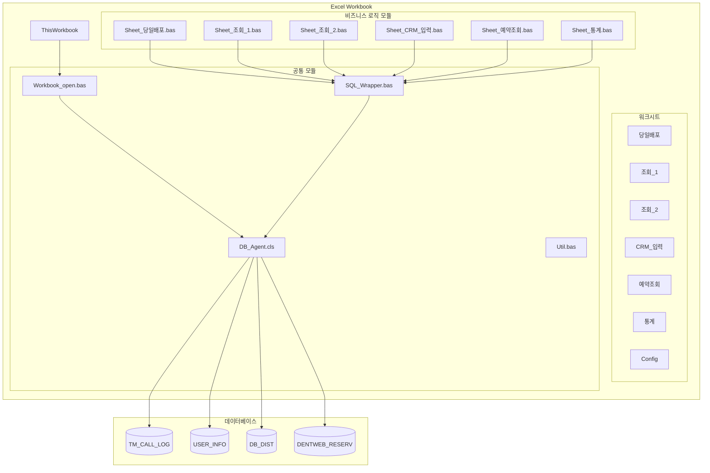

### 모듈 구성

| 구분 | 모듈명 | 타입 | 설명 |
|------|--------|------|------|
| 워크북 | ThisWorkbook.cls | Class | 워크북 초기화 이벤트 |
| 시트 로직 | Sheet_당일배포.bas | Module | 당일 배포 DB 조회/관리 |
| 시트 로직 | Sheet_조회_1.bas | Module | 과거 콜 로그 조회 (메인) |
| 시트 로직 | Sheet_조회_2.bas | Module | 과거 콜 로그 조회 (서브) |
| 시트 로직 | Sheet_CRM_입력.bas | Module | CRM 업로드 처리 |
| 시트 로직 | Sheet_예약조회.bas | Module | 예약 조회 및 관리 |
| 시트 로직 | Sheet_통계.bas | Module | 통계 데이터 조회 |
| 데이터 액세스 | DB_Agent.cls | Class | DB 연결/트랜잭션 관리 |
| 유틸리티 | SQL_Wrapper.bas | Module | SQL 파라미터 바인딩 |
| 유틸리티 | Util.bas | Module | 범용 헬퍼 함수 |
| 초기화 | Workbook_open.bas | Module | 로그인 및 초기화 |
| 기타 | Module1.bas | Module | 녹화된 매크로 (사용 안 함) |

---

## 모듈 및 클래스 상세

### 1. DB_Agent.cls (데이터베이스 에이전트)

**목적**: Oracle 데이터베이스 연결 및 쿼리 실행을 담당하는 핵심 클래스

**주요 속성**:
```vba
Private connection As ADODB.connection
Private connect_str As String
Private sql_str As String
Private result_recordset As ADODB.Recordset
```

**주요 메서드**:

| 메서드 | 반환값 | 설명 |
|--------|--------|------|
| `Connect_DB()` | Boolean | DB 연결 수립 |
| `Close_DB()` | Boolean | DB 연결 종료 |
| `Select_DB(param)` | Boolean | SELECT 쿼리 실행 |
| `Insert_update_DB(param)` | Boolean | INSERT/UPDATE 쿼리 실행 |
| `Begin_Trans()` | Boolean | 트랜잭션 시작 |
| `Commit_Trans()` | Boolean | 트랜잭션 커밋 |
| `Rollback_Trans()` | Boolean | 트랜잭션 롤백 |

**초기화 로직**:
```vba
Private Sub Class_Initialize()
    connect_str = "DSN=knock_crm_real;uid=knock_crm;pwd=kkptcmr!@34"
End Sub
```

**보안 이슈**: DB 비밀번호가 VBA 코드에 하드코딩되어 있음 (보안 취약점)

---

### 2. SQL_Wrapper.bas (SQL 파라미터 래퍼)

**목적**: Named Parameter 형식의 SQL을 실제 값으로 치환

**핵심 함수**:
```vba
Function make_SQL(sql_str As String, ParamArray arglist() As Variant) As String
```

**동작 방식**:
- `:param01`, `:param02`, ... 형식의 플레이스홀더를 실제 값으로 치환
- `"ALL"` 값은 `'%'`로 변환 (LIKE 검색용)
- 모든 값을 작은따옴표로 감싸서 SQL 인젝션 부분 방지

**사용 예시**:
```vba
sql_str = "SELECT * FROM USER_INFO WHERE USER_NO = :param01 AND USER_NAME = :param02"
sql_str = make_SQL(sql_str, "001", "홍길동")
' 결과: "SELECT * FROM USER_INFO WHERE USER_NO = '001' AND USER_NAME = '홍길동'"
```

---

### 3. Workbook_open.bas (초기화 모듈)

**목적**: 워크북 열릴 때 사용자 인증 및 초기 설정

**주요 프로세스**:

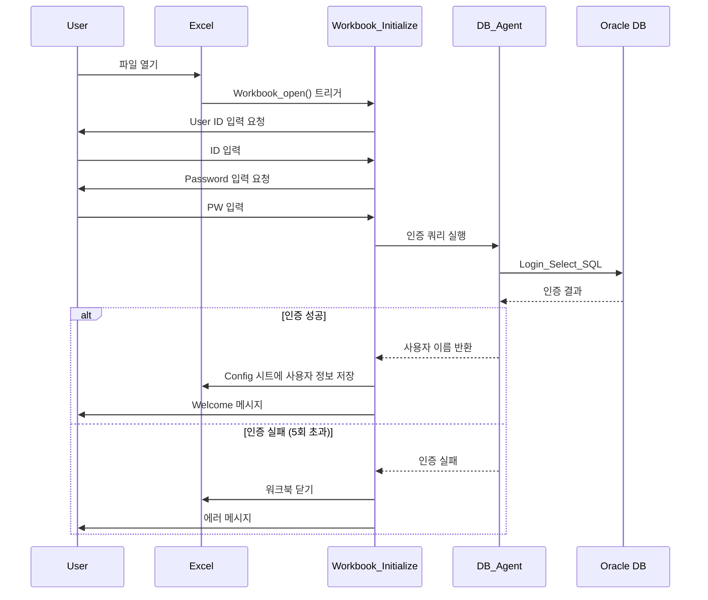

**코드 핵심**:
```vba
Sub Workbook_Initialize()
    Dim try_no As Integer
    try_no = 0

    While try_no < 5 And try_no <> -1
        emp_no = InputBox("User ID를 입력해주세요.", "User ID")
        emp_pass = InputBox("User Pass를 입력해주세요.", "User Pass")

        sql_str = Range("Login_Select_SQL").Offset(0, 0).Value2
        sql_str = make_SQL(sql_str, emp_no, emp_pass)

        If select_db_agent.Select_DB(sql_str) Then
            If Not select_db_agent.DB_result_recordset.EOF Then
                emp_name = select_db_agent.DB_result_recordset(0)
                try_no = -1  ' 로그인 성공
            End If
        End If
    Wend

    If try_no >= 5 Then
        MsgBox "Login Error : 파일을 닫고 다시 열어주세요"
        ThisWorkbook.Close
    End If

    Sheets("Config").Cells(11, 2) = emp_no
    Sheets("Config").Cells(11, 3) = emp_name
End Sub
```

---

### 4. Sheet_당일배포.bas

**목적**: 당일 배포된 DB를 조회하고 CRM_입력 시트로 복사

**주요 상수**:
```vba
Const This_Sheet_Name As String = "당일배포"
Const Target_Sheet_Name As String = "CRM_입력"
Public Const START_ROW_NUM As Integer = 8
Const MAX_ROW_NUM As Integer = 1000
```

**핵심 기능**:

1. **배포 DB 조회** (`Sheet_당일배포_Query`)
   - 지정 날짜의 배포 DB 조회
   - 기존 콜 로그 여부 체크 (이미 전화한 번호는 하이라이트)
   - 덴트웹 예약 정보 자동 조회 및 표시

2. **추가 배포 조회** (`Sheet_당일배포_추가배포_조회`)
   - 당일 추가 배포된 DB 조회
   - 기존 데이터에 추가로 append

3. **CRM 입력 복사** (`Sheet_당일배포_CRM입력_복사`)
   - 입력된 콜 결과를 CRM_입력 시트로 일괄 복사
   - 예약일 검증 로직 포함

**데이터 검증 로직**:
```vba
' 예약완료/예약변경인 경우 예약일 필수
If (.Cells(row_idx, 13) = "예약완료" Or .Cells(row_idx, 13) = "예약변경") _
   And .Cells(row_idx, 14) = "" Then
    MsgBox "예약일이 비었습니다. 행번호 : " & row_idx
    Exit Sub
End If

' 예약일이 입력되어 있으면 콜 결과가 예약완료/예약변경이어야 함
If .Cells(row_idx, 14) <> "" _
   And (.Cells(row_idx, 13) <> "예약완료" And .Cells(row_idx, 13) <> "예약변경") Then
    MsgBox "콜 결과값이 잘못 되었습니다. (예약일이 입력되어있음)"
    Exit Sub
End If
```

---

### 5. Sheet_조회_1.bas (메인 조회 모듈)

**목적**: 과거 콜 로그 조회 및 개별 CRM 입력 복사

**핵심 기능**:

1. **콜 로그 조회** (`Sheet_조회_1_Query`)
   - 기간별 콜 로그 조회 (3가지 모드)
     - 최초 콜 날짜 기준
     - 최종 콜 날짜 기준
     - 개별 콜 날짜 기준
   - 회수된 전화번호는 회색으로 표시

2. **행 추가** (`Sheet_조회_1_행추가`)
   - 현재 행에 새로운 콜 로그 입력 행 추가
   - 담당자, DB 정보 자동 복사

3. **CRM 입력 복사 (개별)** (`Sheet_조회_1_CRM_입력_복사_개별`)
   - 선택한 행만 CRM_입력 시트로 복사
   - 중복 복사 방지 (Y 플래그 체크)
   - 데이터 검증 (담당자, DB업체, 이름, 콜결과 필수)

4. **내원 여부 저장** (`Sheet_조회_1_내원여부_저장`)
   - 예약 환자의 내원 여부 DB 업데이트
   - 차트 번호 입력 가능

**복사 검증 로직**:
```vba
' 당일 입력 콜 로그만 복사 가능
If .Cells(row_idx, 2) <> Date Then
    MsgBox "당일 입력 call log가 아닙니다."
    Exit Sub
End If

' 콜 결과값 필수
If .Cells(row_idx, 10) = "" Then
    MsgBox "콜 결과값이 없습니다."
    Exit Sub
End If

' 이미 복사된 행 체크
If .Cells(row_idx, 1) = "Y" Then
    MsgBox "이미 CRM_입력 시트 복사가 된 행입니다."
    Exit Sub
End If
```

---

### 6. Sheet_CRM_입력.bas (CRM 업로드 모듈)

**목적**: 입력된 콜 로그를 실제 DB에 업로드

**핵심 프로세스**:

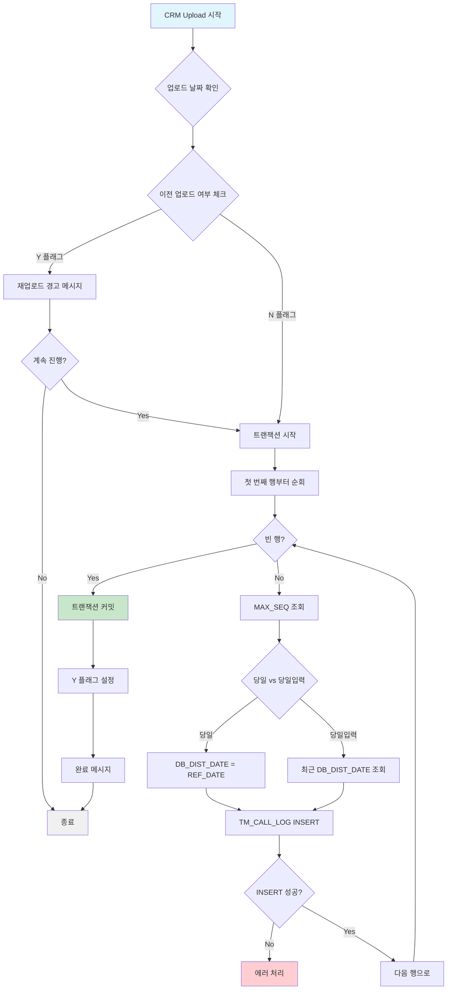

**주요 코드**:
```vba
Public Sub Sheet_CRM_입력_CRM_Upload()
    ' 중복 업로드 경고
    If .Cells(5, 3) = "Y" Then
        If MsgBox("CRM Upload 를 하신 적이 있습니다. 계속?", vbYesNo) = vbNo Then
            Exit Sub
        End If
    End If

    ' 트랜잭션 시작
    select_db_agent.Begin_Trans

    While .Cells(row_idx, 2) <> ""
        ' SEQ_NO 조회
        sql_str = Range("CRM_입력_MAX_SEQ_SELECT_SQL").Value2
        sql_str = make_SQL(sql_str, REF_DATE, TM_NAME, DB_SRC_2, PHONE_NO)

        If IsNull(select_db_agent.DB_result_recordset(0)) Then
            seq_no = 1
        Else
            seq_no = select_db_agent.DB_result_recordset(0) + 1
        End If

        ' INSERT 실행
        sql_str = Range("CRM_입력_INSERT_SQL").Value2
        sql_str = make_SQL(sql_str, REF_DATE, TM_NAME, DB_SRC_2, PHONE_NO, _
                          seq_no, EVENT_TYPE, CLIENT_NAME, CALL_MEMO, _
                          CALL_RESULT, RESERV_DATE, RESERV_TIME, VISITED_YN, _
                          TM_MEMO, DB_DIST_DATE, IN_OUT_TYPE, ALT_USER_NO)

        select_db_agent.Insert_update_DB(sql_str)
        row_idx = row_idx + 1
    Wend

    ' 커밋 및 플래그 설정
    select_db_agent.Commit_Trans
    .Cells(5, 3) = "Y"
End Sub
```

**DB_DIST_DATE 결정 로직**:
- **"당일"**: REF_DATE (CRM 입력 기준일)
- **실제 날짜**: 최근 배포 날짜 조회 (당일배포_최근_DB_DIST_DATE_SELECT_SQL)

---

### 7. Sheet_예약조회.bas

**목적**: 예약 정보 조회

**주요 기능**:

1. **예약 조회** (`Sheet_예약조회_Query`)
   - 날짜별 예약 정보 조회
   - 취소 포함/제외 옵션

2. **당일입력 예약 조회** (`Sheet_예약조회_당일입력_예약조회_Query`)
   - 당일 입력한 예약만 조회

---

### 8. Sheet_통계.bas

**목적**: TM 통계 및 내원 환자 리스트 조회

**주요 기능**:

1. **TM별 일일 통계** (`Sheet_통계_TM별_일일_통계_조회`)
   - 일별 TM 성과 조회
   - 예약, 부재, 상담완료 등 콜 결과별 집계
   - 예약율 자동 계산

2. **내원 환자 리스트** (`Sheet_통계_내원환자_리스트_조회`)
   - 기간별 내원 환자 목록 조회
   - 예약일, 차트번호, 환자명, 전화번호 등

---

### 9. Util.bas (유틸리티 모듈)

**범용 헬퍼 함수 모음**:

| 함수명 | 설명 |
|--------|------|
| `ADD_Date()` | 영업일 기준 날짜 계산 |
| `Find_index_from_Collection()` | 컬렉션에서 인덱스 찾기 |
| `Cnvt_to_Date()` | 문자열을 Date로 변환 |
| `File_Exists()` | 파일 존재 여부 확인 |
| `Get_Row_by_Find()` | 시트에서 특정 값 검색 |
| `Get_Row_num()` | 데이터 행 개수 계산 |
| `목록리스트_추가()` | 드롭다운 리스트 추가 |
| `이름_지정하기()` | 이름 범위 정의 |
| `복호화()` | 파일 복사본 저장 |
| `SET_PRINT_AREA()` | 인쇄 영역 설정 |

---

## Sub/Function 전체 목록

### 전체 함수 요약 (47개)

| No | 함수명 | 모듈 | 타입 | 설명 |
|----|--------|------|------|------|
| 1 | `Workbook_open` | ThisWorkbook.cls | Private Sub | 워크북 열기 이벤트 |
| 2 | `Sheet_예약관리_Clear` | Sheet_예약조회.bas | Public Sub | 예약 시트 데이터 클리어 |
| 3 | `Sheet_예약조회_Query` | Sheet_예약조회.bas | Public Sub | 예약 정보 조회 |
| 4 | `Sheet_예약조회_당일입력_예약조회_Query` | Sheet_예약조회.bas | Public Sub | 당일입력 예약 조회 |
| 5 | `Sheet_예약관리_행추가` | Sheet_예약조회.bas | Public Sub | 예약 행 추가 (비활성화) |
| 6 | `Sheet_예약관리_CRM_입력_복사_개별` | Sheet_예약조회.bas | Public Sub | 예약 개별 복사 (비활성화) |
| 7 | `Sheet_CRM_입력_Clear` | Sheet_CRM_입력.bas | Public Sub | CRM 입력 시트 클리어 |
| 8 | `Sheet_CRM_입력_CRM_Upload` | Sheet_CRM_입력.bas | Public Sub | CRM 데이터 DB 업로드 |
| 9 | `Sheet_조회_2_Clear` | Sheet_조회_2.bas | Public Sub | 조회2 시트 클리어 |
| 10 | `Sheet_조회_2_Query` | Sheet_조회_2.bas | Public Sub | 과거 콜 로그 조회 (조회2) |
| 11 | `Sheet_조회_1_Clear` | Sheet_조회_1.bas | Public Sub | 조회1 시트 클리어 |
| 12 | `Sheet_조회_1_Query` | Sheet_조회_1.bas | Public Sub | 과거 콜 로그 조회 (메인) |
| 13 | `Sheet_조회_1_행추가` | Sheet_조회_1.bas | Public Sub | 콜 로그 행 추가 |
| 14 | `Sheet_조회_1_CRM_입력_복사_개별` | Sheet_조회_1.bas | Public Sub | CRM 입력 개별 복사 |
| 15 | `Sheet_조회_1_CRM_입력_복사_일괄` | Sheet_조회_1.bas | Public Sub | CRM 입력 일괄 복사 (미구현) |
| 16 | `Sheet_조회_1_내원여부_저장` | Sheet_조회_1.bas | Public Sub | 내원 여부 DB 업데이트 |
| 17 | `Connect_DB` | DB_Agent.cls | Public Function | DB 연결 |
| 18 | `Close_DB` | DB_Agent.cls | Private Function | DB 연결 종료 |
| 19 | `Select_DB` | DB_Agent.cls | Function | SELECT 쿼리 실행 |
| 20 | `Insert_update_DB` | DB_Agent.cls | Function | INSERT/UPDATE 실행 |
| 21 | `Class_Initialize` | DB_Agent.cls | Private Sub | DB 연결 문자열 초기화 |
| 22 | `Class_Terminate` | DB_Agent.cls | Private Sub | DB 연결 정리 |
| 23 | `Begin_Trans` | DB_Agent.cls | Public Function | 트랜잭션 시작 |
| 24 | `Commit_Trans` | DB_Agent.cls | Public Function | 트랜잭션 커밋 |
| 25 | `Rollback_Trans` | DB_Agent.cls | Public Function | 트랜잭션 롤백 |
| 26 | `make_SQL` | SQL_Wrapper.bas | Function | SQL 파라미터 바인딩 |
| 27 | `매크로1` | Module1.bas | Sub | 녹화 매크로 (사용 안 함) |
| 28 | `매크로2` | Module1.bas | Sub | 녹화 매크로 (사용 안 함) |
| 29 | `매크로3` | Module1.bas | Sub | 녹화 매크로 (사용 안 함) |
| 30 | `매크로4` | Module1.bas | Sub | 녹화 매크로 (사용 안 함) |
| 31 | `매크로5` | Module1.bas | Sub | 녹화 매크로 (사용 안 함) |
| 32 | `Workbook_Initialize` | Workbook_open.bas | Sub | 로그인 및 초기화 |
| 33 | `ADD_Date` | Util.bas | Public Function | 영업일 계산 |
| 34 | `Find_index_from_Collection` | Util.bas | Public Function | 컬렉션 인덱스 찾기 |
| 35 | `Cnvt_to_Date` | Util.bas | Public Function | 문자열 날짜 변환 |
| 36 | `File_Exists` | Util.bas | Public Function | 파일 존재 확인 |
| 37 | `Get_Row_by_Find` | Util.bas | Public Function | 시트에서 행 찾기 |
| 38 | `Get_Row_num` | Util.bas | Public Function | 데이터 행 개수 |
| 39 | `목록리스트_추가` | Util.bas | Public Sub | 드롭다운 추가 |
| 40 | `이름_지정하기` | Util.bas | Public Sub | 이름 범위 지정 |
| 41 | `복호화` | Util.bas | Public Sub | 파일 복사 |
| 42 | `SET_PRINT_AREA` | Util.bas | Sub | 인쇄 영역 설정 |
| 43 | `사용자용_파일_배포` | Util.bas | Public Sub | 사용자용 배포 (미사용) |
| 44 | `Sheet_당일배포_Clear` | Sheet_당일배포.bas | Public Sub | 당일배포 시트 클리어 |
| 45 | `Sheet_당일배포_추가배포_조회` | Sheet_당일배포.bas | Public Sub | 추가 배포 조회 |
| 46 | `Sheet_당일배포_Query` | Sheet_당일배포.bas | Public Sub | 배포 DB 조회 |
| 47 | `Sheet_당일배포_CRM입력_복사` | Sheet_당일배포.bas | Public Sub | 배포 DB CRM 복사 |
| 48 | `Sheet_통계_조회` | Sheet_통계.bas | Public Sub | 통계 조회 (미사용) |
| 49 | `Sheet_통계_Clear` | Sheet_통계.bas | Public Sub | 통계 시트 클리어 |
| 50 | `Sheet_통계_TM별_일일_통계_조회` | Sheet_통계.bas | Public Sub | TM 일일 통계 조회 |
| 51 | `Sheet_통계_내원환자_리스트_조회` | Sheet_통계.bas | Public Sub | 내원 환자 리스트 조회 |

---

## 주요 상수 및 전역 변수

### 시트별 상수

#### Sheet_당일배포.bas
```vba
Const This_Sheet_Name As String = "당일배포"
Const Target_Sheet_Name As String = "CRM_입력"
Public Const START_ROW_NUM As Integer = 8      ' 데이터 시작 행
Const MAX_ROW_NUM As Integer = 1000            ' 최대 데이터 행
```

#### Sheet_조회_1.bas / Sheet_조회_2.bas
```vba
Const This_Sheet_Name As String = "조회_1"
Const Target_Sheet_Name As String = "CRM_입력"
Public Const START_ROW_NUM As Integer = 8
Const MAX_ROW_NUM As Long = 50000              ' 조회는 최대 5만 행
```

#### Sheet_CRM_입력.bas
```vba
Const This_Sheet_Name As String = "CRM_입력"
Public Const START_ROW_NUM As Integer = 7      ' 여기만 7행 시작
Const MAX_ROW_NUM As Integer = 1000
```

#### Sheet_예약조회.bas
```vba
Const This_Sheet_Name As String = "예약조회"
Public Const START_ROW_NUM As Integer = 8
Const MAX_ROW_NUM As Integer = 1000
```

#### Sheet_통계.bas
```vba
Const This_Sheet_Name As String = "통계"
Public Const START_ROW_NUM As Integer = 8
Const MAX_ROW_NUM As Integer = 10000           ' 통계는 1만 행
```

### 전역 Named Range (Excel 이름 정의)

시트의 특정 셀에 이름을 정의하여 SQL 쿼리 문자열 저장:

| 이름 | 설명 |
|------|------|
| `Cur_User_No` | 현재 로그인 사용자 번호 |
| `Login_Select_SQL` | 로그인 인증 쿼리 |
| `당일배포_배포DB_SELECT_SQL` | 당일 배포 DB 조회 쿼리 |
| `당일배포_추가배포_DB_SELECT_SQL` | 추가 배포 DB 조회 쿼리 |
| `당일배포_기존_CALL_LOG_여부_SQL` | 기존 콜 로그 체크 쿼리 |
| `당일배포_덴트웹_정보_SELECT_SQL` | 덴트웹 예약 정보 쿼리 |
| `CRM_입력_MAX_SEQ_SELECT_SQL` | SEQ_NO 최댓값 조회 |
| `CRM_입력_최근_DB_DIST_DATE_SELECT_SQL` | 최근 배포 날짜 조회 |
| `CRM_입력_INSERT_SQL` | 콜 로그 INSERT 쿼리 |
| `조회_1_과거_CALL_LOG_SELECT_SQL_1` | 최초 콜 날짜 기준 조회 |
| `조회_1_과거_CALL_LOG_SELECT_SQL_2` | 최종 콜 날짜 기준 조회 |
| `조회_1_과거_CALL_LOG_SELECT_SQL_3` | 개별 콜 날짜 기준 조회 |
| `조회_1_내원여부_UPDATE_SQL` | 내원 여부 업데이트 쿼리 |
| `예약관리_예약_조회_취소포함_SELECT` | 예약 조회 (취소 포함) |
| `예약관리_예약_조회_취소제외_SELECT` | 예약 조회 (취소 제외) |
| `예약관리_당일입력_예약_조회_SELECT` | 당일입력 예약 조회 |
| `통계_일일TM통계_SELECT` | TM 일일 통계 쿼리 |
| `통계_내원환자_리스트_SELECT` | 내원 환자 리스트 쿼리 |

---

## 데이터베이스 스키마

### 1. TM_CALL_LOG (콜 로그 테이블)

**목적**: TM이 수행한 모든 콜 기록 저장

| 컬럼명 | 타입 | 설명 | 비고 |
|--------|------|------|------|
| REF_DATE | VARCHAR(8) | 기준일자 (YYYYMMDD) | PK |
| TM_NO | VARCHAR(10) | TM 번호 | PK, FK to USER_INFO |
| DB_SRC_2 | VARCHAR(50) | DB 업체명 | PK |
| PHONE_NO | VARCHAR(20) | 전화번호 | PK |
| SEQ_NO | NUMBER | 순번 | PK |
| EVENT_TYPE | VARCHAR(50) | 이벤트 유형 | DB 정보 |
| CLIENT_NAME | VARCHAR(100) | 고객명 | |
| TM_NAME | VARCHAR(50) | TM 이름 | |
| CALL_MEMO_1 | VARCHAR(500) | 상담 내용 | |
| CALL_MEMO_2 | VARCHAR(500) | 추가 상담 내용 | (사용 안 함) |
| CALL_RESULT | VARCHAR(50) | 콜 결과 | 예약완료, 부재, 상담완료 등 |
| RESERV_DATE | VARCHAR(8) | 예약일 (YYYYMMDD) | |
| RESERV_TIME | VARCHAR(8) | 예약 시간 (HH:MM:SS) | |
| VISITED_YN | VARCHAR(1) | 내원 여부 | Y/N |
| TM_MEMO | VARCHAR(500) | TM 메모 | |
| DB_DIST_DATE | VARCHAR(8) | DB 배포 날짜 | 어느 배포에서 온 번호인지 |
| IN_OUT_TYPE | VARCHAR(1) | 인/아웃바운드 구분 | O: 아웃바운드 |
| ALT_USER_NO | VARCHAR(10) | 수정 사용자 번호 | 내원 여부 수정 시 |
| ALT_DATE | VARCHAR(8) | 수정 날짜 | |
| ALT_TIME | VARCHAR(8) | 수정 시각 | |
| CHART_NO | VARCHAR(20) | 차트 번호 | 내원 시 입력 |

**Primary Key**: (REF_DATE, TM_NO, DB_SRC_2, PHONE_NO, SEQ_NO)

**특징**:
- 동일 번호에 여러 번 전화 가능 (SEQ_NO로 구분)
- DB_DIST_DATE로 어느 배포에서 온 번호인지 추적
- 내원 여부는 나중에 업데이트 가능 (ALT_USER_NO, ALT_DATE, ALT_TIME 기록)

### 2. USER_INFO (사용자 정보 테이블)

**목적**: TM 및 관리자 정보 관리

| 컬럼명 | 타입 | 설명 |
|--------|------|------|
| USER_NO | VARCHAR(10) | 사용자 번호 (PK) |
| USER_NAME | VARCHAR(50) | 사용자 이름 |
| USER_PASS | VARCHAR(50) | 비밀번호 |
| USER_TYPE | VARCHAR(10) | 사용자 유형 (TM, ADMIN 등) |
| USE_YN | VARCHAR(1) | 사용 여부 (Y/N) |

### 3. DB_DIST (DB 배포 테이블)

**목적**: TM에게 배포된 DB 관리

| 컬럼명 | 타입 | 설명 |
|--------|------|------|
| DIST_DATE | VARCHAR(8) | 배포 날짜 (PK) |
| TM_NO | VARCHAR(10) | TM 번호 (PK) |
| DB_SRC_1 | VARCHAR(50) | DB 대분류 |
| DB_SRC_2 | VARCHAR(50) | DB 업체명 (PK) |
| EVENT_TYPE | VARCHAR(50) | 이벤트 유형 (PK) |
| CLIENT_NAME | VARCHAR(100) | 고객명 |
| PHONE_NO | VARCHAR(20) | 전화번호 (PK) |
| DIST_SEQ | NUMBER | 배포 회차 |

**Primary Key**: (DIST_DATE, TM_NO, DB_SRC_2, EVENT_TYPE, PHONE_NO)

### 4. DENTWEB_RESERV (덴트웹 예약 테이블)

**목적**: 덴트웹 시스템과 연동된 실제 예약 정보

| 컬럼명 | 타입 | 설명 |
|--------|------|------|
| RESERV_DATE | DATE | 예약일 |
| RESERV_TIME | VARCHAR(8) | 예약 시간 |
| CHART_NO | VARCHAR(20) | 차트 번호 |
| CLIENT_NAME | VARCHAR(100) | 환자명 |
| PHONE_NO | VARCHAR(20) | 전화번호 |
| RESERV_STATUS | VARCHAR(20) | 예약 상태 (미도래, 이행, 취소) |
| CANCEL_YN | NUMBER | 취소 여부 (0: 정상, >0: 취소) |

**주요 로직**:
```vba
' 덴트웹 예약 상태 표시
.Cells(row_idx, 18) = IIf(DB_result(9) > 0, "이행", DB_result(8)) _
                    & "(" & DB_result(1) & ")"

' 취소 건인 경우 다음 미도래 예약 찾기
If Left(.Cells(row_idx, 18), 2) = "취소" Then
    Do While Not recordset.EOF
        If recordset(8) = "미도래" Then
            .Cells(row_idx, 18) = recordset(8) & "(" & recordset(1) & ")"
            Exit Do
        End If
        recordset.MoveNext
    Loop
End If
```

---

## 핵심 비즈니스 로직

### 1. 로그인 프로세스

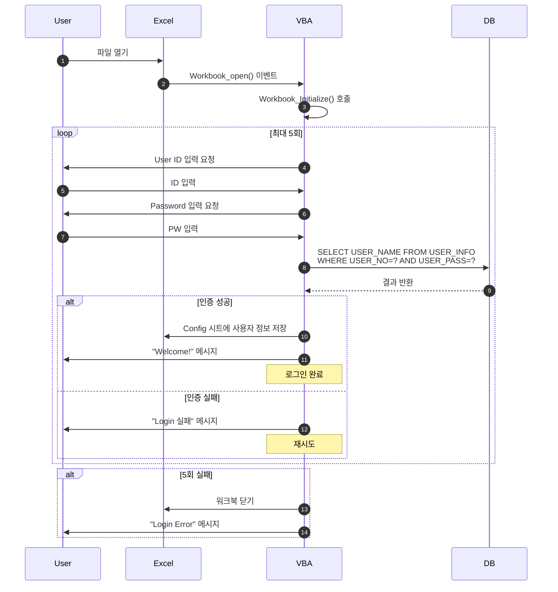

---

### 2. 당일배포 조회 및 CRM 입력 프로세스

```mermaid
flowchart TD
    Start([사용자: 배포 조회 버튼 클릭]) --> A[Sheet_당일배포_Query 실행]
    A --> B[화면 데이터 클리어]
    B --> C[DB에서 당일 배포 조회<br/>당일배포_배포DB_SELECT_SQL]

    C --> D[배포 데이터를 시트에 출력]
    D --> E[행별로 순회 시작]

    E --> F{기존 콜 로그 존재?}
    F -->|Yes| G[전화번호 셀 하이라이트<br/>연한 주황색]
    F -->|No| H[다음 체크]
    G --> H

    H --> I{덴트웹 예약 존재?}
    I -->|Yes| J[예약 상태 표시<br/>미도래/이행/취소+날짜]
    I -->|No| K[다음 행]
    J --> K

    K --> L{마지막 행?}
    L -->|No| E
    L -->|Yes| M[조회 완료]

    M --> N([사용자: 전화 걸기 및 결과 입력])
    N --> O([사용자: CRM입력 복사 버튼])

    O --> P[Sheet_당일배포_CRM입력_복사 실행]
    P --> Q[데이터 검증]

    Q --> R{예약완료/변경인데<br/>예약일 없음?}
    R -->|Yes| S[에러 메시지<br/>종료]
    R -->|No| T{예약일 있는데<br/>결과가 예약 아님?}

    T -->|Yes| S
    T -->|No| U[CRM_입력 시트로 복사]

    U --> V[당일/직전 구분<br/>담당자, DB업체 등<br/>13개 컬럼 복사]

    V --> W[복사 완료 메시지]
    W --> X([사용자: CRM Upload 버튼])

    X --> Y[Sheet_CRM_입력_CRM_Upload 실행]
    Y --> Z{이전 업로드<br/>여부 체크}

    Z -->|Y 플래그| AA[재업로드 경고]
    AA --> AB{계속?}
    AB -->|No| AC[종료]
    AB -->|Yes| AD[트랜잭션 시작]
    Z -->|N 플래그| AD

    AD --> AE[행별로 순회]
    AE --> AF[MAX_SEQ 조회]
    AF --> AG[SEQ_NO 결정<br/>NULL이면 1, 아니면 +1]
    AG --> AH[TM_CALL_LOG INSERT]
    AH --> AI{마지막 행?}
    AI -->|No| AE
    AI -->|Yes| AJ[트랜잭션 커밋]
    AJ --> AK[Y 플래그 설정]
    AK --> AL[업로드 완료 메시지]

    style Start fill:#e1f5ff
    style N fill:#fff9c4
    style O fill:#fff9c4
    style X fill:#fff9c4
    style S fill:#ffcdd2
    style AC fill:#ffcdd2
    style AL fill:#c8e6c9
```

---

### 3. 과거 콜 로그 조회 및 추가 입력 프로세스

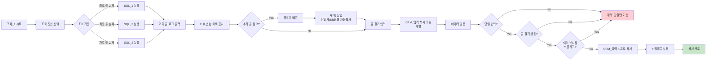

---

### 4. 내원 여부 업데이트 프로세스

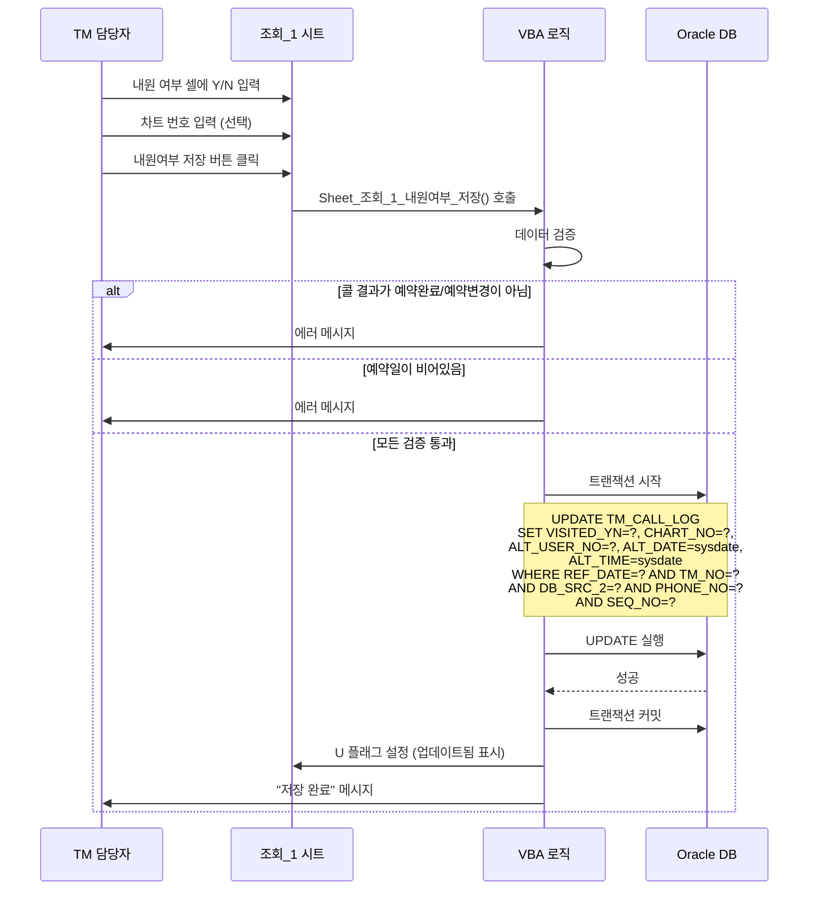

---

### 5. SEQ_NO 결정 로직 (중복 전화 처리)

**문제**: 동일한 전화번호에 여러 번 전화할 수 있음 (재연락, 부재 후 재전화 등)

**해결**: SEQ_NO를 사용하여 동일 번호의 콜 로그 구분

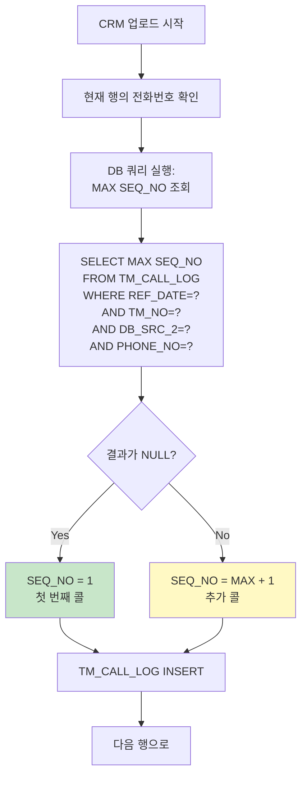

**예시**:

| REF_DATE | TM_NO | DB_SRC_2 | PHONE_NO | SEQ_NO | CALL_RESULT |
|----------|-------|----------|----------|--------|-------------|
| 20261201 | 001 | 업체A | 010-1234-5678 | 1 | 부재 |
| 20261201 | 001 | 업체A | 010-1234-5678 | 2 | 예약완료 |
| 20261202 | 001 | 업체A | 010-1234-5678 | 1 | 예약변경 |

- 12/1에 두 번 전화 → SEQ_NO 1, 2
- 12/2에 한 번 전화 → SEQ_NO 1 (날짜가 다르면 1부터 시작)

---

## 워크플로우 다이어그램

### 다이어그램 1: 전체 시스템 워크플로우

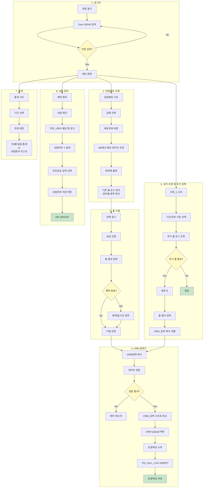

---

### 다이어그램 2: 로그인 및 당일배포 조회 프로세스

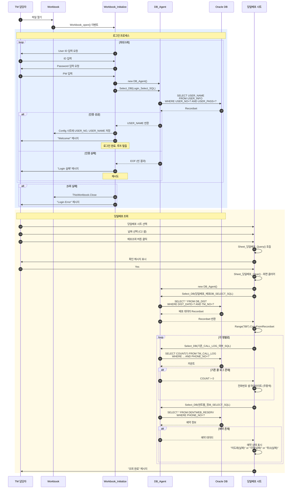

---

### 다이어그램 3: 콜 로그 입력 및 CRM 업로드 프로세스

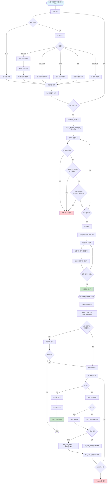

---

### 다이어그램 4: 과거 콜 로그 조회 및 추가 입력

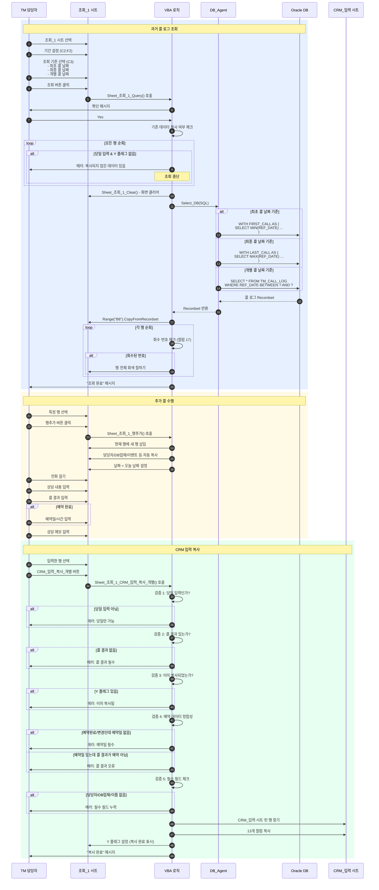

---

### 다이어그램 5: 예약 및 내원 관리 프로세스

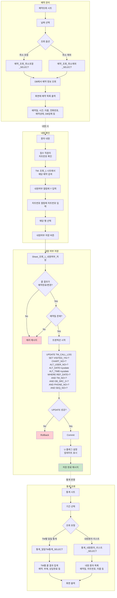

---

## 관리자용과의 차이점

### 개요

Knock CRM 시스템은 사용자 권한에 따라 두 가지 버전으로 구분됩니다:

1. **TM 일반용** (v.0.40) - 본 문서 분석 대상
2. **TM 팀장/관리자용** (mng v.1.60 ~ v.1.69) - 관리 기능 포함

### 주요 차이점 상세 비교

| 구분 | TM 일반용 (v.0.40) | 관리자용 (mng) | 차이점 설명 |
|------|-------------------|---------------|-----------|
| **대상 사용자** | TM 일반 담당자 | TM 팀장, 관리자 | 권한 차이 |
| **DB 배포 기능** | 조회만 가능 | 배포 생성, 수정, 삭제 가능 | 관리자는 DB 배포 권한 보유 |
| **통계 기능** | 본인 통계만 조회 | 전체 TM 통계 조회 가능 | 관리자는 모든 TM 성과 확인 |
| **사용자 관리** | 없음 | 사용자 추가/수정/삭제 | 관리자만 계정 관리 |
| **DB 업체 관리** | 없음 | DB 업체 등록/수정 | 관리자만 업체 정보 관리 |
| **콜 결과 수정** | 본인 당일 콜만 수정 | 모든 콜 로그 수정 가능 | 관리자는 과거 데이터 수정 권한 |
| **내원 여부 관리** | 조회_1에서 개별 저장 | 일괄 업로드 기능 | 관리자는 엑셀로 일괄 처리 |
| **예약 조회** | 본인 예약만 조회 | 전체 TM 예약 조회 | 관리자는 모든 예약 확인 |
| **시트 보호** | 일부 시트 보호됨 | 모든 시트 편집 가능 | 관리자는 제한 없음 |
| **CRM 업로드** | 당일 1회 제한 (Y 플래그) | 재업로드 가능 | 관리자는 데이터 수정 후 재업로드 |
| **마케팅 시트** | 없음 | 마케팅 실적 관리 시트 | 관리자용에만 존재 |
| **KLS 연동** | 없음 | KLS v2 마스터 연동 | 관리자용 일부 버전만 |

### 기능별 상세 비교

#### 1. 로그인 및 권한

**TM 일반용**:
```vba
' Config 시트에 사용자 정보만 저장
Sheets("Config").Cells(11, 2) = emp_no
Sheets("Config").Cells(11, 3) = emp_name
```

**관리자용** (추정):
```vba
' Config 시트에 사용자 정보 + 권한 레벨 저장
Sheets("Config").Cells(11, 2) = emp_no
Sheets("Config").Cells(11, 3) = emp_name
Sheets("Config").Cells(11, 4) = user_type  ' "TM", "ADMIN", "MANAGER" 등
```

#### 2. 당일배포 조회 vs 배포 관리

**TM 일반용**:
- `Sheet_당일배포_Query()`: 조회만 가능
- `Sheet_당일배포_추가배포_조회()`: 추가 배포 조회만

**관리자용** (추정):
- `Sheet_당일배포_Query()`: 조회 가능
- `Sheet_당일배포_배포생성()`: 신규 배포 생성
- `Sheet_당일배포_배포수정()`: 기존 배포 수정
- `Sheet_당일배포_배포삭제()`: 배포 삭제
- `Sheet_당일배포_TM별배포현황()`: 전체 TM 배포 현황

#### 3. 통계 조회 범위

**TM 일반용**:
```vba
' 본인 통계만 조회
user_no = Range("Cur_User_No").Offset(0, 0).Value2
sql_str = make_SQL(sql_str, ref_date_1, ref_date_2, user_no)  ' user_no 필터링
```

**관리자용** (추정):
```vba
' 전체 TM 또는 특정 TM 선택 조회
If user_type = "ADMIN" Or user_type = "MANAGER" Then
    ' TM 선택 드롭다운 표시
    selected_tm = Range("Selected_TM_No").Value
    If selected_tm = "전체" Then
        sql_str = make_SQL(sql_str, ref_date_1, ref_date_2, "%")  ' 모든 TM
    Else
        sql_str = make_SQL(sql_str, ref_date_1, ref_date_2, selected_tm)
    End If
Else
    user_no = Range("Cur_User_No").Value2
    sql_str = make_SQL(sql_str, ref_date_1, ref_date_2, user_no)
End If
```

#### 4. CRM 업로드 중복 체크

**TM 일반용**:
```vba
' Y 플래그가 있으면 경고 후 선택
If .Cells(5, 3) = "Y" Then
    If MsgBox("CRM Upload 를 하신 적이 있습니다. 계속?", vbYesNo) = vbNo Then
        Exit Sub
    End If
End If
```

**관리자용** (추정):
```vba
' 관리자는 Y 플래그 무시 또는 강제 재업로드 가능
If user_type <> "ADMIN" And user_type <> "MANAGER" Then
    If .Cells(5, 3) = "Y" Then
        If MsgBox("CRM Upload 를 하신 적이 있습니다. 계속?", vbYesNo) = vbNo Then
            Exit Sub
        End If
    End If
Else
    ' 관리자는 경고 없이 진행
End If
```

#### 5. 시트 구성 차이

**TM 일반용 시트 목록**:
1. 당일배포
2. 조회_1
3. 조회_2
4. CRM_입력
5. 예약조회
6. 통계
7. Config

**관리자용 시트 목록** (추정):
1. 당일배포
2. 조회_1
3. 조회_2
4. CRM_입력
5. 예약조회
6. 통계
7. Config
8. **DB배포관리** (신규)
9. **사용자관리** (신규)
10. **DB업체관리** (신규)
11. **마케팅** (신규)
12. **전체TM현황** (신규)
13. **KLS연동** (일부 버전만)

#### 6. 내원 여부 관리

**TM 일반용**:
- 조회_1 시트에서 개별 저장만 가능
- 한 번에 한 행씩 처리

**관리자용** (추정):
- 개별 저장 + 일괄 업로드 가능
- 엑셀 파일로 내원 여부 일괄 업데이트
- 덴트웹 시스템과 자동 동기화 기능

### 버전별 기능 매트릭스

| 기능 | TM 일반 v.0.40 | mng v.1.60 | mng v.1.62 | mng v.1.69 |
|------|----------------|------------|------------|------------|
| 로그인 | O | O | O | O |
| 당일배포 조회 | O | O | O | O |
| 당일배포 생성 | X | O | O | O |
| 과거 콜 로그 조회 | O (본인만) | O (전체) | O (전체) | O (전체) |
| CRM 업로드 | O | O | O | O |
| 예약 조회 | O (본인만) | O (전체) | O (전체) | O (전체) |
| 내원 관리 | O (개별) | O (일괄) | O (일괄) | O (일괄) |
| 통계 조회 | O (본인만) | O (전체) | O (전체) | O (전체) |
| 사용자 관리 | X | O | O | O |
| DB 업체 관리 | X | O | O | O |
| 마케팅 관리 | X | O | O | O |
| KLS 연동 | X | X | X | O |

### 권장 사용 시나리오

#### TM 일반용 (v.0.40)
- 일반 TM 담당자
- 자신에게 배포된 DB만 관리
- 콜 수행 및 기록에 집중
- 제한된 통계 조회

#### 관리자용 (mng v.1.60+)
- TM 팀장, 관리자
- 전체 TM 관리 및 모니터링
- DB 배포 계획 및 실행
- 성과 분석 및 리포팅
- 사용자 계정 관리
- 시스템 설정 변경

### 데이터 공유

두 버전 모두 **동일한 Oracle 데이터베이스**를 사용합니다:
- DSN: knock_crm_real
- 테이블: TM_CALL_LOG, USER_INFO, DB_DIST, DENTWEB_RESERV 등

**따라서**:
- TM 일반용에서 입력한 콜 로그는 관리자용에서도 조회 가능
- 관리자가 배포한 DB는 TM 일반용 당일배포 시트에 표시됨
- 통계 데이터는 실시간으로 동기화됨

---

## 보안 및 개선 권장사항

### 1. 보안 취약점

#### 심각도: 높음
- **DB 비밀번호 하드코딩**: VBA 코드에 평문으로 DB 비밀번호 저장
  ```vba
  connect_str = "DSN=knock_crm_real;uid=knock_crm;pwd=kkptcmr!@34"
  ```
  - **권장**: 암호화된 설정 파일 또는 Windows Credential Manager 사용

#### 심각도: 중간
- **SQL 인젝션 부분 방어**: make_SQL 함수가 작은따옴표로만 감싸고 있어 완전한 방어 불가
  - **권장**: 파라미터화된 쿼리 (Prepared Statement) 사용

- **로그인 재시도 제한**: 5회 실패 시 파일만 닫고 계정 잠금 없음
  - **권장**: 3회 실패 시 계정 일시 잠금 (10분) 및 관리자 알림

#### 심각도: 낮음
- **사용자 비밀번호 저장 방식**: DB에 평문 또는 약한 해시로 저장 가능성
  - **권장**: bcrypt, Argon2 등 강력한 해시 알고리즘 사용

### 2. 데이터 정합성

- **트랜잭션 롤백 누락**: 일부 에러 처리에서 명시적 롤백 없음
- **동시성 제어 부족**: 여러 TM이 동시에 같은 번호 입력 시 충돌 가능
- **Y 플래그 의존**: CRM 업로드 중복 방지를 클라이언트 플래그에만 의존

### 3. 코드 품질

- **매직 넘버**: 행 번호, 컬럼 번호가 하드코딩됨 (예: `.Cells(5, 3)`)
- **중복 코드**: 조회_1, 조회_2, 예약조회 등에서 유사 코드 반복
- **에러 처리 부족**: `On Error Resume Next` 미사용으로 런타임 에러 시 중단
- **주석 부족**: 비즈니스 로직 설명 부족

### 4. 성능

- **반복 쿼리**: 당일배포 조회 시 행별로 쿼리 실행 (N+1 문제)
  - **권장**: JOIN으로 한 번에 조회
- **대량 데이터**: 조회_2는 MAX_ROW_NUM 50,000으로 설정되어 있어 느려질 수 있음
  - **권장**: 페이징 구현

### 5. 사용성

- **사용자 피드백**: 일부 작업에 진행 상황 표시 없음
- **데이터 검증 메시지**: 에러 메시지가 불친절함 (예: "ERROR")
- **도움말 부족**: 사용자 매뉴얼 또는 툴팁 없음

---

## 결론

Knock CRM TM v.0.40 일반 사용자용은 치과 텔레마케팅 업무를 효율적으로 수행하기 위한 **엑셀 기반 CRM 시스템**입니다.

### 핵심 특징
1. **Oracle DB 연동**: ADODB를 통한 실시간 데이터 조회/입력
2. **워크플로우 자동화**: 배포 조회 → 콜 수행 → CRM 업로드 프로세스
3. **데이터 검증**: 예약일, 콜 결과 등 필수 필드 검증
4. **중복 방지**: SEQ_NO를 통한 동일 번호 재콜 관리
5. **통계 기능**: TM 개인 성과 및 내원 환자 추적

### 장점
- Excel 기반으로 사용자 친숙도가 높음
- DB와 실시간 연동으로 데이터 일관성 유지
- 트랜잭션 관리로 데이터 무결성 보장
- 덴트웹 시스템과 연동으로 예약 정보 자동 조회

### 단점
- VBA 코드에 DB 비밀번호 노출
- SQL 인젝션 위험
- 하드코딩된 셀 참조로 유지보수 어려움
- 에러 처리 부족
- 대량 데이터 처리 시 성능 저하 가능

### 개선 방향
1. **보안 강화**: 비밀번호 암호화, 파라미터화된 쿼리 사용
2. **코드 리팩토링**: 상수화, 공통 함수 추출, 에러 핸들링 개선
3. **성능 최적화**: 쿼리 통합, 인덱스 활용, 페이징 구현
4. **사용성 개선**: 진행 표시줄, 친절한 메시지, 도움말 추가
5. **웹 기반 전환 고려**: 장기적으로 웹 애플리케이션으로 마이그레이션

---

**문서 작성일**: 2026-03-18
**분석 대상 파일**: Knock_CRM_TM_v.0.40_TM_일반.xlsm
**총 VBA 라인 수**: 2,791 lines
**총 Sub/Function 수**: 51개
**데이터베이스**: Oracle (DSN: knock_crm_real)
