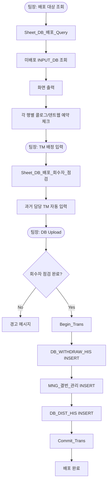
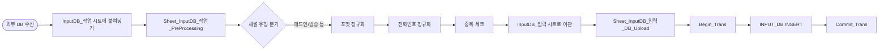
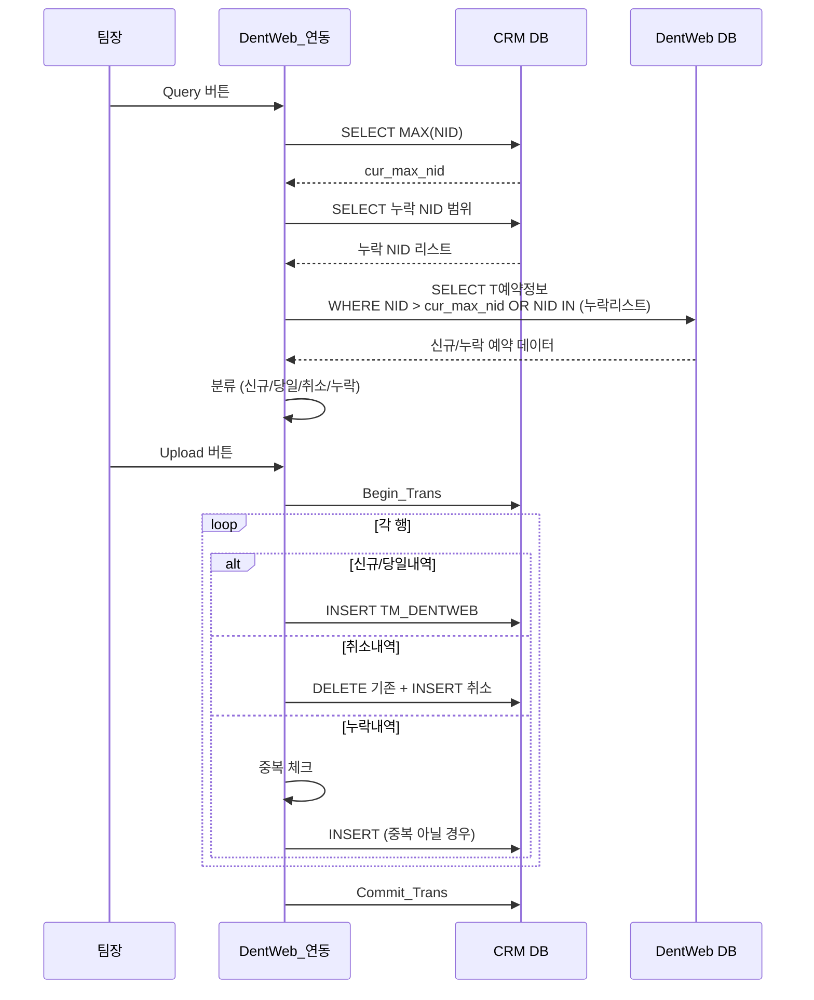
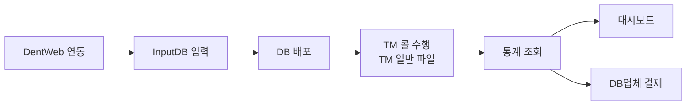

# Knock CRM TM_팀장 분석 문서

## 1. 파일 개요

- **파일명**: Knock_CRM_mng_v.1.62_5_TM_팀장.xlsm
- **버전**: v.1.62
- **목적**: 치과 CRM 시스템의 TM(Tele-Marketing) 팀장용 관리 도구
- **대상 사용자**: TM 팀장급 관리자
- **주요 기능**: DB 배포 관리, INPUT DB 입력/관리, 통계 조회, DentWeb 연동, 예약/내원 정보 관리
- **총 함수 수**: 약 80개
- **총 라인 수**: 약 10,500줄

---

## 2. 전체 구조

### 2.1 주요 모듈 구성

| 모듈명        | 타입   | 주요 역할                          |
| ------------- | ------ | ---------------------------------- |
| ThisWorkbook  | 클래스 | 워크북 초기화 및 로그인 처리       |
| DB_Agent      | 클래스 | 데이터베이스 연결 및 트랜잭션 관리 |
| SQL_Wrapper   | 모듈   | SQL 파라미터 바인딩 유틸리티       |
| Util          | 모듈   | 공통 유틸리티 함수                 |
| Workbook_open | 모듈   | 사용자 인증 및 초기화              |

### 2.2 시트별 모듈

| 모듈명             | 대응 시트    | 주요 역할                                        |
| ------------------ | ------------ | ------------------------------------------------ |
| Sheet_조회         | 조회         | DB 배포/회수 내역, Call Log, 연락처 History 조회 |
| Sheet_Config       | Config       | 시스템 설정 및 사용자 정보 초기화                |
| Sheet_DentWeb_연동 | DentWeb_연동 | DentWeb 예약 데이터 조회 및 업로드               |
| Sheet_DB_결산      | DB_결산      | DB 결산 데이터 조회                              |
| Sheet_예약내원정보 | 예약내원정보 | 예약 및 내원 여부 관리                           |
| Sheet_DB_검색      | DB_검색      | 구DB 검색 및 참고자료 조회                       |
| Sheet_DB_배포      | DB_배포      | DB 배포 대상 조회 및 배포 실행                   |
| Sheet_TM_조회2     | TM_조회_2    | TM별 과거 콜 기록 조회                           |
| Sheet_InputDB_입력 | InputDB_입력 | INPUT DB 데이터 업로드                           |
| Sheet_InputDB_작업 | InputDB_작업 | INPUT DB 전처리 및 가공                          |
| Sheet_DB업체_결제  | DB업체_결제  | DB 업체 결제 관리                                |
| Sheet_통계         | 통계         | TM별 통계, 내원환자 리스트, Performance          |
| Sheet_구DB_작업    | 구DB_작업    | 구DB 조회 및 배포 시트 이관                      |
| Sheet_SQL_실행기   | SQL_실행기   | SQL 직접 실행                                    |
| Sheet_DashBoard    | DashBoard    | 대시보드 데이터 조회                             |
| Sheet_Oracle_조회  | Oracle_조회  | Oracle DB 조회 (선택적)                          |

---

## 3. 전체 Sub/Function 목록

### 3.1 초기화 및 공통

| 함수명                | 유형     | 링크 | 주요 역할 |
| --------------------- | -------- | ---- | --------- |
| `Workbook_open`       | Sub      | [L12](https://github.com/KnockKnock-Dev/VBA/blob/29af26e/src_extracted/Knock_CRM_mng_v.1.62_5_TM_%ED%8C%80%EC%9E%A5.vba#L12) | 워크북 열기 시 Workbook_Initialize 호출 |
| `Workbook_Initialize` | Sub      | [L2806](https://github.com/KnockKnock-Dev/VBA/blob/29af26e/src_extracted/Knock_CRM_mng_v.1.62_5_TM_%ED%8C%80%EC%9E%A5.vba#L2806) | 로그인 인증 (최대 5회) 및 사용자 정보 저장 |
| `Sheet_Config_Intialize` | Sub   | [L813](https://github.com/KnockKnock-Dev/VBA/blob/29af26e/src_extracted/Knock_CRM_mng_v.1.62_5_TM_%ED%8C%80%EC%9E%A5.vba#L813) | Config 시트 초기화 |
| `Connect_DB`          | Function | [L2143](https://github.com/KnockKnock-Dev/VBA/blob/29af26e/src_extracted/Knock_CRM_mng_v.1.62_5_TM_%ED%8C%80%EC%9E%A5.vba#L2143) | ODBC DB 연결 |
| `Select_DB`           | Function | [L2172](https://github.com/KnockKnock-Dev/VBA/blob/29af26e/src_extracted/Knock_CRM_mng_v.1.62_5_TM_%ED%8C%80%EC%9E%A5.vba#L2172) | SELECT 쿼리 실행 |
| `Insert_update_DB`    | Function | [L2203](https://github.com/KnockKnock-Dev/VBA/blob/29af26e/src_extracted/Knock_CRM_mng_v.1.62_5_TM_%ED%8C%80%EC%9E%A5.vba#L2203) | INSERT/UPDATE 실행 |
| `Begin_Trans`         | Function | [L2259](https://github.com/KnockKnock-Dev/VBA/blob/29af26e/src_extracted/Knock_CRM_mng_v.1.62_5_TM_%ED%8C%80%EC%9E%A5.vba#L2259) | 트랜잭션 시작 |
| `Commit_Trans`        | Function | [L2263](https://github.com/KnockKnock-Dev/VBA/blob/29af26e/src_extracted/Knock_CRM_mng_v.1.62_5_TM_%ED%8C%80%EC%9E%A5.vba#L2263) | 트랜잭션 커밋 |
| `Rollback_Trans`      | Function | [L2267](https://github.com/KnockKnock-Dev/VBA/blob/29af26e/src_extracted/Knock_CRM_mng_v.1.62_5_TM_%ED%8C%80%EC%9E%A5.vba#L2267) | 트랜잭션 롤백 |
| `make_SQL`            | Function | [L2278](https://github.com/KnockKnock-Dev/VBA/blob/29af26e/src_extracted/Knock_CRM_mng_v.1.62_5_TM_%ED%8C%80%EC%9E%A5.vba#L2278) | SQL 파라미터 바인딩 |
| `사용자용_파일_배포`  | Sub      | [L3080](https://github.com/KnockKnock-Dev/VBA/blob/29af26e/src_extracted/Knock_CRM_mng_v.1.62_5_TM_%ED%8C%80%EC%9E%A5.vba#L3080) | TM 일반용 배포 파일 생성 |

### 3.2 조회 시트 (Sheet_조회)

| 함수명                                    | 유형 | 링크 | 주요 역할 |
| ----------------------------------------- | ---- | ---- | --------- |
| `Sheet_조회_Query`                        | Sub  | [L32](https://github.com/KnockKnock-Dev/VBA/blob/29af26e/src_extracted/Knock_CRM_mng_v.1.62_5_TM_%ED%8C%80%EC%9E%A5.vba#L32) | 조회 유형별 분기 (6가지 모드) |
| `Sheet_조회_DB_회수_내역_조회`            | Sub  | [L119](https://github.com/KnockKnock-Dev/VBA/blob/29af26e/src_extracted/Knock_CRM_mng_v.1.62_5_TM_%ED%8C%80%EC%9E%A5.vba#L119) | DB 회수 이력 조회 |
| `Sheet_조회_Call_Log_조회`                | Sub  | [L168](https://github.com/KnockKnock-Dev/VBA/blob/29af26e/src_extracted/Knock_CRM_mng_v.1.62_5_TM_%ED%8C%80%EC%9E%A5.vba#L168) | Call Log 전체 조회 |
| `Sheet_조회_연락처_history_전체_조회`     | Sub  | [L216](https://github.com/KnockKnock-Dev/VBA/blob/29af26e/src_extracted/Knock_CRM_mng_v.1.62_5_TM_%ED%8C%80%EC%9E%A5.vba#L216) | 전화번호별 연락 이력 전체 조회 |
| `Sheet_조회_DB_배포_내역_조회`            | Sub  | [L561](https://github.com/KnockKnock-Dev/VBA/blob/29af26e/src_extracted/Knock_CRM_mng_v.1.62_5_TM_%ED%8C%80%EC%9E%A5.vba#L561) | DB 배포 이력 조회 |
| `Sheet_조회_INPUT_DB_source별_입력시간_조회` | Sub | [L609](https://github.com/KnockKnock-Dev/VBA/blob/29af26e/src_extracted/Knock_CRM_mng_v.1.62_5_TM_%ED%8C%80%EC%9E%A5.vba#L609) | INPUT DB 채널별 입력 시간 조회 |
| `Sheet_조회_INPUT_DB_내역_조회`           | Sub  | [L721](https://github.com/KnockKnock-Dev/VBA/blob/29af26e/src_extracted/Knock_CRM_mng_v.1.62_5_TM_%ED%8C%80%EC%9E%A5.vba#L721) | INPUT DB 내역 조회 |

### 3.3 DentWeb 연동 (Sheet_DentWeb_연동)

| 함수명                        | 유형 | 링크 | 주요 역할 |
| ----------------------------- | ---- | ---- | --------- |
| `Sheet_DentWeb_연동_Clear`    | Sub  | [L871](https://github.com/KnockKnock-Dev/VBA/blob/29af26e/src_extracted/Knock_CRM_mng_v.1.62_5_TM_%ED%8C%80%EC%9E%A5.vba#L871) | DentWeb 연동 시트 초기화 |
| `Sheet_DentWeb_연동_Query`    | Sub  | [L888](https://github.com/KnockKnock-Dev/VBA/blob/29af26e/src_extracted/Knock_CRM_mng_v.1.62_5_TM_%ED%8C%80%EC%9E%A5.vba#L888) | DentWeb DB에서 신규/누락 예약 조회 |
| `Sheet_DentWeb_연동_DB_Upload`| Sub  | [L1032](https://github.com/KnockKnock-Dev/VBA/blob/29af26e/src_extracted/Knock_CRM_mng_v.1.62_5_TM_%ED%8C%80%EC%9E%A5.vba#L1032) | CRM DB에 예약 데이터 INSERT/DELETE |

### 3.4 DB 결산 / 예약내원정보 / DB 검색

| 함수명                                  | 유형 | 링크 | 주요 역할 |
| --------------------------------------- | ---- | ---- | --------- |
| `Sheet_DB_결산_Clear`                   | Sub  | [L1326](https://github.com/KnockKnock-Dev/VBA/blob/29af26e/src_extracted/Knock_CRM_mng_v.1.62_5_TM_%ED%8C%80%EC%9E%A5.vba#L1326) | DB 결산 시트 초기화 |
| `Sheet_DB_결산_Query`                   | Sub  | [L1366](https://github.com/KnockKnock-Dev/VBA/blob/29af26e/src_extracted/Knock_CRM_mng_v.1.62_5_TM_%ED%8C%80%EC%9E%A5.vba#L1366) | DB 결산 데이터 조회 |
| `Sheet_예약내원정보_Clear`              | Sub  | [L1494](https://github.com/KnockKnock-Dev/VBA/blob/29af26e/src_extracted/Knock_CRM_mng_v.1.62_5_TM_%ED%8C%80%EC%9E%A5.vba#L1494) | 예약내원정보 시트 초기화 |
| `Sheet_예약내원정보_Query`              | Sub  | [L1511](https://github.com/KnockKnock-Dev/VBA/blob/29af26e/src_extracted/Knock_CRM_mng_v.1.62_5_TM_%ED%8C%80%EC%9E%A5.vba#L1511) | 예약 및 내원 현황 조회 |
| `Sheet_예약내원정보_DB_Update`          | Sub  | [L1593](https://github.com/KnockKnock-Dev/VBA/blob/29af26e/src_extracted/Knock_CRM_mng_v.1.62_5_TM_%ED%8C%80%EC%9E%A5.vba#L1593) | 내원 여부 및 차트번호 UPDATE |
| `Sheet_DB_검색_Clear`                   | Sub  | [L1709](https://github.com/KnockKnock-Dev/VBA/blob/29af26e/src_extracted/Knock_CRM_mng_v.1.62_5_TM_%ED%8C%80%EC%9E%A5.vba#L1709) | DB 검색 시트 초기화 |
| `Sheet_DB_검색_구DB_참고자료만_조희`    | Sub  | [L1759](https://github.com/KnockKnock-Dev/VBA/blob/29af26e/src_extracted/Knock_CRM_mng_v.1.62_5_TM_%ED%8C%80%EC%9E%A5.vba#L1759) | 구DB 참고자료 검색 |

### 3.5 DB 배포 (Sheet_DB_배포)

| 함수명                          | 유형 | 링크 | 주요 역할 |
| ------------------------------- | ---- | ---- | --------- |
| `Sheet_DB_배포_Clear`           | Sub  | [L3134](https://github.com/KnockKnock-Dev/VBA/blob/29af26e/src_extracted/Knock_CRM_mng_v.1.62_5_TM_%ED%8C%80%EC%9E%A5.vba#L3134) | DB 배포 시트 초기화 |
| `Sheet_DB_배포_추가배포_Query`  | Sub  | [L3178](https://github.com/KnockKnock-Dev/VBA/blob/29af26e/src_extracted/Knock_CRM_mng_v.1.62_5_TM_%ED%8C%80%EC%9E%A5.vba#L3178) | 추가 배포 대상 조회 |
| `Sheet_DB_배포_Query`           | Sub  | [L3629](https://github.com/KnockKnock-Dev/VBA/blob/29af26e/src_extracted/Knock_CRM_mng_v.1.62_5_TM_%ED%8C%80%EC%9E%A5.vba#L3629) | 미배포 DB 조회 및 화면 출력 |
| `Sheet_DB_배포_DB_Upload`       | Sub  | [L4040](https://github.com/KnockKnock-Dev/VBA/blob/29af26e/src_extracted/Knock_CRM_mng_v.1.62_5_TM_%ED%8C%80%EC%9E%A5.vba#L4040) | DB_DIST_HIS INSERT (배포 확정) |
| `Sheet_DB_배포_회수자_점검`     | Sub  | [L4611](https://github.com/KnockKnock-Dev/VBA/blob/29af26e/src_extracted/Knock_CRM_mng_v.1.62_5_TM_%ED%8C%80%EC%9E%A5.vba#L4611) | 회수자 정보 자동 입력 |
| `Sheet_DB_배포_구DB_참고자료만_조희` | Sub | [L4703](https://github.com/KnockKnock-Dev/VBA/blob/29af26e/src_extracted/Knock_CRM_mng_v.1.62_5_TM_%ED%8C%80%EC%9E%A5.vba#L4703) | 구DB 참고자료 조회 |

### 3.6 TM 조회 / InputDB / DB업체 결제

| 함수명                                     | 유형 | 링크 | 주요 역할 |
| ------------------------------------------ | ---- | ---- | --------- |
| `Sheet_TM_조회_2_Clear`                    | Sub  | [L5066](https://github.com/KnockKnock-Dev/VBA/blob/29af26e/src_extracted/Knock_CRM_mng_v.1.62_5_TM_%ED%8C%80%EC%9E%A5.vba#L5066) | TM_조회_2 시트 초기화 |
| `Sheet_TM_조회_2_Query`                    | Sub  | [L5106](https://github.com/KnockKnock-Dev/VBA/blob/29af26e/src_extracted/Knock_CRM_mng_v.1.62_5_TM_%ED%8C%80%EC%9E%A5.vba#L5106) | TM별 과거 콜 기록 조회 (3가지 기준) |
| `Sheet_InputDB_입력_Clear`                 | Sub  | [L5243](https://github.com/KnockKnock-Dev/VBA/blob/29af26e/src_extracted/Knock_CRM_mng_v.1.62_5_TM_%ED%8C%80%EC%9E%A5.vba#L5243) | InputDB_입력 시트 초기화 |
| `Sheet_InputDB_입력_DB_Upload`             | Sub  | [L5285](https://github.com/KnockKnock-Dev/VBA/blob/29af26e/src_extracted/Knock_CRM_mng_v.1.62_5_TM_%ED%8C%80%EC%9E%A5.vba#L5285) | INPUT_DB 테이블 INSERT |
| `Sheet_DB업체_결제_Clear`                  | Sub  | [L5497](https://github.com/KnockKnock-Dev/VBA/blob/29af26e/src_extracted/Knock_CRM_mng_v.1.62_5_TM_%ED%8C%80%EC%9E%A5.vba#L5497) | DB업체_결제 시트 초기화 |
| `Sheet_DB업체_결제_Query`                  | Sub  | [L5537](https://github.com/KnockKnock-Dev/VBA/blob/29af26e/src_extracted/Knock_CRM_mng_v.1.62_5_TM_%ED%8C%80%EC%9E%A5.vba#L5537) | DB 업체별 결제 정보 조회 |

### 3.7 통계 (Sheet_통계)

| 함수명                                       | 유형 | 링크 | 주요 역할 |
| -------------------------------------------- | ---- | ---- | --------- |
| `Sheet_통계_조회`                            | Sub  | [L5780](https://github.com/KnockKnock-Dev/VBA/blob/29af26e/src_extracted/Knock_CRM_mng_v.1.62_5_TM_%ED%8C%80%EC%9E%A5.vba#L5780) | 통계 유형별 분기 (4가지 모드) |
| `Sheet_통계_Clear`                           | Sub  | [L5811](https://github.com/KnockKnock-Dev/VBA/blob/29af26e/src_extracted/Knock_CRM_mng_v.1.62_5_TM_%ED%8C%80%EC%9E%A5.vba#L5811) | 통계 시트 초기화 |
| `Sheet_통계_내원환자_리스트_내원일_조회`      | Sub  | [L5855](https://github.com/KnockKnock-Dev/VBA/blob/29af26e/src_extracted/Knock_CRM_mng_v.1.62_5_TM_%ED%8C%80%EC%9E%A5.vba#L5855) | 내원일 기준 환자 리스트 |
| `Sheet_통계_내원환자_리스트_배포일_조회`      | Sub  | [L6028](https://github.com/KnockKnock-Dev/VBA/blob/29af26e/src_extracted/Knock_CRM_mng_v.1.62_5_TM_%ED%8C%80%EC%9E%A5.vba#L6028) | 배포일 기준 환자 리스트 |
| `Sheet_통계_TM별_일일_통계_조회`             | Sub  | [L6195](https://github.com/KnockKnock-Dev/VBA/blob/29af26e/src_extracted/Knock_CRM_mng_v.1.62_5_TM_%ED%8C%80%EC%9E%A5.vba#L6195) | TM별 일일 성과 집계 |
| `Sheet_통계_TM별_DB업체별_Performance_조회`  | Sub  | [L6372](https://github.com/KnockKnock-Dev/VBA/blob/29af26e/src_extracted/Knock_CRM_mng_v.1.62_5_TM_%ED%8C%80%EC%9E%A5.vba#L6372) | 채널별 성과 분석 |

### 3.8 InputDB 작업 / 구DB 작업 / 대시보드

| 함수명                                     | 유형 | 링크 | 주요 역할 |
| ------------------------------------------ | ---- | ---- | --------- |
| `Sheet_InputDB_작업_Clear`                 | Sub  | [L6580](https://github.com/KnockKnock-Dev/VBA/blob/29af26e/src_extracted/Knock_CRM_mng_v.1.62_5_TM_%ED%8C%80%EC%9E%A5.vba#L6580) | InputDB_작업 시트 초기화 |
| `Sheet_InputDB_작업_PreProcessing`         | Sub  | [L6636](https://github.com/KnockKnock-Dev/VBA/blob/29af26e/src_extracted/Knock_CRM_mng_v.1.62_5_TM_%ED%8C%80%EC%9E%A5.vba#L6636) | 원천 데이터 채널별 정규화 및 InputDB_입력으로 이관 |
| `Sheet_InputDB_작업_배포업무_일괄세팅하기` | Sub  | [L8956](https://github.com/KnockKnock-Dev/VBA/blob/29af26e/src_extracted/Knock_CRM_mng_v.1.62_5_TM_%ED%8C%80%EC%9E%A5.vba#L8956) | 기준일 입력 후 관련 시트 일괄 초기화 |
| `Sheet_구DB_작업_Clear`                    | Sub  | [L9043](https://github.com/KnockKnock-Dev/VBA/blob/29af26e/src_extracted/Knock_CRM_mng_v.1.62_5_TM_%ED%8C%80%EC%9E%A5.vba#L9043) | 구DB_작업 시트 초기화 |
| `Sheet_구DB_작업_Query`                    | Sub  | [L9083](https://github.com/KnockKnock-Dev/VBA/blob/29af26e/src_extracted/Knock_CRM_mng_v.1.62_5_TM_%ED%8C%80%EC%9E%A5.vba#L9083) | 재활용 가능 구DB 조회 |
| `Sheet_구DB_작업_DB배포시트_옮기기`        | Sub  | [L9383](https://github.com/KnockKnock-Dev/VBA/blob/29af26e/src_extracted/Knock_CRM_mng_v.1.62_5_TM_%ED%8C%80%EC%9E%A5.vba#L9383) | 구DB를 DB_배포 시트로 이관 |
| `Sheet_구DB_결번정보_DB_Upload`            | Sub  | [L9468](https://github.com/KnockKnock-Dev/VBA/blob/29af26e/src_extracted/Knock_CRM_mng_v.1.62_5_TM_%ED%8C%80%EC%9E%A5.vba#L9468) | 결번 정보 DB에 업로드 |
| `Sheet_DashBoard_Clear`                    | Sub  | [L9732](https://github.com/KnockKnock-Dev/VBA/blob/29af26e/src_extracted/Knock_CRM_mng_v.1.62_5_TM_%ED%8C%80%EC%9E%A5.vba#L9732) | 대시보드 시트 초기화 |
| `Sheet_DashBoard_Query`                    | Sub  | [L9772](https://github.com/KnockKnock-Dev/VBA/blob/29af26e/src_extracted/Knock_CRM_mng_v.1.62_5_TM_%ED%8C%80%EC%9E%A5.vba#L9772) | 실시간 대시보드 데이터 집계 |
| `GetMissingCall`                           | Sub  | [L10354](https://github.com/KnockKnock-Dev/VBA/blob/29af26e/src_extracted/Knock_CRM_mng_v.1.62_5_TM_%ED%8C%80%EC%9E%A5.vba#L10354) | 미콜 DB 현황 집계 |
| `Sheet_Oracle_조회_Query`                  | Sub  | [L10481](https://github.com/KnockKnock-Dev/VBA/blob/29af26e/src_extracted/Knock_CRM_mng_v.1.62_5_TM_%ED%8C%80%EC%9E%A5.vba#L10481) | Oracle DB 직접 조회 (선택적) |

---

## 4. 주요 상수 및 전역 변수

### 4.1 시트별 상수

| 모듈                    | 상수명           | 값           | 설명                  |
| ----------------------- | ---------------- | ------------ | --------------------- |
| Sheet_조회              | `START_ROW_NUM`  | 8            | 데이터 시작 행        |
| Sheet_조회              | `MAX_ROW_NUM`    | 10000        | 최대 처리 행          |
| Sheet_DentWeb_연동      | `START_ROW_NUM`  | 8            | 데이터 시작 행        |
| Sheet_DB_배포           | `START_ROW_NUM`  | 11           | 데이터 시작 행        |
| Sheet_DB_배포           | `MAX_ROW_NUM`    | 5000         | 최대 처리 행          |
| Sheet_TM_조회_2         | `START_ROW_NUM`  | 8            | 데이터 시작 행        |
| Sheet_InputDB_입력      | `START_ROW_NUM`  | 7            | 데이터 시작 행        |
| Sheet_InputDB_작업      | `START_ROW_NUM`  | 19           | 데이터 시작 행        |
| Sheet_통계              | `START_ROW_NUM`  | 8            | 데이터 시작 행        |
| Sheet_구DB_작업         | `START_ROW_NUM`  | 8            | 데이터 시작 행        |
| Sheet_DashBoard         | `START_ROW_NUM`  | 8            | 데이터 시작 행        |

### 4.2 DB_Agent 클래스 변수

| 변수명             | 타입                | 설명                     |
| ------------------ | ------------------- | ------------------------ |
| `connection`       | ADODB.Connection    | DB 연결 객체             |
| `connect_str`      | String              | 연결 문자열 (하드코딩)   |
| `sql_str`          | String              | 현재 실행 중인 SQL       |
| `result_recordset` | ADODB.Recordset     | SELECT 결과 레코드셋     |

**연결 문자열** (하드코딩 — 보안 취약점):
```
DSN=knock_crm_real;uid=knock_crm;pwd=kkptcmr!@34
```

---

## 5. DB 스키마 정보

### 5.1 주요 테이블

| 테이블명           | 주요 용도                         | 관련 모듈                   |
| ------------------ | --------------------------------- | --------------------------- |
| `INPUT_DB`         | 원천 DB 데이터 저장               | Sheet_InputDB_입력          |
| `DB_DIST_HIS`      | DB 배포 이력                      | Sheet_DB_배포               |
| `TM_CALL_LOG`      | TM 콜 기록 (TM 일반이 INSERT)     | Sheet_조회, Sheet_TM_조회_2 |
| `TM_DENTWEB`       | DentWeb 예약 정보 동기화          | Sheet_DentWeb_연동          |
| `DB_WITHDRAW_HIS`  | 회수자 이력                       | Sheet_DB_배포               |
| `MNG_결번_관리`    | 결번 전화번호 관리                | Sheet_구DB_작업             |
| `USER_INFO`        | 사용자 정보 및 인증               | Workbook_open               |

### 5.2 TM_CALL_LOG 주요 컬럼

| 컬럼명          | 설명                          |
| --------------- | ----------------------------- |
| `REF_DATE`      | 콜 기준 날짜 (PK)             |
| `TM_NO`         | TM 담당자 번호 (PK)           |
| `DB_SRC_2`      | DB 출처 세부 채널 (PK)        |
| `PHONE_NO`      | 전화번호 (PK)                 |
| `SEQ_NO`        | 동일 번호 콜 순번 (PK)        |
| `CALL_RESULT`   | 콜 결과 (예약완료/부재 등)    |
| `RESERV_DATE`   | 예약일자                      |
| `VISITED_YN`    | 내원 여부 (Y/N)               |
| `CHART_NO`      | 차트번호                      |
| `DB_DIST_DATE`  | 배포 기준일                   |

---

## 6. 핵심 비즈니스 로직

### 6.1 DB 배포 프로세스



**관련 함수 (TM_팀장.vba)**
| 단계 | 함수 | 설명 |
|------|------|------|
| 배포 대상 조회 | [`Sheet_DB_배포_Query`](https://github.com/KnockKnock-Dev/VBA/blob/29af26e/src_extracted/Knock_CRM_mng_v.1.62_5_TM_%ED%8C%80%EC%9E%A5.vba#L3629) | 미배포 DB 조회 및 화면 출력 |
| 추가배포 조회 | [`Sheet_DB_배포_추가배포_Query`](https://github.com/KnockKnock-Dev/VBA/blob/29af26e/src_extracted/Knock_CRM_mng_v.1.62_5_TM_%ED%8C%80%EC%9E%A5.vba#L3178) | 추가 배포 대상 조회 |
| 회수자 점검 | [`Sheet_DB_배포_회수자_점검`](https://github.com/KnockKnock-Dev/VBA/blob/29af26e/src_extracted/Knock_CRM_mng_v.1.62_5_TM_%ED%8C%80%EC%9E%A5.vba#L4611) | 과거 담당 TM 자동 입력 |
| 배포 확정 | [`Sheet_DB_배포_DB_Upload`](https://github.com/KnockKnock-Dev/VBA/blob/29af26e/src_extracted/Knock_CRM_mng_v.1.62_5_TM_%ED%8C%80%EC%9E%A5.vba#L4040) | DB_DIST_HIS INSERT/트랜잭션 |
| 트랜잭션 | [`Begin_Trans`](https://github.com/KnockKnock-Dev/VBA/blob/29af26e/src_extracted/Knock_CRM_mng_v.1.62_5_TM_%ED%8C%80%EC%9E%A5.vba#L2259) / [`Commit_Trans`](https://github.com/KnockKnock-Dev/VBA/blob/29af26e/src_extracted/Knock_CRM_mng_v.1.62_5_TM_%ED%8C%80%EC%9E%A5.vba#L2263) / [`Rollback_Trans`](https://github.com/KnockKnock-Dev/VBA/blob/29af26e/src_extracted/Knock_CRM_mng_v.1.62_5_TM_%ED%8C%80%EC%9E%A5.vba#L2267) | DB_Agent 트랜잭션 제어 |

### 6.2 INPUT DB 입력 프로세스



**관련 함수 (TM_팀장.vba)**
| 단계 | 함수 | 설명 |
|------|------|------|
| 전처리 | [`Sheet_InputDB_작업_PreProcessing`](https://github.com/KnockKnock-Dev/VBA/blob/29af26e/src_extracted/Knock_CRM_mng_v.1.62_5_TM_%ED%8C%80%EC%9E%A5.vba#L6636) | 채널별 데이터 정규화 |
| 일괄 세팅 | [`Sheet_InputDB_작업_배포업무_일괄세팅하기`](https://github.com/KnockKnock-Dev/VBA/blob/29af26e/src_extracted/Knock_CRM_mng_v.1.62_5_TM_%ED%8C%80%EC%9E%A5.vba#L8956) | 기준일 기반 관련 시트 일괄 초기화 |
| DB 업로드 | [`Sheet_InputDB_입력_DB_Upload`](https://github.com/KnockKnock-Dev/VBA/blob/29af26e/src_extracted/Knock_CRM_mng_v.1.62_5_TM_%ED%8C%80%EC%9E%A5.vba#L5285) | INPUT_DB 테이블 INSERT |

### 6.3 DentWeb 연동 프로세스



**관련 함수 (TM_팀장.vba)**
| 단계 | 함수 | 설명 |
|------|------|------|
| DentWeb 조회 | [`Sheet_DentWeb_연동_Query`](https://github.com/KnockKnock-Dev/VBA/blob/29af26e/src_extracted/Knock_CRM_mng_v.1.62_5_TM_%ED%8C%80%EC%9E%A5.vba#L888) | DentWeb DB 연결 후 신규/누락 예약 조회 |
| CRM DB 반영 | [`Sheet_DentWeb_연동_DB_Upload`](https://github.com/KnockKnock-Dev/VBA/blob/29af26e/src_extracted/Knock_CRM_mng_v.1.62_5_TM_%ED%8C%80%EC%9E%A5.vba#L1032) | INSERT/DELETE 및 트랜잭션 처리 |

### 6.4 통계 조회 프로세스

`Sheet_통계_조회`는 C8 셀 값에 따라 4가지 통계 유형으로 분기합니다.

| 셀 값 | 호출 함수 | 설명 |
|-------|----------|------|
| `TM별 일일 통계` | [`Sheet_통계_TM별_일일_통계_조회`](https://github.com/KnockKnock-Dev/VBA/blob/29af26e/src_extracted/Knock_CRM_mng_v.1.62_5_TM_%ED%8C%80%EC%9E%A5.vba#L6195) | TM별 콜 수/예약 수/내원 수 |
| `내원환자 리스트 (내원일)` | [`Sheet_통계_내원환자_리스트_내원일_조회`](https://github.com/KnockKnock-Dev/VBA/blob/29af26e/src_extracted/Knock_CRM_mng_v.1.62_5_TM_%ED%8C%80%EC%9E%A5.vba#L5855) | 내원일 기준 환자 리스트 |
| `TM 기간 Performance(업체별)` | [`Sheet_통계_TM별_DB업체별_Performance_조회`](https://github.com/KnockKnock-Dev/VBA/blob/29af26e/src_extracted/Knock_CRM_mng_v.1.62_5_TM_%ED%8C%80%EC%9E%A5.vba#L6372) | 채널별 배포수/예약률/내원률 |
| `내원환자 리스트 (배포일)` | [`Sheet_통계_내원환자_리스트_배포일_조회`](https://github.com/KnockKnock-Dev/VBA/blob/29af26e/src_extracted/Knock_CRM_mng_v.1.62_5_TM_%ED%8C%80%EC%9E%A5.vba#L6028) | 배포일 기준 환자 리스트 |

---

## 7. master(v.1.69) vs TM_팀장(v.1.62) 차이점

| 구분 | TM_팀장 (v.1.62) | master (v.1.69) |
|------|-----------------|-----------------|
| 대상 사용자 | TM 팀장 | 시스템 관리자 |
| KLS v2 연동 | 없음 | 있음 |
| 예약내원정보 | 조회 + DB_Update 가능 | 더 상세한 관리 |
| TM_조회_2 | TM 지정 조회 | 전체 TM 조회 가능 |
| 통계 유형 수 | 4가지 | 5가지 이상 |
| DashBoard | 있음 | 있음 (더 상세) |
| InputDB_작업 | 있음 | 있음 (채널 추가) |
| 구DB 재활용 | 있음 | 있음 |

---

## 8. 보안 고려사항

**경고**: VBA 코드에 DB 자격증명이 하드코딩되어 있습니다.

- **CRM DB**: `DSN=knock_crm_real;uid=knock_crm;pwd=kkptcmr!@34`
- **DentWeb DB**: `DSN=dentweb;uid=sa;pwd=Q3xzJiwpv2zC` (`Sheet_DentWeb_연동_Query`에서 런타임 할당)

양방향 DB 접근 특성상 DentWeb 자격증명이 별도로 관리됩니다.

---

## 9. 성능 최적화 포인트

- 모든 대량 처리 함수에서 `Application.Calculation = xlCalculationManual` / `Application.ScreenUpdating = False` 적용
- `CopyFromRecordset`으로 대량 데이터 일괄 출력 (행별 루프 없음)
- DB_Agent 인스턴스를 함수 내 지역 변수로 생성 → 함수 종료 시 `Class_Terminate`에서 자동 연결 해제

---

## 10. 유지보수 가이드

- **SQL 쿼리 위치**: Config 시트 내 Named Range (ex. `DB_배포_SELECT_REF_LIST_SQL`, `DentWeb_연동_덴트웹_SELECT_SQL`)
- **사용자 목록**: Config 시트 `C20:E50` 범위에서 TM 번호/이름 관리
- **배포 파일 생성**: `사용자용_파일_배포` 함수로 TM 일반용 파일 자동 배포
- **회수자 점검 우회**: DB_배포 시트 `C4` 셀을 `Y`로 수동 설정하면 점검 없이 Upload 가능 (주의)

---

## 11. 비즈니스 프로세스 요약



### 일일 업무 흐름

1. **오전 9시**: DentWeb 연동 (전일 예약 데이터 동기화) → [`Sheet_DentWeb_연동_Query`](https://github.com/KnockKnock-Dev/VBA/blob/29af26e/src_extracted/Knock_CRM_mng_v.1.62_5_TM_%ED%8C%80%EC%9E%A5.vba#L888)
2. **오전 10시**: 신규 DB 입력 → [`Sheet_InputDB_작업_PreProcessing`](https://github.com/KnockKnock-Dev/VBA/blob/29af26e/src_extracted/Knock_CRM_mng_v.1.62_5_TM_%ED%8C%80%EC%9E%A5.vba#L6636) → [`Sheet_InputDB_입력_DB_Upload`](https://github.com/KnockKnock-Dev/VBA/blob/29af26e/src_extracted/Knock_CRM_mng_v.1.62_5_TM_%ED%8C%80%EC%9E%A5.vba#L5285)
3. **오전 11시**: DB 배포 → [`Sheet_DB_배포_Query`](https://github.com/KnockKnock-Dev/VBA/blob/29af26e/src_extracted/Knock_CRM_mng_v.1.62_5_TM_%ED%8C%80%EC%9E%A5.vba#L3629) → TM 배정 → [`Sheet_DB_배포_DB_Upload`](https://github.com/KnockKnock-Dev/VBA/blob/29af26e/src_extracted/Knock_CRM_mng_v.1.62_5_TM_%ED%8C%80%EC%9E%A5.vba#L4040)
4. **오후 1시~5시**: TM 통화 작업 (별도 TM 일반 파일)
5. **오후 6시**: 통계 확인 → [`Sheet_통계_조회`](https://github.com/KnockKnock-Dev/VBA/blob/29af26e/src_extracted/Knock_CRM_mng_v.1.62_5_TM_%ED%8C%80%EC%9E%A5.vba#L5780) / 대시보드 → [`Sheet_DashBoard_Query`](https://github.com/KnockKnock-Dev/VBA/blob/29af26e/src_extracted/Knock_CRM_mng_v.1.62_5_TM_%ED%8C%80%EC%9E%A5.vba#L9772)
6. **월말**: DB 결산 → [`Sheet_DB_결산_Query`](https://github.com/KnockKnock-Dev/VBA/blob/29af26e/src_extracted/Knock_CRM_mng_v.1.62_5_TM_%ED%8C%80%EC%9E%A5.vba#L1366), DB 업체 결제 → [`Sheet_DB업체_결제_Query`](https://github.com/KnockKnock-Dev/VBA/blob/29af26e/src_extracted/Knock_CRM_mng_v.1.62_5_TM_%ED%8C%80%EC%9E%A5.vba#L5537)

---

## 12. 결론

이 시스템은 **치과 CRM의 핵심 운영 도구**로서, TM 팀장이 일일 DB 배포, 성과 관리, 품질 관리를 효율적으로 수행할 수 있도록 지원합니다. master v.1.69와 구조는 동일하나 KLS v2 연동이 없는 팀장 전용 버전으로, DentWeb과의 연동을 통해 예약부터 내원까지의 전체 고객 여정을 추적하고 DB 품질 및 TM 성과를 정량적으로 평가합니다.
