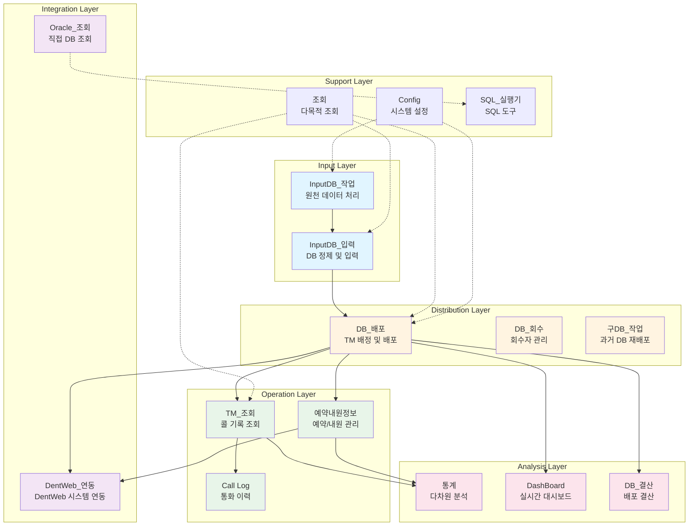
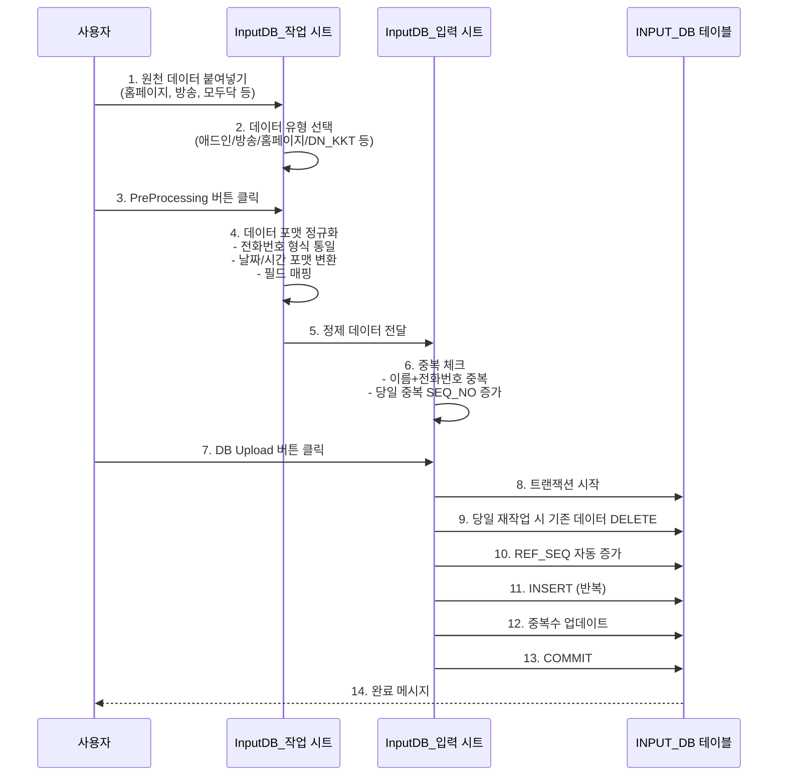
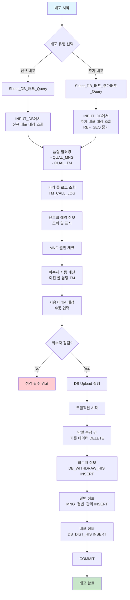
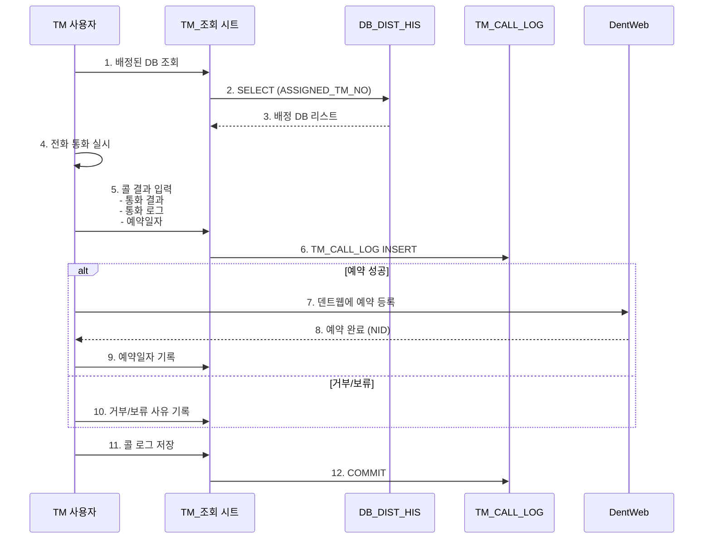
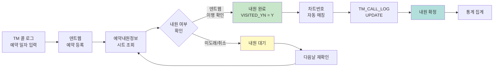
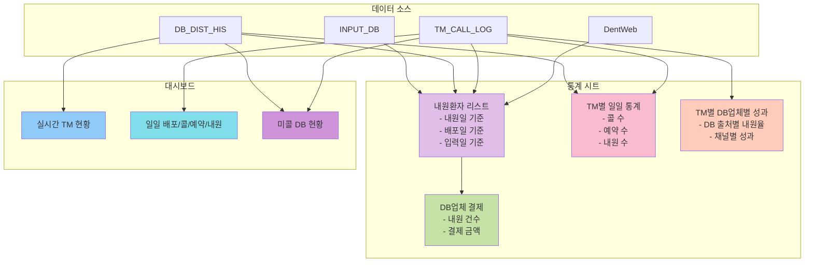
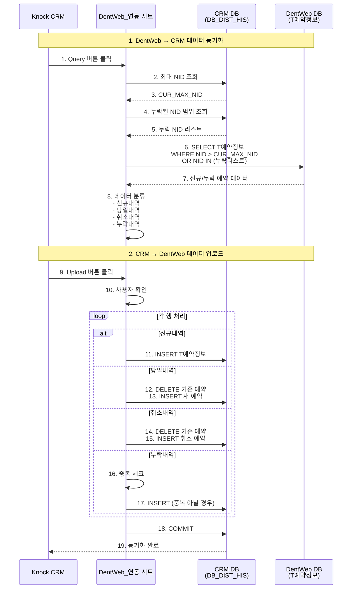

# Knock CRM master 분석 문서

## 1. 파일 개요

### 기본 정보
- **파일명**: Knock_CRM_mng_v.1.69_2_KLS_v2_master.xlsm
- **버전**: v.1.69_2_KLS_v2_master
- **목적**: 치과 CRM 마스터 관리 시스템 (원장님용)
- **총 라인 수**: 11,107 lines
- **대상 사용자**: 원장님
- **주요 기능**: 치과 고객 DB 입력, 배포, TM 콜 관리, 예약/내원 추적, 통계 분석

---

## 2. 전체 구조

### 시스템 아키텍처



---

### VBA 모듈 구성

| 모듈명             | 타입            | 주요 역할                |
| ------------------ | --------------- | ------------------------ |
| ThisWorkbook       | Workbook Class  | 워크북 초기화            |
| Sheet_조회         | Sheet Module    | 다목적 조회 기능         |
| Sheet_Config       | Sheet Module    | 사용자 및 코드 설정      |
| Sheet_DentWeb_연동 | Sheet Module    | 덴트웹 시스템 연동       |
| Sheet_DB_결산      | Sheet Module    | DB 배포 결산             |
| Sheet_DB_배포      | Sheet Module    | DB 배포 메인 모듈        |
| Sheet_InputDB_작업 | Sheet Module    | 원천 데이터 가공         |
| Sheet_InputDB_입력 | Sheet Module    | 정제된 DB 입력           |
| Sheet_구DB_작업    | Sheet Module    | 과거 DB 재처리           |
| Sheet_SQL_실행기   | Sheet Module    | SQL 직접 실행            |
| Sheet_DashBoard    | Sheet Module    | 실시간 대시보드          |
| Sheet_통계         | Sheet Module    | 통계 분석                |
| Sheet_DB업체_결제  | Sheet Module    | DB 업체 결제 조회        |
| Sheet_예약내원정보 | Sheet Module    | 예약/내원 관리           |
| Sheet_TM_조회2     | Sheet Module    | TM 콜 기록 조회          |
| Sheet_Oracle_조회  | Sheet Module    | Oracle 직접 조회         |
| Sheet_DB_검색      | Sheet Module    | DB 검색                  |
| DB_Agent           | Class Module    | 데이터베이스 연결 클래스 |
| SQL_Wrapper        | Standard Module | SQL 파라미터 처리        |
| Util               | Standard Module | 유틸리티 함수 모음       |
| Workbook_open      | Standard Module | 로그인 및 초기화         |
| Module3            | Standard Module | 매크로 보조              |

### Empty Sheet Classes (데이터 시트)

- Sheet2, Sheet4, Sheet5, Sheet6, Sheet7, Sheet8, Sheet9, Sheet10, Sheet11, Sheet14, Sheet15, Sheet16, Sheet17, Sheet18

---

## 3. Sub/Function 목록 (85개)

| #   | 함수/서브루틴명                                    | 유형             | 소속 모듈              | 주요 기능                      |
| --- | -------------------------------------------------- | ---------------- | ---------------------- | ------------------------------ |
| 1   | Workbook_open                                      | Private Sub      | ThisWorkbook           | 워크북 열기 이벤트             |
| 2   | Sheet_조회_Query                                   | Public Sub       | Sheet_조회             | 조회 메인 라우터               |
| 3   | Sheet_조회_DB_회수_내역_조회                       | Public Sub       | Sheet_조회             | DB 회수 내역 조회              |
| 4   | Sheet_조회_Call_Log_조회                           | Public Sub       | Sheet_조회             | 콜 로그 조회                   |
| 5   | Sheet_조회_연락처_history_전체_조회                | Public Sub       | Sheet_조회             | 연락처 전체 히스토리 조회      |
| 6   | Sheet_조회_DB_배포_내역_조회                       | Public Sub       | Sheet_조회             | DB 배포 내역 조회              |
| 7   | Sheet_조회_INPUT_DB_source별_입력시간_조회         | Public Sub       | Sheet_조회             | 채널별 입력 시간 조회          |
| 8   | Sheet_조회_INPUT_DB_내역_조회                      | Public Sub       | Sheet_조회             | INPUT DB 내역 조회             |
| 9   | Sheet_Config_Intialize                             | Public Sub       | Sheet_Config           | 설정 초기화 (코드/사용자)      |
| 10  | Sheet_DentWeb_연동_Clear                           | Public Sub       | Sheet_DentWeb_연동     | 화면 클리어                    |
| 11  | Sheet_DentWeb_연동_Query                           | Public Sub       | Sheet_DentWeb_연동     | 덴트웹 데이터 조회             |
| 12  | Sheet_DentWeb_연동_DB_Upload                       | Public Sub       | Sheet_DentWeb_연동     | 덴트웹 데이터 업로드           |
| 13  | Sheet_DB_결산_Clear                                | Public Sub       | Sheet_DB_결산          | 화면 클리어                    |
| 14  | Sheet_DB_결산_Query                                | Public Sub       | Sheet_DB_결산          | DB 결산 조회                   |
| 15  | Connect_DB                                         | Public Function  | DB_Agent               | DB 연결                        |
| 16  | Close_DB                                           | Private Function | DB_Agent               | DB 닫기                        |
| 17  | Select_DB                                          | Function         | DB_Agent               | SELECT 쿼리 실행               |
| 18  | Insert_update_DB                                   | Function         | DB_Agent               | INSERT/UPDATE 실행             |
| 19  | Class_Initialize                                   | Private Sub      | DB_Agent               | 클래스 생성자                  |
| 20  | Class_Terminate                                    | Private Sub      | DB_Agent               | 클래스 소멸자                  |
| 21  | Begin_Trans                                        | Public Function  | DB_Agent               | 트랜잭션 시작                  |
| 22  | Commit_Trans                                       | Public Function  | DB_Agent               | 트랜잭션 커밋                  |
| 23  | Rollback_Trans                                     | Public Function  | DB_Agent               | 트랜잭션 롤백                  |
| 24  | make_SQL                                           | Function         | SQL_Wrapper            | SQL 파라미터 바인딩            |
| 25  | Sheet_InputDB_작업_Clear_                          | Public Sub       | Sheet_InputDB_작업_old | 화면 클리어 (구버전)           |
| 26  | Sheet_InputDB_작업_PreProcessing_                  | Public Sub       | Sheet_InputDB_작업_old | 전처리 (구버전)                |
| 27  | Workbook_Initialize                                | Sub              | Workbook_open          | 로그인 및 초기화               |
| 28  | ADD_Date                                           | Public Function  | Util                   | 날짜 계산 (영업일 기준)        |
| 29  | Find_index_from_Collection                         | Public Function  | Util                   | 컬렉션 인덱스 찾기             |
| 30  | Cnvt_to_Date                                       | Public Function  | Util                   | 문자열 날짜 변환               |
| 31  | File_Exists                                        | Public Function  | Util                   | 파일 존재 여부 확인            |
| 32  | Get_Row_by_Find                                    | Public Function  | Util                   | 행 번호 찾기                   |
| 33  | Get_Row_num                                        | Public Function  | Util                   | 행 개수 세기                   |
| 34  | 목록리스트_추가                                    | Public Sub       | Util                   | 드롭다운 리스트 추가           |
| 35  | 이름_지정하기                                      | Public Sub       | Util                   | 범위 이름 지정                 |
| 36  | 복호화                                             | Public Sub       | Util                   | 파일 복사 (복호화)             |
| 37  | SET_PRINT_AREA                                     | Sub              | Util                   | 인쇄 영역 설정                 |
| 38  | 사용자용_파일_배포                                 | Public Sub       | Util                   | 사용자용 파일 생성             |
| 39  | Sheet_DB_배포_Clear                                | Public Sub       | Sheet_DB_배포          | 화면 클리어                    |
| 40  | Sheet_DB_배포_추가배포_Query                       | Public Sub       | Sheet_DB_배포          | 추가 배포 대상 조회            |
| 41  | Sheet_DB_배포_Query                                | Public Sub       | Sheet_DB_배포          | 배포 대상 조회                 |
| 42  | Sheet_DB_배포_DB_Upload                            | Public Sub       | Sheet_DB_배포          | DB 배포 업로드                 |
| 43  | Sheet_DB_배포_회수자_점검                          | Public Sub       | Sheet_DB_배포          | 회수자 자동 점검               |
| 44  | Sheet_DB_배포_구DB_참고자료만_조희                 | Public Sub       | Sheet_DB_배포          | 구DB 참고 자료 조회            |
| 45  | Sheet_InputDB_입력_Clear                           | Public Sub       | Sheet_InputDB_입력     | 화면 클리어                    |
| 46  | Sheet_InputDB_입력_DB_Upload                       | Public Sub       | Sheet_InputDB_입력     | INPUT DB 업로드                |
| 47  | Sheet_InputDB_작업_Clear                           | Public Sub       | Sheet_InputDB_작업     | 화면 클리어                    |
| 48  | Sheet_InputDB_작업_PreProcessing                   | Public Sub       | Sheet_InputDB_작업     | 데이터 전처리                  |
| 49  | Sheet_InputDB_작업_배포업무_일괄세팅하기           | Public Sub       | Sheet_InputDB_작업     | 배포 업무 일괄 세팅            |
| 50  | ProcessInsurance                                   | Private Sub      | Sheet_InputDB_작업     | 보험 임플 데이터 처리          |
| 51  | CalculateAgeFromYYYYMMDD                           | Function         | Sheet_InputDB_작업     | 생년월일로 나이 계산           |
| 52  | Sheet_구DB_작업_Clear                              | Public Sub       | Sheet_구DB_작업        | 화면 클리어                    |
| 53  | Sheet_구DB_작업_Query                              | Public Sub       | Sheet_구DB_작업        | 구DB 조회                      |
| 54  | Sheet_구DB_작업_DB배포시트_옮기기                  | Public Sub       | Sheet_구DB_작업        | DB 배포 시트로 이동            |
| 55  | Sheet_구DB_결번정보_DB_Upload                      | Public Sub       | Sheet_구DB_작업        | 결번 정보 업로드               |
| 56  | Sheet_SQL_실행기_Clear                             | Public Sub       | Sheet_SQL_실행기       | 화면 클리어                    |
| 57  | Sheet_SQL_실행기_Query                             | Public Sub       | Sheet_SQL_실행기       | SQL 실행                       |
| 58  | Sheet_DashBoard_Ref_Date_UP                        | Public Sub       | Sheet_DashBoard        | 기준일 증가                    |
| 59  | Sheet_DashBoard_Ref_Date_Down                      | Public Sub       | Sheet_DashBoard        | 기준일 감소                    |
| 60  | Sheet_DashBoard_Clear                              | Public Sub       | Sheet_DashBoard        | 화면 클리어                    |
| 61  | Sheet_DashBoard_Query                              | Public Sub       | Sheet_DashBoard        | 대시보드 조회                  |
| 62  | GetMissingCall                                     | Sub              | Sheet_DashBoard        | 미콜 정보 가져오기             |
| 63  | Sheet_통계_조회                                    | Public Sub       | Sheet_통계             | 통계 메인 조회                 |
| 64  | Sheet_통계_Clear                                   | Public Sub       | Sheet_통계             | 화면 클리어                    |
| 65  | Sheet_통계_내원환자_리스트_내원일_조회             | Public Sub       | Sheet_통계             | 내원 환자 리스트 (내원일 기준) |
| 66  | Sheet_통계_내원환자_리스트_배포일_조회             | Public Sub       | Sheet_통계             | 내원 환자 리스트 (배포일 기준) |
| 67  | Sheet_통계_TM별_일일_통계_조회                     | Public Sub       | Sheet_통계             | TM별 일일 통계                 |
| 68  | Sheet_통계_TM별_DB업체별_Performance_조회          | Public Sub       | Sheet_통계             | TM별 DB업체별 성과             |
| 69  | Sheet_통계_내원환자_리스트_inputdate_조회          | Public Sub       | Sheet_통계             | 내원 환자 리스트 (입력일 기준) |
| 70  | Sheet_통계_TM별_DB업체별_Performance_inputdate조회 | Public Sub       | Sheet_통계             | TM별 성과 (입력일 기준)        |
| 71  | 매크로1                                            | Sub              | Sheet_통계             | 매크로 1                       |
| 72  | 매크로3                                            | Sub              | Sheet_통계             | 매크로 3                       |
| 73  | Sheet_DB업체_결제_Clear                            | Public Sub       | Sheet_DB업체_결제      | 화면 클리어                    |
| 74  | Sheet_DB업체_결제_Query                            | Public Sub       | Sheet_DB업체_결제      | DB 업체 결제 조회              |
| 75  | Sheet_예약내원정보_Clear                           | Public Sub       | Sheet_예약내원정보     | 화면 클리어                    |
| 76  | Sheet_예약내원정보_Query                           | Public Sub       | Sheet_예약내원정보     | 예약/내원 정보 조회            |
| 77  | Sheet_예약내원정보_DB_Update                       | Public Sub       | Sheet_예약내원정보     | 내원 여부 업데이트             |
| 78  | Sheet_TM_조회_2_Clear                              | Public Sub       | Sheet_TM_조회2         | 화면 클리어                    |
| 79  | Sheet_TM_조회_2_Query                              | Public Sub       | Sheet_TM_조회2         | TM 과거 콜 로그 조회           |
| 80  | 매크로2                                            | Sub              | Module3                | 매크로 2                       |
| 81  | Sheet_Oracle_조회_Clear                            | Public Sub       | Sheet_Oracle_조회      | 화면 클리어                    |
| 82  | Sheet_Oracle_조회_Query                            | Public Sub       | Sheet_Oracle_조회      | Oracle 테이블 직접 조회        |
| 83  | Sheet_TM_CALL_LOG_DENTWEB_조회                     | Public Sub       | Sheet_Oracle_조회      | TM 콜로그+덴트웹 조회          |
| 84  | Sheet_DB_검색_Clear                                | Public Sub       | Sheet_DB_검색          | 화면 클리어                    |
| 85  | Sheet_DB_검색_구DB_참고자료만_조희                 | Public Sub       | Sheet_DB_검색          | DB 검색 (구DB 참조)            |

---

## 4. 주요 상수 및 전역 변수

### 4.1 Sheet별 상수

```vba
' Sheet_조회
Const This_Sheet_Name As String = "조회"
Public Const START_ROW_NUM As Integer = 8
Const MAX_ROW_NUM As Integer = 10000

' Sheet_DB_배포
Const This_Sheet_Name As String = "DB_배포"
Public Const START_ROW_NUM As Integer = 11
Const MAX_ROW_NUM As Integer = 15000

' Sheet_InputDB_작업
Const This_Sheet_Name As String = "InputDB_작업"
Const Target_Sheet_Name As String = "InputDB_입력"
Const START_ROW_NUM As Integer = 19
Const MAX_ROW_NUM As Integer = 5000

' Sheet_통계
Const This_Sheet_Name As String = "통계"
Public Const START_ROW_NUM As Integer = 8
Const MAX_ROW_NUM As Integer = 10000
```

### 4.2 DB 연결 정보 (DB_Agent 클래스)

```vba
' 실제 운영 DB 연결 문자열 (DSN 방식)
Private connect_str As String = "DSN=knock_crm_real;uid=knock_crm;pwd=kkptcmr!@34"

' DentWeb 연동용 (Direct 연결)
Private connect_str As String = "Provider=SQLOLEDB;" & _
                                "Data Source=192.168.0.245,1436;" & _
                                "Initial Catalog=DentWeb;" & _
                                "User ID=kkpt;" & _
                                "Password=kkpt12#$;"
```

---

## 5. DB 스키마 정보

### 5.1 주요 테이블 구조

#### 1. INPUT_DB (DB 입력 원천 테이블)

| 컬럼명             | 데이터 타입 | 설명                                     |
| ------------------ | ----------- | ---------------------------------------- |
| REF_DATE           | VARCHAR(8)  | 기준일자 (yyyyMMdd)                      |
| REF_SEQ            | INTEGER     | 입력회차                                 |
| SEQ_NO             | INTEGER     | 순번 (당일 중복 관리)                    |
| DB_SRC_1           | VARCHAR     | DB 출처 (1차: 홈페이지, 방송, 모두닥 등) |
| DB_SRC_2           | VARCHAR     | DB 출처 (2차: 세부 채널)                 |
| EVENT_TYPE         | VARCHAR     | 이벤트 유형                              |
| CLIENT_NAME        | VARCHAR     | 고객명                                   |
| PHONE_NO           | VARCHAR     | 전화번호 (Primary)                       |
| DB_INPUT_DATE      | VARCHAR(8)  | DB 입력일자                              |
| DB_INPUT_TIME      | VARCHAR(8)  | DB 입력시각                              |
| AGE                | INTEGER     | 나이                                     |
| GENDER             | VARCHAR(1)  | 성별 (M/F)                               |
| DB_MEMO_1          | VARCHAR     | 메모 1                                   |
| DB_MEMO_2          | VARCHAR     | 메모 2                                   |
| DB_MEMO_3          | VARCHAR     | 메모 3                                   |
| QUAL_MNG           | VARCHAR     | 관리 품질 평가                           |
| QUAL_TM            | VARCHAR     | TM 품질 평가                             |
| DUPL_CNT_1         | INTEGER     | 중복 횟수 1                              |
| DUPL_CNT_2         | INTEGER     | 중복 횟수 2                              |
| DUPL_LAST_DATE_1   | VARCHAR(8)  | 최근 중복일 1                            |
| DUPL_LAST_DATE_2   | VARCHAR(8)  | 최근 중복일 2                            |
| DUPL_LAST_DB_SRC_1 | VARCHAR     | 최근 중복 출처                           |
| ALT_USER_NO        | VARCHAR     | 작업자 번호                              |
| ALT_DATE           | VARCHAR(8)  | 작업일자                                 |
| ALT_TIME           | VARCHAR(8)  | 작업시각                                 |

#### 2. DB_DIST_HIS (DB 배포 이력 테이블)

| 컬럼명           | 데이터 타입 | 설명                                   |
| ---------------- | ----------- | -------------------------------------- |
| REF_DATE         | VARCHAR(8)  | 배포 기준일자                          |
| REF_SEQ          | INTEGER     | 배포회차                               |
| DB_SRC_1         | VARCHAR     | DB 출처 1                              |
| DB_SRC_2         | VARCHAR     | DB 출처 2                              |
| PHONE_NO         | VARCHAR     | 전화번호 (Primary)                     |
| ASSIGNED_TM_NO   | VARCHAR     | 배정된 TM 번호                         |
| ASSIGNED_TM_NAME | VARCHAR     | 배정된 TM 이름                         |
| CLIENT_NAME      | VARCHAR     | 고객명                                 |
| EVENT_TYPE       | VARCHAR     | 이벤트 유형                            |
| DB_INPUT_DATE    | VARCHAR(8)  | 원천 입력일자                          |
| DB_INPUT_TIME    | VARCHAR(8)  | 원천 입력시각                          |
| AGE              | INTEGER     | 나이                                   |
| GENDER           | VARCHAR(1)  | 성별                                   |
| DB_MEMO_1        | VARCHAR     | 메모 1                                 |
| DB_MEMO_2        | VARCHAR     | 메모 2                                 |
| DB_MEMO_3        | VARCHAR     | 메모 3                                 |
| ASSIGNED_STATUS  | VARCHAR     | 배포 상태 (배포완료/배포예정/배포안함) |
| INPUT_DB_QUAL    | VARCHAR     | Input DB 품질                          |
| IS_OLD_DB        | VARCHAR(1)  | 구DB 여부 (Y/N)                        |
| FOLLOWING_DB_SRC | VARCHAR     | 후속 DB 출처                           |
| MNG_MEMO         | VARCHAR     | 관리 메모                              |
| ALT_USER_NO      | VARCHAR     | 작업자 번호                            |
| ALT_DATE         | VARCHAR(8)  | 작업일자                               |
| ALT_TIME         | VARCHAR(8)  | 작업시각                               |
| INPUTDB_REF_DATE | VARCHAR(8)  | 원천 INPUT_DB 기준일                   |
| INPUTDB_REF_SEQ  | INTEGER     | 원천 INPUT_DB 회차                     |
| INPUTDB_SEQ_NO   | INTEGER     | 원천 INPUT_DB 순번                     |

#### 3. TM_CALL_LOG (TM 콜 로그 테이블)

| 컬럼명           | 데이터 타입 | 설명                          |
| ---------------- | ----------- | ----------------------------- |
| REF_DATE         | VARCHAR(8)  | 콜 기준일자                   |
| TM_NO            | VARCHAR     | TM 번호                       |
| TM_NAME          | VARCHAR     | TM 이름                       |
| DB_SRC_1         | VARCHAR     | DB 출처 1                     |
| DB_SRC_2         | VARCHAR     | DB 출처 2                     |
| PHONE_NO         | VARCHAR     | 전화번호 (Primary)            |
| SEQ_NO           | INTEGER     | 순번                          |
| CLIENT_NAME      | VARCHAR     | 고객명                        |
| CALL_RESULT      | VARCHAR     | 통화 결과 (예약/보류/거부 등) |
| CALL_LOG         | VARCHAR     | 통화 내용                     |
| RESERVATION_DATE | VARCHAR(8)  | 예약일자                      |
| CHART_NO         | VARCHAR     | 차트번호                      |
| VISITED_YN       | VARCHAR(1)  | 내원여부 (Y/N)                |
| VISITED_DATE     | VARCHAR(8)  | 내원일자                      |
| TREATMENT_INFO   | VARCHAR     | 진료정보                      |
| ALT_USER_NO      | VARCHAR     | 작업자 번호                   |
| ALT_DATE         | VARCHAR(8)  | 작업일자                      |
| ALT_TIME         | VARCHAR(8)  | 작업시각                      |

#### 4. DB_WITHDRAW_HIS (DB 회수 이력 테이블)

| 컬럼명      | 데이터 타입 | 설명           |
| ----------- | ----------- | -------------- |
| REF_DATE    | VARCHAR(8)  | 회수 기준일자  |
| PHONE_NO    | VARCHAR     | 전화번호       |
| TM_NO       | VARCHAR     | 회수자 TM 번호 |
| TM_NAME     | VARCHAR     | 회수자 TM 이름 |
| CLIENT_NAME | VARCHAR     | 고객명         |
| DB_SRC_1    | VARCHAR     | DB 출처 1      |
| DB_SRC_2    | VARCHAR     | DB 출처 2      |
| ALT_USER_NO | VARCHAR     | 작업자 번호    |
| ALT_DATE    | VARCHAR(8)  | 작업일자       |
| ALT_TIME    | VARCHAR(8)  | 작업시각       |

#### 5. MNG_결번_관리 (결번 관리 테이블)

| 컬럼명      | 데이터 타입 | 설명               |
| ----------- | ----------- | ------------------ |
| PHONE_NO    | VARCHAR     | 전화번호 (Primary) |
| CLIENT_NAME | VARCHAR     | 고객명             |
| MEMO        | VARCHAR     | 결번 사유          |
| ALT_USER_NO | VARCHAR     | 작업자 번호        |
| ALT_DATE    | VARCHAR(8)  | 등록일자           |
| ALT_TIME    | VARCHAR(8)  | 등록시각           |

#### 6. DentWeb 연동 테이블 (외부 시스템)

**DentWeb.dbo.T예약정보**

| 컬럼명        | 설명                            |
| ------------- | ------------------------------- |
| NID           | 예약 ID (Primary)               |
| 예약날짜      | 예약일자                        |
| 예약시각      | 예약시간                        |
| 작성날짜      | 작성일자                        |
| 작성시각      | 작성시간                        |
| N환자ID       | 환자 ID                         |
| 환자이름      | 환자명                          |
| 환자전화번호  | 전화번호                        |
| 차트번호      | 차트번호                        |
| N소요시간     | 소요시간                        |
| N예약종류     | 예약 종류                       |
| N이행현황     | 이행 현황 (미도래/이행/취소 등) |
| N담당의사     | 담당 의사                       |
| N담당직원     | 담당 직원                       |
| SZ예약내용    | 예약 내용                       |
| SZ메모        | 메모                            |
| T최종수정날짜 | 최종 수정일                     |
| T최종수정시각 | 최종 수정시간                   |

---

## 6. 핵심 비즈니스 로직 흐름

### 6.1 DB 입력 프로세스 (INPUT_DB)



**관련 함수 (master.vba)**

| 단계               | 함수                                                                                                                                                                                                                                                                                                                                                                                              | 설명                                   |
| ------------------ | ------------------------------------------------------------------------------------------------------------------------------------------------------------------------------------------------------------------------------------------------------------------------------------------------------------------------------------------------------------------------------------------------- | -------------------------------------- |
| 3 PreProcessing    | [`Sheet_InputDB_작업_PreProcessing`](https://github.com/KnockKnock-Dev/VBA/blob/main/src_extracted/Knock_CRM_mng_v.1.69_2_KLS_v2_master.vba#L4780)                                                                                                                                                                                                                                                | 원천 데이터 포맷 정규화                |
| 5 정제 데이터 전달 | [`Sheet_InputDB_작업_배포업무_일괄세팅하기`](https://github.com/KnockKnock-Dev/VBA/blob/main/src_extracted/Knock_CRM_mng_v.1.69_2_KLS_v2_master.vba#L7101)                                                                                                                                                                                                                                        | InputDB_입력 시트로 일괄 이관          |
| 7 DB Upload        | [`Sheet_InputDB_입력_DB_Upload`](https://github.com/KnockKnock-Dev/VBA/blob/main/src_extracted/Knock_CRM_mng_v.1.69_2_KLS_v2_master.vba#L4491)                                                                                                                                                                                                                                                    | INPUT_DB 테이블에 INSERT/트랜잭션 관리 |
| 7 화면 초기화      | [`Sheet_InputDB_입력_Clear`](https://github.com/KnockKnock-Dev/VBA/blob/main/src_extracted/Knock_CRM_mng_v.1.69_2_KLS_v2_master.vba#L4449)                                                                                                                                                                                                                                                        | 입력 시트 초기화                       |
| 8/13 트랜잭션      | [`Begin_Trans`](https://github.com/KnockKnock-Dev/VBA/blob/main/src_extracted/Knock_CRM_mng_v.1.69_2_KLS_v2_master.vba#L1631) / [`Commit_Trans`](https://github.com/KnockKnock-Dev/VBA/blob/main/src_extracted/Knock_CRM_mng_v.1.69_2_KLS_v2_master.vba#L1635) / [`Rollback_Trans`](https://github.com/KnockKnock-Dev/VBA/blob/main/src_extracted/Knock_CRM_mng_v.1.69_2_KLS_v2_master.vba#L1639) | DB_Agent 트랜잭션 제어                 |

### 6.2 DB 배포 프로세스 (DB_DIST_HIS)



**관련 함수 (master.vba)**

| 단계           | 함수                                                                                                                                           | 설명                                        |
| -------------- | ---------------------------------------------------------------------------------------------------------------------------------------------- | ------------------------------------------- |
| 신규 배포 조회 | [`Sheet_DB_배포_Query`](https://github.com/KnockKnock-Dev/VBA/blob/main/src_extracted/Knock_CRM_mng_v.1.69_2_KLS_v2_master.vba#L3002)          | INPUT_DB 기반 신규 배포 대상 조회           |
| 추가 배포 조회 | [`Sheet_DB_배포_추가배포_Query`](https://github.com/KnockKnock-Dev/VBA/blob/main/src_extracted/Knock_CRM_mng_v.1.69_2_KLS_v2_master.vba#L2551) | REF_SEQ 증가 기반 추가 배포 조회            |
| 회수자 점검    | [`Sheet_DB_배포_회수자_점검`](https://github.com/KnockKnock-Dev/VBA/blob/main/src_extracted/Knock_CRM_mng_v.1.69_2_KLS_v2_master.vba#L3984)    | 이전 담당 TM과 현재 배포 TM 비교            |
| DB Upload      | [`Sheet_DB_배포_DB_Upload`](https://github.com/KnockKnock-Dev/VBA/blob/main/src_extracted/Knock_CRM_mng_v.1.69_2_KLS_v2_master.vba#L3413)      | DB_DIST_HIS/DB_WITHDRAW_HIS/MNG_결번 INSERT |
| 화면 초기화    | [`Sheet_DB_배포_Clear`](https://github.com/KnockKnock-Dev/VBA/blob/main/src_extracted/Knock_CRM_mng_v.1.69_2_KLS_v2_master.vba#L2507)          | 배포 시트 초기화                            |

### 6.3 TM 콜 작업 프로세스 (TM_CALL_LOG)



**관련 함수 (master.vba)**

| 단계           | 함수                                                                                                                                                                                                                                                                                                                                                                                            | 설명                          |
| -------------- | ----------------------------------------------------------------------------------------------------------------------------------------------------------------------------------------------------------------------------------------------------------------------------------------------------------------------------------------------------------------------------------------------- | ----------------------------- |
| 1 배정 DB 조회 | [`Sheet_TM_조회_2_Query`](https://github.com/KnockKnock-Dev/VBA/blob/main/src_extracted/Knock_CRM_mng_v.1.69_2_KLS_v2_master.vba#L10293)                                                                                                                                                                                                                                                        | TM별 과거 콜 기록 조회        |
| 조회 초기화    | [`Sheet_TM_조회_2_Clear`](https://github.com/KnockKnock-Dev/VBA/blob/main/src_extracted/Knock_CRM_mng_v.1.69_2_KLS_v2_master.vba#L10253)                                                                                                                                                                                                                                                        | TM 조회 시트 초기화           |
| SQL 바인딩     | [`make_SQL`](https://github.com/KnockKnock-Dev/VBA/blob/main/src_extracted/Knock_CRM_mng_v.1.69_2_KLS_v2_master.vba#L1650)                                                                                                                                                                                                                                                                      | :param01 형식 파라미터 바인딩 |
| DB 연결/실행   | [`Connect_DB`](https://github.com/KnockKnock-Dev/VBA/blob/main/src_extracted/Knock_CRM_mng_v.1.69_2_KLS_v2_master.vba#L1515) / [`Select_DB`](https://github.com/KnockKnock-Dev/VBA/blob/main/src_extracted/Knock_CRM_mng_v.1.69_2_KLS_v2_master.vba#L1544) / [`Insert_update_DB`](https://github.com/KnockKnock-Dev/VBA/blob/main/src_extracted/Knock_CRM_mng_v.1.69_2_KLS_v2_master.vba#L1575) | DB_Agent 핵심 메서드          |

### 6.4 예약 및 내원 추적 프로세스



**관련 함수 (master.vba)**

| 단계               | 함수                                                                                                                                            | 설명                          |
| ------------------ | ----------------------------------------------------------------------------------------------------------------------------------------------- | ----------------------------- |
| 예약/내원 조회     | [`Sheet_예약내원정보_Query`](https://github.com/KnockKnock-Dev/VBA/blob/main/src_extracted/Knock_CRM_mng_v.1.69_2_KLS_v2_master.vba#L10055)     | DentWeb 예약 상태 조회        |
| 내원 여부 업데이트 | [`Sheet_예약내원정보_DB_Update`](https://github.com/KnockKnock-Dev/VBA/blob/main/src_extracted/Knock_CRM_mng_v.1.69_2_KLS_v2_master.vba#L10137) | VISITED_YN=Y, 차트번호 UPDATE |
| DentWeb 동기화     | [`Sheet_DentWeb_연동_Query`](https://github.com/KnockKnock-Dev/VBA/blob/main/src_extracted/Knock_CRM_mng_v.1.69_2_KLS_v2_master.vba#L888)       | DentWeb에서 예약 데이터 조회  |
| DentWeb 업로드     | [`Sheet_DentWeb_연동_DB_Upload`](https://github.com/KnockKnock-Dev/VBA/blob/main/src_extracted/Knock_CRM_mng_v.1.69_2_KLS_v2_master.vba#L1036)  | CRM DB에 예약 데이터 반영     |

### 6.5 통계 및 대시보드 집계



**관련 함수 (master.vba)**
| 단계                     | 함수                                                                                                                                                        | 설명                    |
| ------------------------ | ----------------------------------------------------------------------------------------------------------------------------------------------------------- | ----------------------- |
| 통계 라우터              | [`Sheet_통계_조회`](https://github.com/KnockKnock-Dev/VBA/blob/main/src_extracted/Knock_CRM_mng_v.1.69_2_KLS_v2_master.vba#L8617)                           | 통계 타입별 분기 처리   |
| 내원환자 리스트 (내원일) | [`Sheet_통계_내원환자_리스트_내원일_조회`](https://github.com/KnockKnock-Dev/VBA/blob/main/src_extracted/Knock_CRM_mng_v.1.69_2_KLS_v2_master.vba#L8699)    | 내원일 기준 환자 리스트 |
| TM별 일일 통계           | [`Sheet_통계_TM별_일일_통계_조회`](https://github.com/KnockKnock-Dev/VBA/blob/main/src_extracted/Knock_CRM_mng_v.1.69_2_KLS_v2_master.vba#L9039)            | TM별 일일 성과 집계     |
| TM별 DB업체 성과         | [`Sheet_통계_TM별_DB업체별_Performance_조회`](https://github.com/KnockKnock-Dev/VBA/blob/main/src_extracted/Knock_CRM_mng_v.1.69_2_KLS_v2_master.vba#L9216) | 채널별 성과 분석        |
| 대시보드 조회            | [`Sheet_DashBoard_Query`](https://github.com/KnockKnock-Dev/VBA/blob/main/src_extracted/Knock_CRM_mng_v.1.69_2_KLS_v2_master.vba#L7951)                     | 실시간 대시보드 집계    |
| 대시보드 초기화          | [`Sheet_DashBoard_Clear`](https://github.com/KnockKnock-Dev/VBA/blob/main/src_extracted/Knock_CRM_mng_v.1.69_2_KLS_v2_master.vba#L7911)                     | 대시보드 시트 초기화    |
| 미콜 조회                | [`GetMissingCall`](https://github.com/KnockKnock-Dev/VBA/blob/main/src_extracted/Knock_CRM_mng_v.1.69_2_KLS_v2_master.vba#L8529)                            | 미콜 DB 현황 집계       |
| DB업체 결제              | [`Sheet_DB업체_결제_Query`](https://github.com/KnockKnock-Dev/VBA/blob/main/src_extracted/Knock_CRM_mng_v.1.69_2_KLS_v2_master.vba#L9816)                   | 결제 정보 조회          |

---

## 7. DentWeb 연동 프로세스



**관련 함수 (master.vba)**
| 단계                  | 함수                                                                                                                                                                                                                                                                                                                                                                                              | 설명                                        |
| --------------------- | ------------------------------------------------------------------------------------------------------------------------------------------------------------------------------------------------------------------------------------------------------------------------------------------------------------------------------------------------------------------------------------------------- | ------------------------------------------- |
| Query (DentWeb → CRM) | [`Sheet_DentWeb_연동_Query`](https://github.com/KnockKnock-Dev/VBA/blob/main/src_extracted/Knock_CRM_mng_v.1.69_2_KLS_v2_master.vba#L888)                                                                                                                                                                                                                                                         | DentWeb T예약정보에서 신규/누락 데이터 조회 |
| Upload (CRM DB 반영)  | [`Sheet_DentWeb_연동_DB_Upload`](https://github.com/KnockKnock-Dev/VBA/blob/main/src_extracted/Knock_CRM_mng_v.1.69_2_KLS_v2_master.vba#L1036)                                                                                                                                                                                                                                                    | INSERT/DELETE 처리 및 트랜잭션 커밋         |
| 트랜잭션 제어         | [`Begin_Trans`](https://github.com/KnockKnock-Dev/VBA/blob/main/src_extracted/Knock_CRM_mng_v.1.69_2_KLS_v2_master.vba#L1631) / [`Commit_Trans`](https://github.com/KnockKnock-Dev/VBA/blob/main/src_extracted/Knock_CRM_mng_v.1.69_2_KLS_v2_master.vba#L1635) / [`Rollback_Trans`](https://github.com/KnockKnock-Dev/VBA/blob/main/src_extracted/Knock_CRM_mng_v.1.69_2_KLS_v2_master.vba#L1639) | DB_Agent 트랜잭션 제어                      |
| DB 연결               | [`Connect_DB`](https://github.com/KnockKnock-Dev/VBA/blob/main/src_extracted/Knock_CRM_mng_v.1.69_2_KLS_v2_master.vba#L1515)                                                                                                                                                                                                                                                                      | ODBC 연결 (CRM DB / DentWeb DB 분기)        |

---

## 8. 다른 파일들과의 차별점

### 8.1 v.1.69_2_KLS_v2_master vs. 이전 버전

| 구분             | 이전 버전 (v1.6x) | 현재 버전 (v1.69_2_KLS_v2)              |
| ---------------- | ----------------- | --------------------------------------- |
| **InputDB 처리** | 단일 시트 처리    | 작업 시트 + 입력 시트 분리 (2단계)      |
| **DB 배포**      | 단순 배포         | 추가 배포 기능, REF_SEQ 관리            |
| **회수자 관리**  | 수동 입력         | 자동 계산 + 회수자 점검                 |
| **DentWeb 연동** | 없음              | 양방향 동기화 (Query + Upload)          |
| **통계 기능**    | 기본 통계         | 다차원 통계 (내원일/배포일/입력일 기준) |
| **대시보드**     | 없음              | 실시간 대시보드 추가                    |
| **결번 관리**    | 수동 관리         | 자동 체크 및 MNG_결번_관리 테이블       |
| **Oracle 조회**  | 없음              | 직접 테이블 조회 기능                   |
| **보안**         | 단순 로그인       | 사용자 인증 + 권한 관리                 |

### 8.2 핵심 개선 사항

1. **데이터 품질 관리 강화**
   - QUAL_MNG, QUAL_TM 필드 추가
   - 중복 관리 (DUPL_CNT_1, DUPL_CNT_2)
   - 당일 중복 시 SEQ_NO 자동 증가

2. **배포 프로세스 개선**
   - REF_SEQ 회차 관리
   - 추가 배포 기능
   - 회수자 자동 계산
   - 당일 수정 기능

3. **DentWeb 시스템 통합**
   - 예약 정보 양방향 동기화
   - NID 기반 중복 방지
   - 이행 현황 자동 추적

4. **통계 분석 고도화**
   - 내원일/배포일/입력일 기준 다차원 분석
   - TM별 성과 분석
   - DB 업체별 성과 분석
   - DB 업체 결제 관리

5. **사용자 경험 개선**
   - 실시간 대시보드
   - 자동 필터링
   - 색상 코딩 (회수 DB, 콜 기록 등)
   - 미콜 DB 자동 추적

---

## 9. 시스템 주요 특징

### 9.1 강점

1. **완전한 워크플로우 관리**
   - DB 입력 → 배포 → 콜 → 예약 → 내원 → 통계까지 전 과정 통합

2. **데이터 품질 관리**
   - 중복 자동 감지 (DUPL_CNT_1, DUPL_CNT_2)
   - 품질 평가 (QUAL_MNG, QUAL_TM)
   - 결번 관리 (MNG_결번_관리)

3. **외부 시스템 연동**
   - DentWeb 양방향 동기화
   - 예약 정보 실시간 추적

4. **다차원 통계 분석**
   - 내원일/배포일/입력일 기준 분석
   - TM별 성과 분석
   - DB 업체별 ROI 분석

5. **자동화**
   - 회수자 자동 계산
   - REF_SEQ 자동 증가
   - 내원 여부 자동 매칭

### 9.2 제약 사항

1. **Excel 기반 시스템**
   - 동시 사용자 제한
   - 대용량 데이터 처리 성능

2. **수동 작업 포함**
   - TM 배정 (수동 입력)
   - 데이터 유형 선택

3. **보안**
   - DB 접속 정보 하드코딩
   - 사용자 권한 관리 제한적

---

## 10. 결론

**Knock CRM 마스터 관리 시스템 v.1.69_2_KLS_v2**는 치과 CRM을 위한 포괄적인 Excel 기반 관리 시스템으로, DB 입력부터 통계 분석까지 전 과정을 통합 관리합니다.

### 핵심 가치

- **통합성**: 모든 워크플로우를 하나의 시스템에서 관리
- **자동화**: 반복 작업 최소화 (회수자 계산, 중복 관리 등)
- **연동성**: DentWeb과 양방향 동기화
- **분석력**: 다차원 통계 및 실시간 대시보드

### 향후 개선 방향

- **웹 기반 시스템 전환**: 동시 사용자 지원, 성능 개선
- **API 연동**: DentWeb API 사용으로 실시간 동기화
- **권한 관리 고도화**: 역할 기반 접근 제어 (RBAC)
- **AI 활용**: TM 배정 자동화, 내원 예측 모델

---

**문서 작성일**: 2026-03-18
**분석자**: Claude Code
**시스템 버전**: v.1.69_2_KLS_v2_master
