# Knock CRM 시스템 종합 분석 - 전체 아키텍처 및 데이터 순환

## 📋 목차
1. [시스템 개요](#시스템-개요)
2. [전체 파일 구조](#전체-파일-구조)
3. [시스템 간 관계도](#시스템-간-관계도)
4. [데이터 순환 흐름](#데이터-순환-흐름)
5. [함수 호출 체인](#함수-호출-체인)
6. [사용자 여정 맵](#사용자-여정-맵)
7. [통합 데이터베이스 스키마](#통합-데이터베이스-스키마)

---

## 시스템 개요

### 전체 구성

Knock CRM은 치과 고객 관리를 위한 **다층 아키텍처 시스템**으로 구성되어 있습니다:

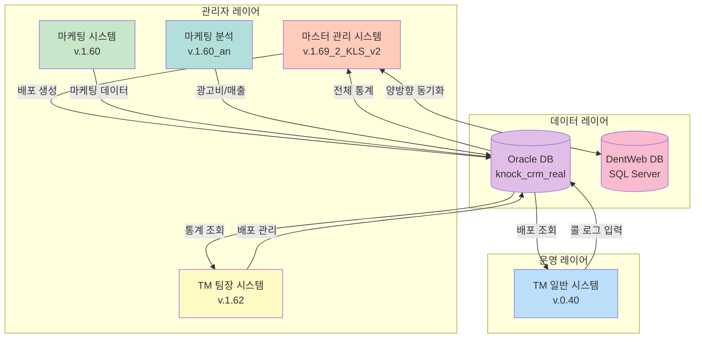
```mermaid
graph TB
    subgraph "관리자 레이어"
        MNG[마스터 관리 시스템<br/>v.1.69_2_KLS_v2]
        TMLEADER[TM 팀장 시스템<br/>v.1.62]
        MKT[마케팅 시스템<br/>v.1.60]
        MKTAN[마케팅 분석<br/>v.1.60_an]
    end

    subgraph "운영 레이어"
        TMGEN[TM 일반 시스템<br/>v.0.40]
    end

    subgraph "데이터 레이어"
        DB[(Oracle DB<br/>knock_crm_real)]
        DWDB[(DentWeb DB<br/>SQL Server)]
    end

    MNG -->|배포 생성| DB
    TMLEADER -->|배포 관리| DB
    MKT -->|마케팅 데이터| DB
    MKTAN -->|광고비/매출| DB

    TMGEN -->|콜 로그 입력| DB

    DB -->|배포 조회| TMGEN
    DB -->|통계 조회| TMLEADER
    DB -->|전체 통계| MNG

    MNG <-->|양방향 동기화| DWDB

    style MNG fill:#ffccbc
    style TMLEADER fill:#fff9c4
    style MKT fill:#c8e6c9
    style MKTAN fill:#b2dfdb
    style TMGEN fill:#bbdefb
    style DB fill:#e1bee7
    style DWDB fill:#f8bbd0
```

---

## 전체 파일 구조

### 파일별 주요 기능

| 파일명                                        | 버전   | 사용자        | 주요 기능                         | 라인 수 | 함수 수 |
| --------------------------------------------- | ------ | ------------- | --------------------------------- | ------- | ------- |
| **Knock_CRM_mng_v.1.69_2_KLS_v2_master.xlsm** | v.1.69 | 시스템 관리자 | DB 입력, 배포, 통계, DentWeb 연동 | 11,107  | 85      |
| **Knock_CRM_mng_v.1.62_5_TM_팀장.xlsm**       | v.1.62 | TM 팀장       | DB 배포 관리, TM 성과 분석        | ~10,000 | 80+     |
| **Knock_CRM_mng_v.1.60_Marketing.xlsm**       | v.1.60 | 마케팅 담당자 | 마케팅 DB 관리, 캠페인 분석       | 10,717  | 80+     |
| **Knock_CRM_mng_v.1.60_Marketing_an.xlsm**    | v.1.60 | 데이터 분석가 | 광고비, 매출 데이터 분석          | 470     | 7       |
| **Knock_CRM_TM_v.0.40_TM_일반.xlsm**          | v.0.40 | TM 일반       | 콜 수행, CRM 입력, 예약 관리      | 2,791   | 51      |

---

## 시스템 간 관계도

### 1. 전체 시스템 아키텍처

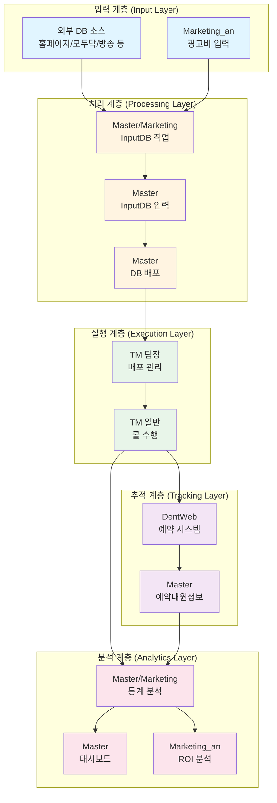
```mermaid
graph TB
    subgraph "입력 계층 (Input Layer)"
        A1[외부 DB 소스<br/>홈페이지/모두닥/방송 등]
        A2[Marketing_an<br/>광고비 입력]
    end

    subgraph "처리 계층 (Processing Layer)"
        B1[Master/Marketing<br/>InputDB 작업]
        B2[Master<br/>InputDB 입력]
        B3[Master<br/>DB 배포]
    end

    subgraph "실행 계층 (Execution Layer)"
        C1[TM 팀장<br/>배포 관리]
        C2[TM 일반<br/>콜 수행]
    end

    subgraph "추적 계층 (Tracking Layer)"
        D1[DentWeb<br/>예약 시스템]
        D2[Master<br/>예약내원정보]
    end

    subgraph "분석 계층 (Analytics Layer)"
        E1[Master/Marketing<br/>통계 분석]
        E2[Master<br/>대시보드]
        E3[Marketing_an<br/>ROI 분석]
    end

    A1 --> B1
    A2 --> B1
    B1 --> B2
    B2 --> B3
    B3 --> C1
    C1 --> C2
    C2 --> D1
    D1 --> D2
    C2 --> E1
    D2 --> E1
    E1 --> E2
    E1 --> E3

    style A1 fill:#e1f5ff
    style A2 fill:#e1f5ff
    style B1 fill:#fff4e1
    style B2 fill:#fff4e1
    style B3 fill:#fff4e1
    style C1 fill:#e8f5e9
    style C2 fill:#e8f5e9
    style D1 fill:#f3e5f5
    style D2 fill:#f3e5f5
    style E1 fill:#fce4ec
    style E2 fill:#fce4ec
    style E3 fill:#fce4ec
```

---

## 데이터 순환 흐름

### 전체 데이터 라이프사이클

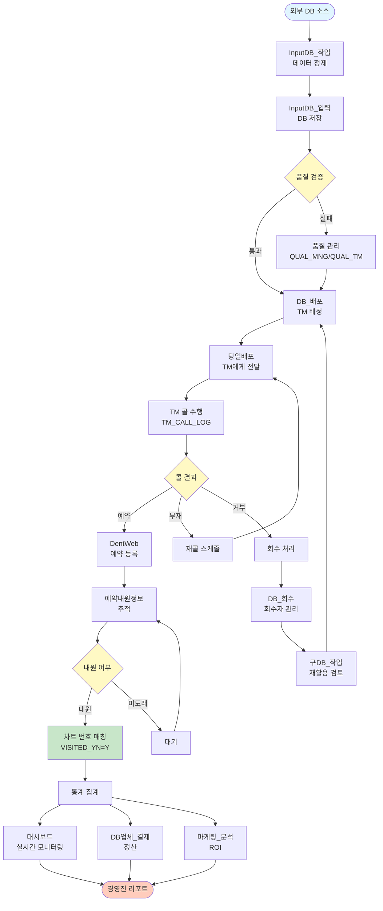
```mermaid
flowchart TB
    Start([외부 DB 소스]) --> A[InputDB_작업<br/>데이터 정제]

    A --> B[InputDB_입력<br/>DB 저장]

    B --> C{품질 검증}
    C -->|통과| D[DB_배포<br/>TM 배정]
    C -->|실패| E[품질 관리<br/>QUAL_MNG/QUAL_TM]
    E --> D

    D --> F[당일배포<br/>TM에게 전달]

    F --> G[TM 콜 수행<br/>TM_CALL_LOG]

    G --> H{콜 결과}
    H -->|예약| I[DentWeb<br/>예약 등록]
    H -->|부재| J[재콜 스케줄]
    H -->|거부| K[회수 처리]

    I --> L[예약내원정보<br/>추적]

    L --> M{내원 여부}
    M -->|내원| N[차트 번호 매칭<br/>VISITED_YN=Y]
    M -->|미도래| O[대기]

    N --> P[통계 집계]
    O --> L
    J --> F
    K --> Q[DB_회수<br/>회수자 관리]

    Q --> R[구DB_작업<br/>재활용 검토]
    R --> D

    P --> S[대시보드<br/>실시간 모니터링]
    P --> T[DB업체_결제<br/>정산]
    P --> U[마케팅_분석<br/>ROI]

    S --> V([경영진 리포트])
    T --> V
    U --> V

    style Start fill:#e1f5ff
    style C fill:#fff9c4
    style H fill:#fff9c4
    style M fill:#fff9c4
    style N fill:#c8e6c9
    style V fill:#ffccbc
```

---

## 함수 호출 체인

### 1. DB 입력 프로세스 함수 체인

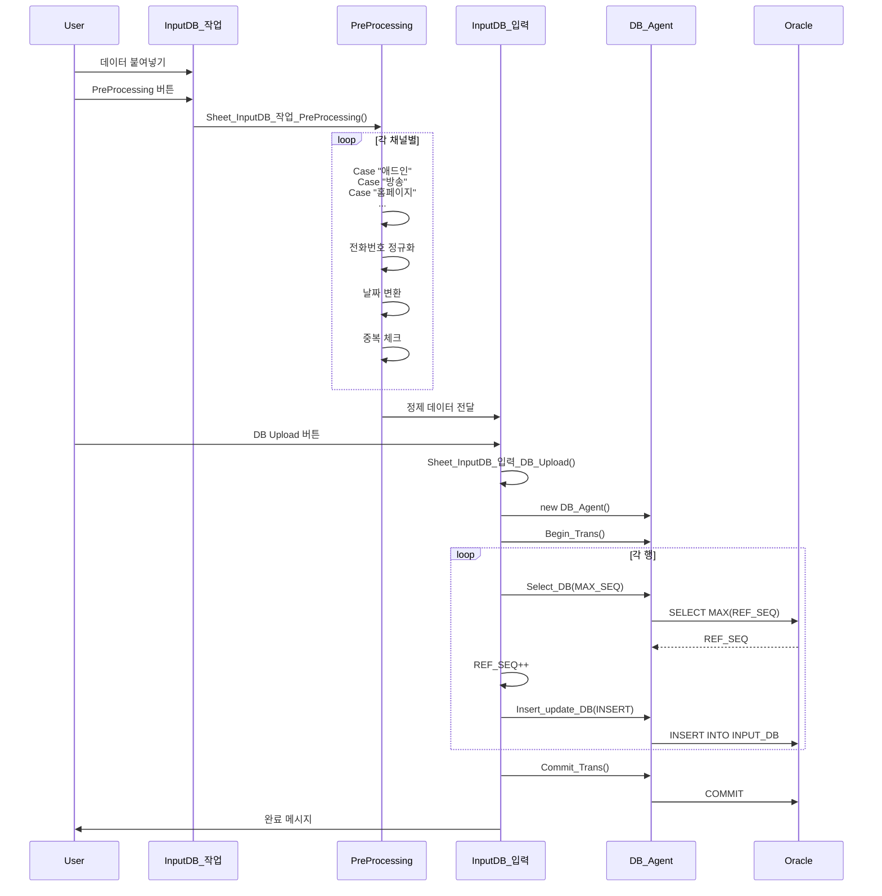
```mermaid
sequenceDiagram
    participant User
    participant Sheet as InputDB_작업
    participant Process as PreProcessing
    participant Target as InputDB_입력
    participant DB as DB_Agent
    participant Oracle

    User->>Sheet: 데이터 붙여넣기
    User->>Sheet: PreProcessing 버튼

    Sheet->>Process: Sheet_InputDB_작업_PreProcessing()

    loop 각 채널별
        Process->>Process: Case "애드인"<br/>Case "방송"<br/>Case "홈페이지"<br/>...
        Process->>Process: 전화번호 정규화
        Process->>Process: 날짜 변환
        Process->>Process: 중복 체크
    end

    Process->>Target: 정제 데이터 전달

    User->>Target: DB Upload 버튼
    Target->>Target: Sheet_InputDB_입력_DB_Upload()

    Target->>DB: new DB_Agent()
    Target->>DB: Begin_Trans()

    loop 각 행
        Target->>DB: Select_DB(MAX_SEQ)
        DB->>Oracle: SELECT MAX(REF_SEQ)
        Oracle-->>DB: REF_SEQ

        Target->>Target: REF_SEQ++

        Target->>DB: Insert_update_DB(INSERT)
        DB->>Oracle: INSERT INTO INPUT_DB
    end

    Target->>DB: Commit_Trans()
    DB->>Oracle: COMMIT

    Target->>User: 완료 메시지
```

**관련 함수**
| 함수                               | 파일   | 링크                                                                                                                  |
| ---------------------------------- | ------ | --------------------------------------------------------------------------------------------------------------------- |
| `Sheet_InputDB_작업_PreProcessing` | master | [L4780](https://github.com/KnockKnock-Dev/VBA/blob/main/src_extracted/Knock_CRM_mng_v.1.69_2_KLS_v2_master.vba#L4780) |
| `Sheet_InputDB_입력_DB_Upload`     | master | [L4491](https://github.com/KnockKnock-Dev/VBA/blob/main/src_extracted/Knock_CRM_mng_v.1.69_2_KLS_v2_master.vba#L4491) |
| `Begin_Trans`                      | master | [L1631](https://github.com/KnockKnock-Dev/VBA/blob/main/src_extracted/Knock_CRM_mng_v.1.69_2_KLS_v2_master.vba#L1631) |
| `Commit_Trans`                     | master | [L1635](https://github.com/KnockKnock-Dev/VBA/blob/main/src_extracted/Knock_CRM_mng_v.1.69_2_KLS_v2_master.vba#L1635) |
| `Insert_update_DB`                 | master | [L1575](https://github.com/KnockKnock-Dev/VBA/blob/main/src_extracted/Knock_CRM_mng_v.1.69_2_KLS_v2_master.vba#L1575) |

### 2. DB 배포 프로세스 함수 체인

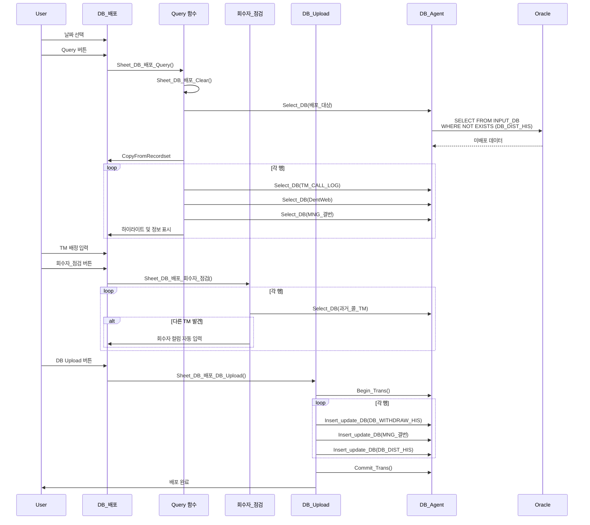
```mermaid
sequenceDiagram
    participant User
    participant Sheet as DB_배포
    participant Query as Query 함수
    participant Check as 회수자_점검
    participant Upload as DB_Upload
    participant DB as DB_Agent
    participant Oracle

    User->>Sheet: 날짜 선택
    User->>Sheet: Query 버튼

    Sheet->>Query: Sheet_DB_배포_Query()
    Query->>Query: Sheet_DB_배포_Clear()

    Query->>DB: Select_DB(배포_대상)
    DB->>Oracle: SELECT FROM INPUT_DB<br/>WHERE NOT EXISTS (DB_DIST_HIS)
    Oracle-->>DB: 미배포 데이터

    Query->>Sheet: CopyFromRecordset

    loop 각 행
        Query->>DB: Select_DB(TM_CALL_LOG)
        Query->>DB: Select_DB(DentWeb)
        Query->>DB: Select_DB(MNG_결번)
        Query->>Sheet: 하이라이트 및 정보 표시
    end

    User->>Sheet: TM 배정 입력
    User->>Sheet: 회수자_점검 버튼

    Sheet->>Check: Sheet_DB_배포_회수자_점검()

    loop 각 행
        Check->>DB: Select_DB(과거_콜_TM)
        alt 다른 TM 발견
            Check->>Sheet: 회수자 컬럼 자동 입력
        end
    end

    User->>Sheet: DB Upload 버튼
    Sheet->>Upload: Sheet_DB_배포_DB_Upload()

    Upload->>DB: Begin_Trans()

    loop 각 행
        Upload->>DB: Insert_update_DB(DB_WITHDRAW_HIS)
        Upload->>DB: Insert_update_DB(MNG_결번)
        Upload->>DB: Insert_update_DB(DB_DIST_HIS)
    end

    Upload->>DB: Commit_Trans()
    Upload->>User: 배포 완료
```

**관련 함수**
| 함수                           | 파일   | 링크                                                                                                                                                                                                                                          |
| ------------------------------ | ------ | --------------------------------------------------------------------------------------------------------------------------------------------------------------------------------------------------------------------------------------------- |
| `Sheet_DB_배포_Query`          | master | [L3002](https://github.com/KnockKnock-Dev/VBA/blob/main/src_extracted/Knock_CRM_mng_v.1.69_2_KLS_v2_master.vba#L3002)                                                                                                                         |
| `Sheet_DB_배포_회수자_점검`    | master | [L3984](https://github.com/KnockKnock-Dev/VBA/blob/main/src_extracted/Knock_CRM_mng_v.1.69_2_KLS_v2_master.vba#L3984)                                                                                                                         |
| `Sheet_DB_배포_DB_Upload`      | master | [L3413](https://github.com/KnockKnock-Dev/VBA/blob/main/src_extracted/Knock_CRM_mng_v.1.69_2_KLS_v2_master.vba#L3413)                                                                                                                         |
| `Begin_Trans` / `Commit_Trans` | master | [L1631](https://github.com/KnockKnock-Dev/VBA/blob/main/src_extracted/Knock_CRM_mng_v.1.69_2_KLS_v2_master.vba#L1631) / [L1635](https://github.com/KnockKnock-Dev/VBA/blob/main/src_extracted/Knock_CRM_mng_v.1.69_2_KLS_v2_master.vba#L1635) |

### 3. TM 콜 수행 프로세스 함수 체인

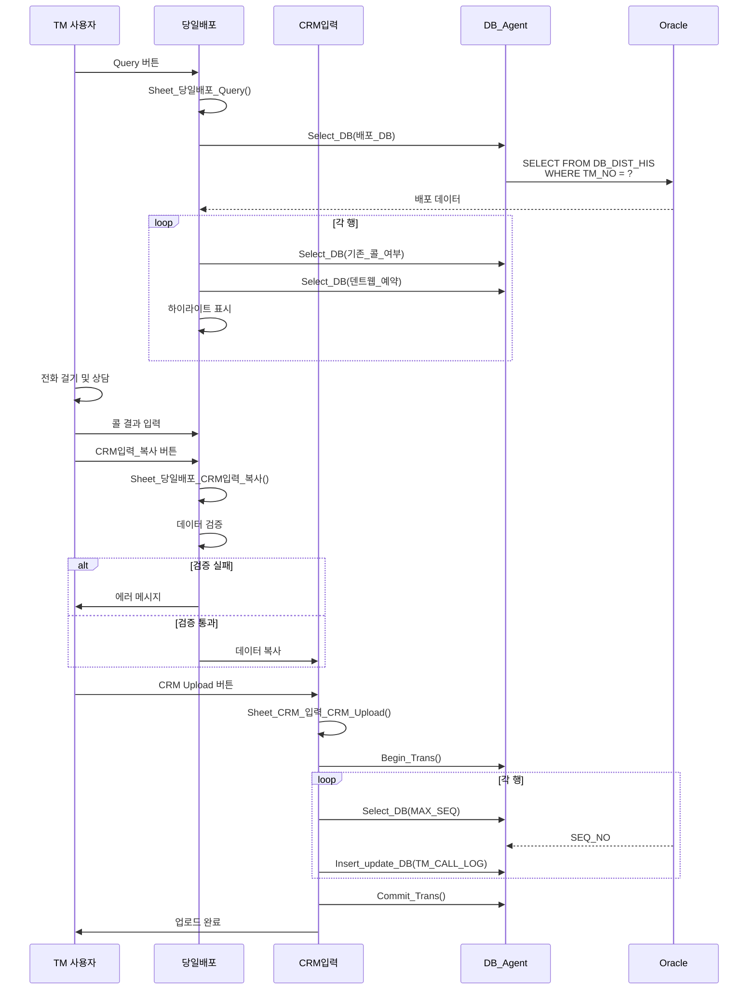
```mermaid
sequenceDiagram
    participant TM as TM 사용자
    participant 당일배포
    participant CRM입력
    participant DB as DB_Agent
    participant Oracle

    TM->>당일배포: Query 버튼
    당일배포->>당일배포: Sheet_당일배포_Query()
    당일배포->>DB: Select_DB(배포_DB)
    DB->>Oracle: SELECT FROM DB_DIST_HIS<br/>WHERE TM_NO = ?
    Oracle-->>당일배포: 배포 데이터

    loop 각 행
        당일배포->>DB: Select_DB(기존_콜_여부)
        당일배포->>DB: Select_DB(덴트웹_예약)
        당일배포->>당일배포: 하이라이트 표시
    end

    TM->>TM: 전화 걸기 및 상담
    TM->>당일배포: 콜 결과 입력

    TM->>당일배포: CRM입력_복사 버튼
    당일배포->>당일배포: Sheet_당일배포_CRM입력_복사()

    당일배포->>당일배포: 데이터 검증
    alt 검증 실패
        당일배포->>TM: 에러 메시지
    else 검증 통과
        당일배포->>CRM입력: 데이터 복사
    end

    TM->>CRM입력: CRM Upload 버튼
    CRM입력->>CRM입력: Sheet_CRM_입력_CRM_Upload()

    CRM입력->>DB: Begin_Trans()

    loop 각 행
        CRM입력->>DB: Select_DB(MAX_SEQ)
        Oracle-->>DB: SEQ_NO
        CRM입력->>DB: Insert_update_DB(TM_CALL_LOG)
    end

    CRM입력->>DB: Commit_Trans()
    CRM입력->>TM: 업로드 완료
```

**관련 함수**
| 함수                           | 파일    | 링크                                                                                                                                                                                                                                                    |
| ------------------------------ | ------- | ------------------------------------------------------------------------------------------------------------------------------------------------------------------------------------------------------------------------------------------------------- |
| `Sheet_당일배포_Query`         | TM_일반 | [L2156](https://github.com/KnockKnock-Dev/VBA/blob/main/src_extracted/Knock_CRM_TM_v.0.40_TM_%EC%9D%BC%EB%B0%98.vba#L2156)                                                                                                                              |
| `Sheet_당일배포_CRM입력_복사`  | TM_일반 | [L2320](https://github.com/KnockKnock-Dev/VBA/blob/main/src_extracted/Knock_CRM_TM_v.0.40_TM_%EC%9D%BC%EB%B0%98.vba#L2320)                                                                                                                              |
| `Sheet_CRM_입력_CRM_Upload`    | TM_일반 | [L420](https://github.com/KnockKnock-Dev/VBA/blob/main/src_extracted/Knock_CRM_TM_v.0.40_TM_%EC%9D%BC%EB%B0%98.vba#L420)                                                                                                                                |
| `Begin_Trans` / `Commit_Trans` | TM_일반 | [L1415](https://github.com/KnockKnock-Dev/VBA/blob/main/src_extracted/Knock_CRM_TM_v.0.40_TM_%EC%9D%BC%EB%B0%98.vba#L1415) / [L1419](https://github.com/KnockKnock-Dev/VBA/blob/main/src_extracted/Knock_CRM_TM_v.0.40_TM_%EC%9D%BC%EB%B0%98.vba#L1419) |

### 4. DentWeb 연동 프로세스 함수 체인

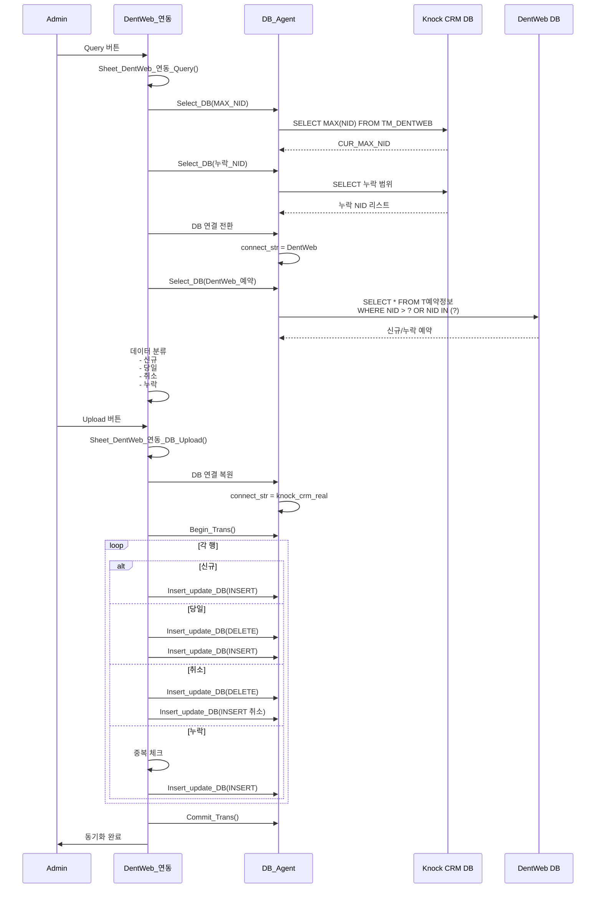
```mermaid
sequenceDiagram
    participant Admin
    participant Sheet as DentWeb_연동
    participant DB as DB_Agent
    participant CRM_DB as Knock CRM DB
    participant DW_DB as DentWeb DB

    Admin->>Sheet: Query 버튼
    Sheet->>Sheet: Sheet_DentWeb_연동_Query()

    Sheet->>DB: Select_DB(MAX_NID)
    DB->>CRM_DB: SELECT MAX(NID) FROM TM_DENTWEB
    CRM_DB-->>DB: CUR_MAX_NID

    Sheet->>DB: Select_DB(누락_NID)
    DB->>CRM_DB: SELECT 누락 범위
    CRM_DB-->>DB: 누락 NID 리스트

    Sheet->>DB: DB 연결 전환
    DB->>DB: connect_str = DentWeb

    Sheet->>DB: Select_DB(DentWeb_예약)
    DB->>DW_DB: SELECT * FROM T예약정보<br/>WHERE NID > ? OR NID IN (?)
    DW_DB-->>DB: 신규/누락 예약

    Sheet->>Sheet: 데이터 분류<br/>- 신규<br/>- 당일<br/>- 취소<br/>- 누락

    Admin->>Sheet: Upload 버튼
    Sheet->>Sheet: Sheet_DentWeb_연동_DB_Upload()

    Sheet->>DB: DB 연결 복원
    DB->>DB: connect_str = knock_crm_real

    Sheet->>DB: Begin_Trans()

    loop 각 행
        alt 신규
            Sheet->>DB: Insert_update_DB(INSERT)
        else 당일
            Sheet->>DB: Insert_update_DB(DELETE)
            Sheet->>DB: Insert_update_DB(INSERT)
        else 취소
            Sheet->>DB: Insert_update_DB(DELETE)
            Sheet->>DB: Insert_update_DB(INSERT 취소)
        else 누락
            Sheet->>Sheet: 중복 체크
            Sheet->>DB: Insert_update_DB(INSERT)
        end
    end

    Sheet->>DB: Commit_Trans()
    Sheet->>Admin: 동기화 완료
```

**관련 함수**
| 함수                           | 파일   | 링크                                                                                                                                                                                                                                          |
| ------------------------------ | ------ | --------------------------------------------------------------------------------------------------------------------------------------------------------------------------------------------------------------------------------------------- |
| `Sheet_DentWeb_연동_Query`     | master | [L888](https://github.com/KnockKnock-Dev/VBA/blob/main/src_extracted/Knock_CRM_mng_v.1.69_2_KLS_v2_master.vba#L888)                                                                                                                           |
| `Sheet_DentWeb_연동_DB_Upload` | master | [L1036](https://github.com/KnockKnock-Dev/VBA/blob/main/src_extracted/Knock_CRM_mng_v.1.69_2_KLS_v2_master.vba#L1036)                                                                                                                         |
| `Connect_DB`                   | master | [L1515](https://github.com/KnockKnock-Dev/VBA/blob/main/src_extracted/Knock_CRM_mng_v.1.69_2_KLS_v2_master.vba#L1515)                                                                                                                         |
| `Begin_Trans` / `Commit_Trans` | master | [L1631](https://github.com/KnockKnock-Dev/VBA/blob/main/src_extracted/Knock_CRM_mng_v.1.69_2_KLS_v2_master.vba#L1631) / [L1635](https://github.com/KnockKnock-Dev/VBA/blob/main/src_extracted/Knock_CRM_mng_v.1.69_2_KLS_v2_master.vba#L1635) |

### 5. 통계 및 분석 프로세스 함수 체인

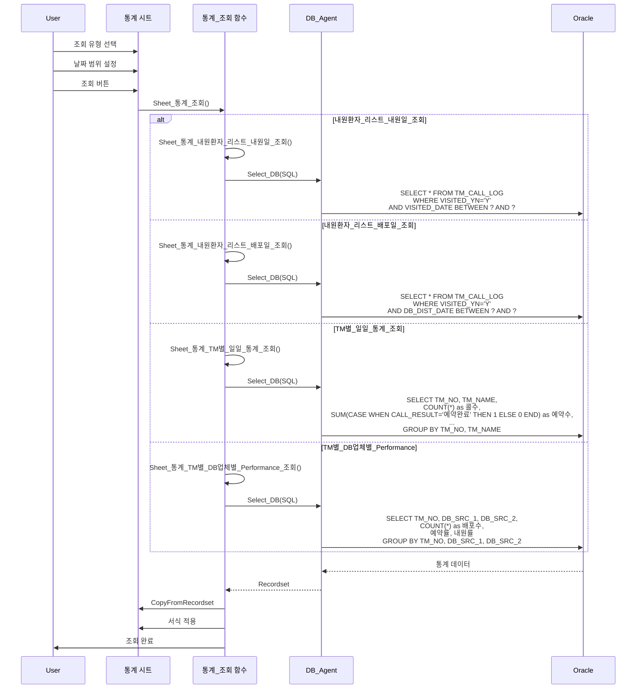
```mermaid
sequenceDiagram
    participant User
    participant 통계 as 통계 시트
    participant Query as 통계_조회 함수
    participant DB as DB_Agent
    participant Oracle

    User->>통계: 조회 유형 선택
    User->>통계: 날짜 범위 설정
    User->>통계: 조회 버튼

    통계->>Query: Sheet_통계_조회()

    alt 내원환자_리스트_내원일_조회
        Query->>Query: Sheet_통계_내원환자_리스트_내원일_조회()
        Query->>DB: Select_DB(SQL)
        DB->>Oracle: SELECT * FROM TM_CALL_LOG<br/>WHERE VISITED_YN='Y'<br/>AND VISITED_DATE BETWEEN ? AND ?
    else 내원환자_리스트_배포일_조회
        Query->>Query: Sheet_통계_내원환자_리스트_배포일_조회()
        Query->>DB: Select_DB(SQL)
        DB->>Oracle: SELECT * FROM TM_CALL_LOG<br/>WHERE VISITED_YN='Y'<br/>AND DB_DIST_DATE BETWEEN ? AND ?
    else TM별_일일_통계_조회
        Query->>Query: Sheet_통계_TM별_일일_통계_조회()
        Query->>DB: Select_DB(SQL)
        DB->>Oracle: SELECT TM_NO, TM_NAME,<br/>COUNT(*) as 콜수,<br/>SUM(CASE WHEN CALL_RESULT='예약완료' THEN 1 ELSE 0 END) as 예약수,<br/>...<br/>GROUP BY TM_NO, TM_NAME
    else TM별_DB업체별_Performance
        Query->>Query: Sheet_통계_TM별_DB업체별_Performance_조회()
        Query->>DB: Select_DB(SQL)
        DB->>Oracle: SELECT TM_NO, DB_SRC_1, DB_SRC_2,<br/>COUNT(*) as 배포수,<br/>예약률, 내원률<br/>GROUP BY TM_NO, DB_SRC_1, DB_SRC_2
    end

    Oracle-->>DB: 통계 데이터
    DB-->>Query: Recordset

    Query->>통계: CopyFromRecordset
    Query->>통계: 서식 적용
    Query->>User: 조회 완료
```

**관련 함수**
| 함수                                        | 파일   | 링크                                                                                                                  |
| ------------------------------------------- | ------ | --------------------------------------------------------------------------------------------------------------------- |
| `Sheet_통계_조회`                           | master | [L8617](https://github.com/KnockKnock-Dev/VBA/blob/main/src_extracted/Knock_CRM_mng_v.1.69_2_KLS_v2_master.vba#L8617) |
| `Sheet_통계_내원환자_리스트_내원일_조회`    | master | [L8699](https://github.com/KnockKnock-Dev/VBA/blob/main/src_extracted/Knock_CRM_mng_v.1.69_2_KLS_v2_master.vba#L8699) |
| `Sheet_통계_TM별_일일_통계_조회`            | master | [L9039](https://github.com/KnockKnock-Dev/VBA/blob/main/src_extracted/Knock_CRM_mng_v.1.69_2_KLS_v2_master.vba#L9039) |
| `Sheet_통계_TM별_DB업체별_Performance_조회` | master | [L9216](https://github.com/KnockKnock-Dev/VBA/blob/main/src_extracted/Knock_CRM_mng_v.1.69_2_KLS_v2_master.vba#L9216) |
| `Select_DB`                                 | master | [L1544](https://github.com/KnockKnock-Dev/VBA/blob/main/src_extracted/Knock_CRM_mng_v.1.69_2_KLS_v2_master.vba#L1544) |

---

## 사용자 여정 맵

### 1. 관리자 일일 워크플로우

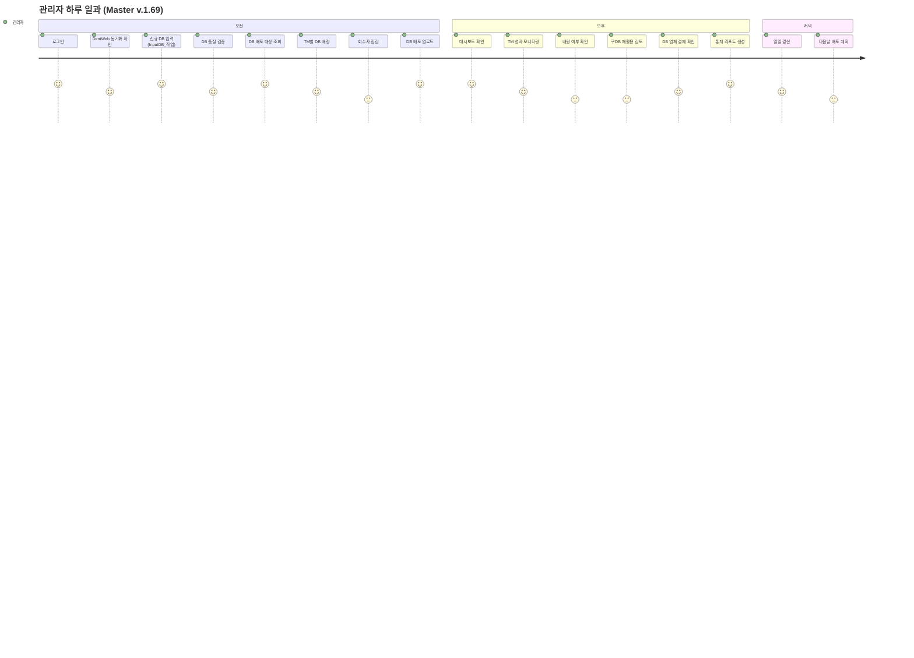
```mermaid
journey
    title 관리자 하루 일과 (Master v.1.69)
    section 오전
      로그인: 5: 관리자
      DentWeb 동기화 확인: 4: 관리자
      신규 DB 입력 (InputDB_작업): 5: 관리자
      DB 품질 검증: 4: 관리자
      DB 배포 대상 조회: 5: 관리자
      TM별 DB 배정: 4: 관리자
      회수자 점검: 3: 관리자
      DB 배포 업로드: 5: 관리자
    section 오후
      대시보드 확인: 5: 관리자
      TM 성과 모니터링: 4: 관리자
      내원 여부 확인: 3: 관리자
      구DB 재활용 검토: 3: 관리자
      DB 업체 결제 확인: 4: 관리자
      통계 리포트 생성: 5: 관리자
    section 저녁
      일일 결산: 4: 관리자
      다음날 배포 계획: 3: 관리자
```

### 2. TM 일반 일일 워크플로우

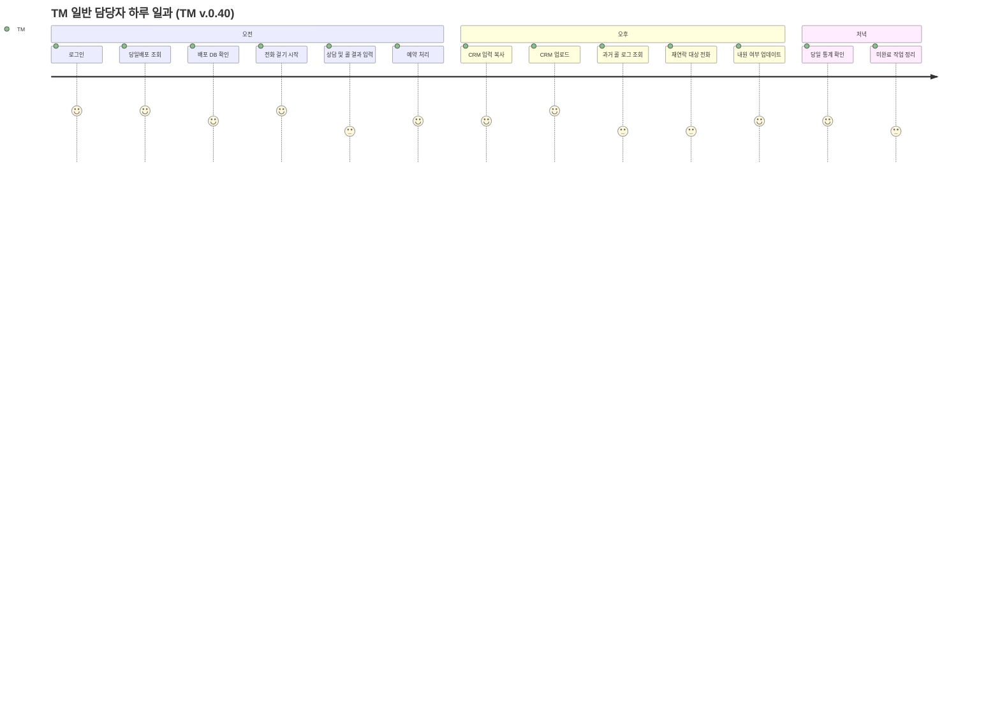
```mermaid
journey
    title TM 일반 담당자 하루 일과 (TM v.0.40)
    section 오전
      로그인: 5: TM
      당일배포 조회: 5: TM
      배포 DB 확인: 4: TM
      전화 걸기 시작: 5: TM
      상담 및 콜 결과 입력: 3: TM
      예약 처리: 4: TM
    section 오후
      CRM 입력 복사: 4: TM
      CRM 업로드: 5: TM
      과거 콜 로그 조회: 3: TM
      재연락 대상 전화: 3: TM
      내원 여부 업데이트: 4: TM
    section 저녁
      당일 통계 확인: 4: TM
      미완료 작업 정리: 3: TM
```

### 3. 마케팅 담당자 워크플로우

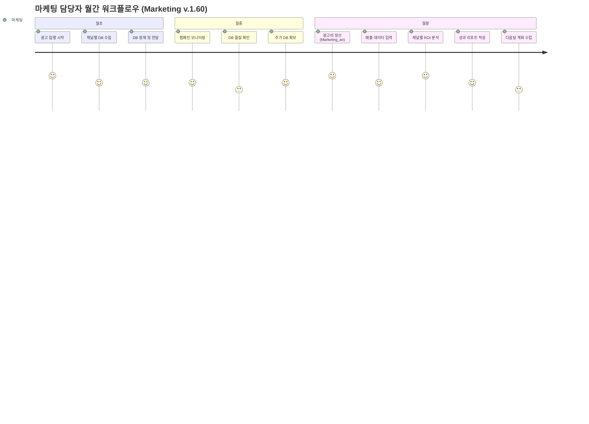
```mermaid
journey
    title 마케팅 담당자 월간 워크플로우 (Marketing v.1.60)
    section 월초
      광고 집행 시작: 5: 마케팅
      채널별 DB 수집: 4: 마케팅
      DB 정제 및 전달: 4: 마케팅
    section 월중
      캠페인 모니터링: 4: 마케팅
      DB 품질 확인: 3: 마케팅
      추가 DB 확보: 4: 마케팅
    section 월말
      광고비 정산 (Marketing_an): 5: 마케팅
      매출 데이터 입력: 4: 마케팅
      채널별 ROI 분석: 5: 마케팅
      성과 리포트 작성: 4: 마케팅
      다음달 계획 수립: 3: 마케팅
```

---

## 통합 데이터베이스 스키마

### 전체 ERD (Entity Relationship Diagram)

```mermaid
erDiagram
    INPUT_DB ||--o{ DB_DIST_HIS : "배포"
    DB_DIST_HIS ||--o{ TM_CALL_LOG : "콜 수행"
    TM_CALL_LOG ||--o| TM_DENTWEB : "예약 매칭"
    TM_CALL_LOG ||--o{ DB_WITHDRAW_HIS : "회수"
    USER_INFO ||--o{ TM_CALL_LOG : "담당"
    USER_INFO ||--o{ DB_DIST_HIS : "배정"
    MNG_결번_관리 ||--o{ INPUT_DB : "필터링"
    AD_COST_COMPANY ||--o{ CHART_SALES_STATUS : "ROI 계산"

    INPUT_DB {
        varchar REF_DATE PK
        int REF_SEQ PK
        int SEQ_NO PK
        varchar DB_SRC_1
        varchar DB_SRC_2
        varchar EVENT_TYPE
        varchar CLIENT_NAME
        varchar PHONE_NO
        varchar DB_INPUT_DATE
        int DUPL_CNT_1
        int DUPL_CNT_2
        varchar QUAL_MNG
        varchar QUAL_TM
    }

    DB_DIST_HIS {
        varchar REF_DATE PK
        int REF_SEQ PK
        varchar PHONE_NO PK
        varchar ASSIGNED_TM_NO FK
        varchar ASSIGNED_TM_NAME
        varchar CLIENT_NAME
        varchar DB_SRC_1
        varchar DB_SRC_2
        varchar ASSIGNED_STATUS
        varchar IS_OLD_DB
        varchar INPUTDB_REF_DATE FK
        int INPUTDB_REF_SEQ FK
        int INPUTDB_SEQ_NO FK
    }

    TM_CALL_LOG {
        varchar REF_DATE PK
        varchar TM_NO PK FK
        varchar DB_SRC_2 PK
        varchar PHONE_NO PK
        int SEQ_NO PK
        varchar TM_NAME
        varchar CLIENT_NAME
        varchar CALL_RESULT
        varchar CALL_LOG
        varchar RESERV_DATE
        varchar VISITED_YN
        varchar CHART_NO
        varchar DB_DIST_DATE FK
    }

    TM_DENTWEB {
        int NID PK
        date 예약날짜
        time 예약시각
        varchar 환자이름
        varchar 환자전화번호
        varchar 차트번호
        varchar N이행현황
    }

    USER_INFO {
        varchar USER_NO PK
        varchar USER_NAME
        varchar USER_PASS
        varchar USER_TYPE
    }

    DB_WITHDRAW_HIS {
        varchar REF_DATE PK
        varchar PHONE_NO PK
        varchar TM_NO FK
        varchar TM_NAME
        varchar CLIENT_NAME
        varchar DB_SRC_1
        varchar DB_SRC_2
    }

    MNG_결번_관리 {
        varchar PHONE_NO PK
        varchar CLIENT_NAME
        varchar MEMO
    }

    AD_COST_COMPANY {
        varchar DB_INPUT_DATE PK
        varchar DB_SRC_1 PK
        varchar DB_SRC_2 PK
        varchar EVENT PK
        decimal AD_COST
    }

    CHART_SALES_STATUS {
        varchar INPUT_DATE PK
        varchar CHART_NO PK
        varchar CLIENT_NAME
        varchar PHONE_NO
        decimal CONSENT_SALES
    }
```

### 주요 테이블 간 데이터 흐름

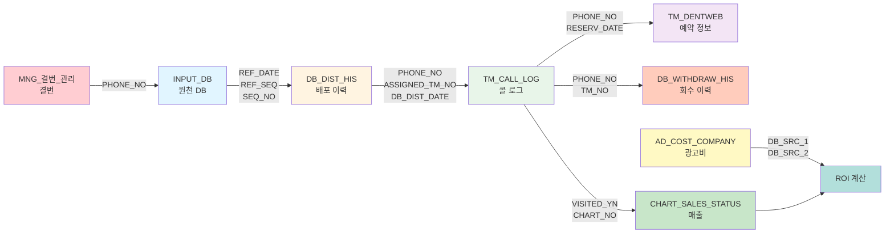
```mermaid
graph LR
    A[INPUT_DB<br/>원천 DB] -->|REF_DATE<br/>REF_SEQ<br/>SEQ_NO| B[DB_DIST_HIS<br/>배포 이력]

    B -->|PHONE_NO<br/>ASSIGNED_TM_NO<br/>DB_DIST_DATE| C[TM_CALL_LOG<br/>콜 로그]

    C -->|PHONE_NO<br/>RESERV_DATE| D[TM_DENTWEB<br/>예약 정보]

    C -->|PHONE_NO<br/>TM_NO| E[DB_WITHDRAW_HIS<br/>회수 이력]

    C -->|VISITED_YN<br/>CHART_NO| F[CHART_SALES_STATUS<br/>매출]

    G[AD_COST_COMPANY<br/>광고비] -->|DB_SRC_1<br/>DB_SRC_2| H[ROI 계산]

    F --> H

    I[MNG_결번_관리<br/>결번] -->|PHONE_NO| A

    style A fill:#e1f5ff
    style B fill:#fff4e1
    style C fill:#e8f5e9
    style D fill:#f3e5f5
    style E fill:#ffccbc
    style F fill:#c8e6c9
    style G fill:#fff9c4
    style H fill:#b2dfdb
    style I fill:#ffcdd2
```

---

## 핵심 함수 호출 관계

### 마스터 시스템 핵심 함수 맵

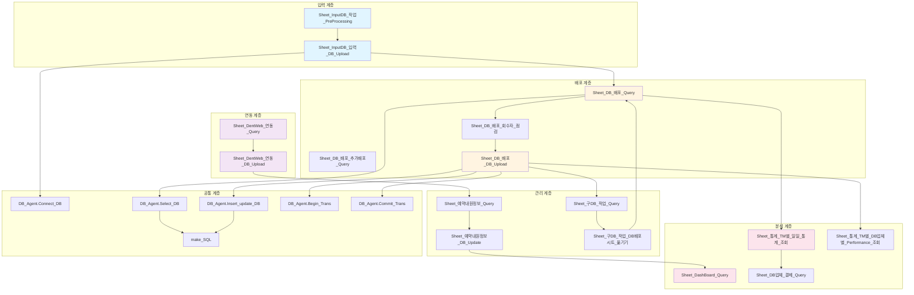
```mermaid
graph TB
    subgraph "입력 계층"
        F1[Sheet_InputDB_작업_PreProcessing]
        F2[Sheet_InputDB_입력_DB_Upload]
    end

    subgraph "배포 계층"
        F3[Sheet_DB_배포_Query]
        F4[Sheet_DB_배포_추가배포_Query]
        F5[Sheet_DB_배포_회수자_점검]
        F6[Sheet_DB_배포_DB_Upload]
    end

    subgraph "연동 계층"
        F7[Sheet_DentWeb_연동_Query]
        F8[Sheet_DentWeb_연동_DB_Upload]
    end

    subgraph "관리 계층"
        F9[Sheet_예약내원정보_Query]
        F10[Sheet_예약내원정보_DB_Update]
        F11[Sheet_구DB_작업_Query]
        F12[Sheet_구DB_작업_DB배포시트_옮기기]
    end

    subgraph "분석 계층"
        F13[Sheet_통계_TM별_일일_통계_조회]
        F14[Sheet_통계_TM별_DB업체별_Performance_조회]
        F15[Sheet_DashBoard_Query]
        F16[Sheet_DB업체_결제_Query]
    end

    subgraph "공통 계층"
        F17[DB_Agent.Connect_DB]
        F18[DB_Agent.Select_DB]
        F19[DB_Agent.Insert_update_DB]
        F20[DB_Agent.Begin_Trans]
        F21[DB_Agent.Commit_Trans]
        F22[make_SQL]
    end

    F1 --> F2
    F2 --> F3
    F3 --> F5
    F5 --> F6
    F6 --> F11
    F11 --> F12
    F12 --> F3

    F7 --> F8
    F8 --> F9
    F9 --> F10

    F3 --> F13
    F6 --> F14
    F10 --> F15
    F13 --> F16

    F2 --> F17
    F3 --> F18
    F6 --> F19
    F6 --> F20
    F6 --> F21
    F18 --> F22
    F19 --> F22

    style F1 fill:#e1f5ff
    style F2 fill:#e1f5ff
    style F3 fill:#fff4e1
    style F6 fill:#fff4e1
    style F7 fill:#f3e5f5
    style F8 fill:#f3e5f5
    style F13 fill:#fce4ec
    style F15 fill:#fce4ec
```

**관련 함수 (master.vba) — permalink**
| 함수                                        | 링크                                                                                                                    |
| ------------------------------------------- | ----------------------------------------------------------------------------------------------------------------------- |
| `Sheet_InputDB_작업_PreProcessing`          | [L4780](https://github.com/KnockKnock-Dev/VBA/blob/main/src_extracted/Knock_CRM_mng_v.1.69_2_KLS_v2_master.vba#L4780)   |
| `Sheet_InputDB_입력_DB_Upload`              | [L4491](https://github.com/KnockKnock-Dev/VBA/blob/main/src_extracted/Knock_CRM_mng_v.1.69_2_KLS_v2_master.vba#L4491)   |
| `Sheet_DB_배포_Query`                       | [L3002](https://github.com/KnockKnock-Dev/VBA/blob/main/src_extracted/Knock_CRM_mng_v.1.69_2_KLS_v2_master.vba#L3002)   |
| `Sheet_DB_배포_추가배포_Query`              | [L2551](https://github.com/KnockKnock-Dev/VBA/blob/main/src_extracted/Knock_CRM_mng_v.1.69_2_KLS_v2_master.vba#L2551)   |
| `Sheet_DB_배포_회수자_점검`                 | [L3984](https://github.com/KnockKnock-Dev/VBA/blob/main/src_extracted/Knock_CRM_mng_v.1.69_2_KLS_v2_master.vba#L3984)   |
| `Sheet_DB_배포_DB_Upload`                   | [L3413](https://github.com/KnockKnock-Dev/VBA/blob/main/src_extracted/Knock_CRM_mng_v.1.69_2_KLS_v2_master.vba#L3413)   |
| `Sheet_DentWeb_연동_Query`                  | [L888](https://github.com/KnockKnock-Dev/VBA/blob/main/src_extracted/Knock_CRM_mng_v.1.69_2_KLS_v2_master.vba#L888)     |
| `Sheet_DentWeb_연동_DB_Upload`              | [L1036](https://github.com/KnockKnock-Dev/VBA/blob/main/src_extracted/Knock_CRM_mng_v.1.69_2_KLS_v2_master.vba#L1036)   |
| `Sheet_예약내원정보_Query`                  | [L10055](https://github.com/KnockKnock-Dev/VBA/blob/main/src_extracted/Knock_CRM_mng_v.1.69_2_KLS_v2_master.vba#L10055) |
| `Sheet_예약내원정보_DB_Update`              | [L10137](https://github.com/KnockKnock-Dev/VBA/blob/main/src_extracted/Knock_CRM_mng_v.1.69_2_KLS_v2_master.vba#L10137) |
| `Sheet_구DB_작업_Query`                     | [L10293](https://github.com/KnockKnock-Dev/VBA/blob/main/src_extracted/Knock_CRM_mng_v.1.69_2_KLS_v2_master.vba#L10293) |
| `Sheet_통계_TM별_일일_통계_조회`            | [L9039](https://github.com/KnockKnock-Dev/VBA/blob/main/src_extracted/Knock_CRM_mng_v.1.69_2_KLS_v2_master.vba#L9039)   |
| `Sheet_통계_TM별_DB업체별_Performance_조회` | [L9216](https://github.com/KnockKnock-Dev/VBA/blob/main/src_extracted/Knock_CRM_mng_v.1.69_2_KLS_v2_master.vba#L9216)   |
| `Sheet_DashBoard_Query`                     | [L7951](https://github.com/KnockKnock-Dev/VBA/blob/main/src_extracted/Knock_CRM_mng_v.1.69_2_KLS_v2_master.vba#L7951)   |
| `Sheet_DB업체_결제_Query`                   | [L9816](https://github.com/KnockKnock-Dev/VBA/blob/main/src_extracted/Knock_CRM_mng_v.1.69_2_KLS_v2_master.vba#L9816)   |
| `Connect_DB`                                | [L1515](https://github.com/KnockKnock-Dev/VBA/blob/main/src_extracted/Knock_CRM_mng_v.1.69_2_KLS_v2_master.vba#L1515)   |
| `Select_DB`                                 | [L1544](https://github.com/KnockKnock-Dev/VBA/blob/main/src_extracted/Knock_CRM_mng_v.1.69_2_KLS_v2_master.vba#L1544)   |
| `Insert_update_DB`                          | [L1575](https://github.com/KnockKnock-Dev/VBA/blob/main/src_extracted/Knock_CRM_mng_v.1.69_2_KLS_v2_master.vba#L1575)   |
| `Begin_Trans`                               | [L1631](https://github.com/KnockKnock-Dev/VBA/blob/main/src_extracted/Knock_CRM_mng_v.1.69_2_KLS_v2_master.vba#L1631)   |
| `Commit_Trans`                              | [L1635](https://github.com/KnockKnock-Dev/VBA/blob/main/src_extracted/Knock_CRM_mng_v.1.69_2_KLS_v2_master.vba#L1635)   |
| `make_SQL`                                  | [L1650](https://github.com/KnockKnock-Dev/VBA/blob/main/src_extracted/Knock_CRM_mng_v.1.69_2_KLS_v2_master.vba#L1650)   |

### TM 일반 시스템 핵심 함수 맵

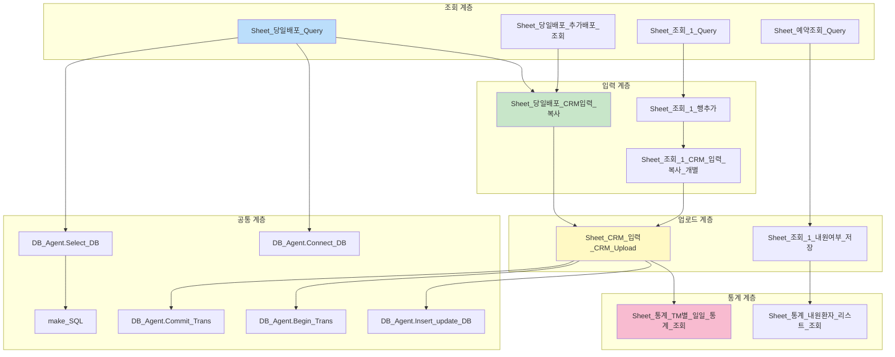
```mermaid
graph TB
    subgraph "조회 계층"
        T1[Sheet_당일배포_Query]
        T2[Sheet_당일배포_추가배포_조회]
        T3[Sheet_조회_1_Query]
        T4[Sheet_예약조회_Query]
    end

    subgraph "입력 계층"
        T5[Sheet_조회_1_행추가]
        T6[Sheet_당일배포_CRM입력_복사]
        T7[Sheet_조회_1_CRM_입력_복사_개별]
    end

    subgraph "업로드 계층"
        T8[Sheet_CRM_입력_CRM_Upload]
        T9[Sheet_조회_1_내원여부_저장]
    end

    subgraph "통계 계층"
        T10[Sheet_통계_TM별_일일_통계_조회]
        T11[Sheet_통계_내원환자_리스트_조회]
    end

    subgraph "공통 계층"
        T12[DB_Agent.Connect_DB]
        T13[DB_Agent.Select_DB]
        T14[DB_Agent.Insert_update_DB]
        T15[DB_Agent.Begin_Trans]
        T16[DB_Agent.Commit_Trans]
        T17[make_SQL]
    end

    T1 --> T6
    T2 --> T6
    T3 --> T5
    T5 --> T7
    T6 --> T8
    T7 --> T8
    T4 --> T9

    T8 --> T10
    T9 --> T11

    T1 --> T12
    T1 --> T13
    T8 --> T14
    T8 --> T15
    T8 --> T16
    T13 --> T17

    style T1 fill:#bbdefb
    style T6 fill:#c8e6c9
    style T8 fill:#fff9c4
    style T10 fill:#f8bbd0
```

**관련 함수 (TM_일반.vba) — permalink**
| 함수                              | 링크                                                                                                                       |
| --------------------------------- | -------------------------------------------------------------------------------------------------------------------------- |
| `Sheet_당일배포_Query`            | [L2156](https://github.com/KnockKnock-Dev/VBA/blob/main/src_extracted/Knock_CRM_TM_v.0.40_TM_%EC%9D%BC%EB%B0%98.vba#L2156) |
| `Sheet_당일배포_추가배포_조회`    | [L1968](https://github.com/KnockKnock-Dev/VBA/blob/main/src_extracted/Knock_CRM_TM_v.0.40_TM_%EC%9D%BC%EB%B0%98.vba#L1968) |
| `Sheet_조회_1_Query`              | [L846](https://github.com/KnockKnock-Dev/VBA/blob/main/src_extracted/Knock_CRM_TM_v.0.40_TM_%EC%9D%BC%EB%B0%98.vba#L846)   |
| `Sheet_조회_1_행추가`             | [L986](https://github.com/KnockKnock-Dev/VBA/blob/main/src_extracted/Knock_CRM_TM_v.0.40_TM_%EC%9D%BC%EB%B0%98.vba#L986)   |
| `Sheet_당일배포_CRM입력_복사`     | [L2320](https://github.com/KnockKnock-Dev/VBA/blob/main/src_extracted/Knock_CRM_TM_v.0.40_TM_%EC%9D%BC%EB%B0%98.vba#L2320) |
| `Sheet_조회_1_CRM_입력_복사_개별` | [L1038](https://github.com/KnockKnock-Dev/VBA/blob/main/src_extracted/Knock_CRM_TM_v.0.40_TM_%EC%9D%BC%EB%B0%98.vba#L1038) |
| `Sheet_CRM_입력_CRM_Upload`       | [L420](https://github.com/KnockKnock-Dev/VBA/blob/main/src_extracted/Knock_CRM_TM_v.0.40_TM_%EC%9D%BC%EB%B0%98.vba#L420)   |
| `Sheet_조회_1_내원여부_저장`      | [L1167](https://github.com/KnockKnock-Dev/VBA/blob/main/src_extracted/Knock_CRM_TM_v.0.40_TM_%EC%9D%BC%EB%B0%98.vba#L1167) |
| `Sheet_통계_TM별_일일_통계_조회`  | [L2524](https://github.com/KnockKnock-Dev/VBA/blob/main/src_extracted/Knock_CRM_TM_v.0.40_TM_%EC%9D%BC%EB%B0%98.vba#L2524) |
| `Sheet_통계_내원환자_리스트_조회` | [L2692](https://github.com/KnockKnock-Dev/VBA/blob/main/src_extracted/Knock_CRM_TM_v.0.40_TM_%EC%9D%BC%EB%B0%98.vba#L2692) |
| `Connect_DB`                      | [L1299](https://github.com/KnockKnock-Dev/VBA/blob/main/src_extracted/Knock_CRM_TM_v.0.40_TM_%EC%9D%BC%EB%B0%98.vba#L1299) |
| `Select_DB`                       | [L1328](https://github.com/KnockKnock-Dev/VBA/blob/main/src_extracted/Knock_CRM_TM_v.0.40_TM_%EC%9D%BC%EB%B0%98.vba#L1328) |
| `Insert_update_DB`                | [L1359](https://github.com/KnockKnock-Dev/VBA/blob/main/src_extracted/Knock_CRM_TM_v.0.40_TM_%EC%9D%BC%EB%B0%98.vba#L1359) |
| `make_SQL`                        | [L1434](https://github.com/KnockKnock-Dev/VBA/blob/main/src_extracted/Knock_CRM_TM_v.0.40_TM_%EC%9D%BC%EB%B0%98.vba#L1434) |

---

## 시스템 통합 시나리오

### 시나리오 1: 신규 DB 입력부터 내원까지 전체 흐름

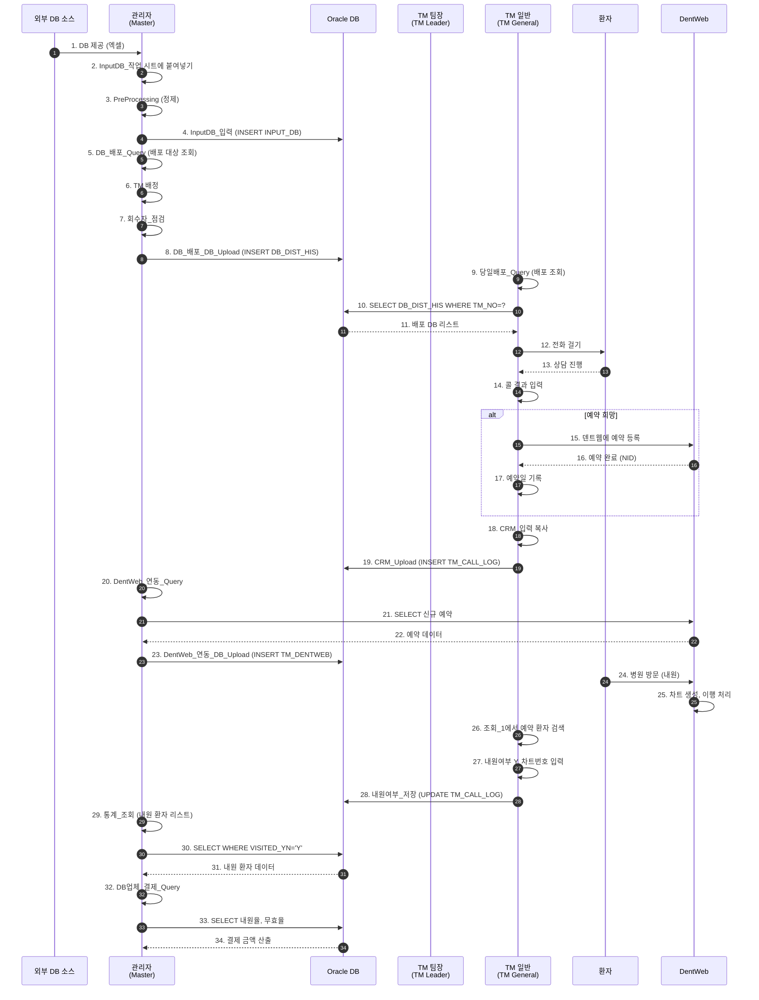
```mermaid
sequenceDiagram
    autonumber
    participant 외부 as 외부 DB 소스
    participant 관리자 as 관리자<br/>(Master)
    participant DB as Oracle DB
    participant 팀장 as TM 팀장<br/>(TM Leader)
    participant TM as TM 일반<br/>(TM General)
    participant 환자 as 환자
    participant DW as DentWeb

    외부->>관리자: 1. DB 제공 (엑셀)
    관리자->>관리자: 2. InputDB_작업 시트에 붙여넣기
    관리자->>관리자: 3. PreProcessing (정제)
    관리자->>DB: 4. InputDB_입력 (INSERT INPUT_DB)

    관리자->>관리자: 5. DB_배포_Query (배포 대상 조회)
    관리자->>관리자: 6. TM 배정
    관리자->>관리자: 7. 회수자_점검
    관리자->>DB: 8. DB_배포_DB_Upload (INSERT DB_DIST_HIS)

    TM->>TM: 9. 당일배포_Query (배포 조회)
    TM->>DB: 10. SELECT DB_DIST_HIS WHERE TM_NO=?
    DB-->>TM: 11. 배포 DB 리스트

    TM->>환자: 12. 전화 걸기
    환자-->>TM: 13. 상담 진행
    TM->>TM: 14. 콜 결과 입력

    alt 예약 희망
        TM->>DW: 15. 덴트웹에 예약 등록
        DW-->>TM: 16. 예약 완료 (NID)
        TM->>TM: 17. 예약일 기록
    end

    TM->>TM: 18. CRM_입력 복사
    TM->>DB: 19. CRM_Upload (INSERT TM_CALL_LOG)

    관리자->>관리자: 20. DentWeb_연동_Query
    관리자->>DW: 21. SELECT 신규 예약
    DW-->>관리자: 22. 예약 데이터
    관리자->>DB: 23. DentWeb_연동_DB_Upload (INSERT TM_DENTWEB)

    환자->>DW: 24. 병원 방문 (내원)
    DW->>DW: 25. 차트 생성, 이행 처리

    TM->>TM: 26. 조회_1에서 예약 환자 검색
    TM->>TM: 27. 내원여부 Y, 차트번호 입력
    TM->>DB: 28. 내원여부_저장 (UPDATE TM_CALL_LOG)

    관리자->>관리자: 29. 통계_조회 (내원 환자 리스트)
    관리자->>DB: 30. SELECT WHERE VISITED_YN='Y'
    DB-->>관리자: 31. 내원 환자 데이터

    관리자->>관리자: 32. DB업체_결제_Query
    관리자->>DB: 33. SELECT 내원율, 무효율
    DB-->>관리자: 34. 결제 금액 산출
```

**관련 함수**
| 단계               | 함수                                                                                                                                                                                                                                                                                       | 파일    | 링크        |
| ------------------ | ------------------------------------------------------------------------------------------------------------------------------------------------------------------------------------------------------------------------------------------------------------------------------------------ | ------- | ----------- |
| 3~4 InputDB 입력   | [`Sheet_InputDB_작업_PreProcessing`](https://github.com/KnockKnock-Dev/VBA/blob/main/src_extracted/Knock_CRM_mng_v.1.69_2_KLS_v2_master.vba#L4780)                                                                                                                                         | master  | L4780       |
| 4 DB 저장          | [`Sheet_InputDB_입력_DB_Upload`](https://github.com/KnockKnock-Dev/VBA/blob/main/src_extracted/Knock_CRM_mng_v.1.69_2_KLS_v2_master.vba#L4491)                                                                                                                                             | master  | L4491       |
| 5~8 DB 배포        | [`Sheet_DB_배포_Query`](https://github.com/KnockKnock-Dev/VBA/blob/main/src_extracted/Knock_CRM_mng_v.1.69_2_KLS_v2_master.vba#L3002) / [`Sheet_DB_배포_DB_Upload`](https://github.com/KnockKnock-Dev/VBA/blob/main/src_extracted/Knock_CRM_mng_v.1.69_2_KLS_v2_master.vba#L3413)          | master  | L3002/L3413 |
| 9~11 당일배포 조회 | [`Sheet_당일배포_Query`](https://github.com/KnockKnock-Dev/VBA/blob/main/src_extracted/Knock_CRM_TM_v.0.40_TM_%EC%9D%BC%EB%B0%98.vba#L2156)                                                                                                                                                | TM_일반 | L2156       |
| 18~19 CRM 업로드   | [`Sheet_CRM_입력_CRM_Upload`](https://github.com/KnockKnock-Dev/VBA/blob/main/src_extracted/Knock_CRM_TM_v.0.40_TM_%EC%9D%BC%EB%B0%98.vba#L420)                                                                                                                                            | TM_일반 | L420        |
| 20~23 DentWeb 연동 | [`Sheet_DentWeb_연동_Query`](https://github.com/KnockKnock-Dev/VBA/blob/main/src_extracted/Knock_CRM_mng_v.1.69_2_KLS_v2_master.vba#L888) / [`Sheet_DentWeb_연동_DB_Upload`](https://github.com/KnockKnock-Dev/VBA/blob/main/src_extracted/Knock_CRM_mng_v.1.69_2_KLS_v2_master.vba#L1036) | master  | L888/L1036  |
| 26~28 내원 저장    | [`Sheet_조회_1_내원여부_저장`](https://github.com/KnockKnock-Dev/VBA/blob/main/src_extracted/Knock_CRM_TM_v.0.40_TM_%EC%9D%BC%EB%B0%98.vba#L1167)                                                                                                                                          | TM_일반 | L1167       |
| 29~31 통계 조회    | [`Sheet_통계_조회`](https://github.com/KnockKnock-Dev/VBA/blob/main/src_extracted/Knock_CRM_mng_v.1.69_2_KLS_v2_master.vba#L8617)                                                                                                                                                          | master  | L8617       |
| 32~34 결제 조회    | [`Sheet_DB업체_결제_Query`](https://github.com/KnockKnock-Dev/VBA/blob/main/src_extracted/Knock_CRM_mng_v.1.69_2_KLS_v2_master.vba#L9816)                                                                                                                                                  | master  | L9816       |

### 시나리오 2: 마케팅 ROI 분석 전체 흐름

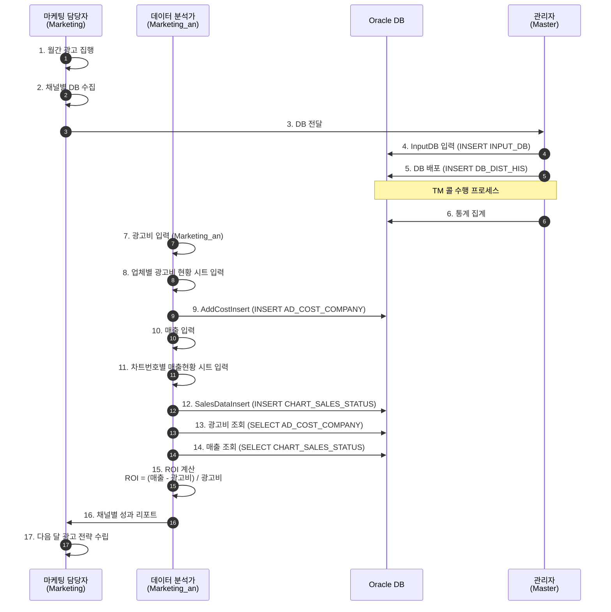
```mermaid
sequenceDiagram
    autonumber
    participant 마케팅 as 마케팅 담당자<br/>(Marketing)
    participant 분석가 as 데이터 분석가<br/>(Marketing_an)
    participant DB as Oracle DB
    participant 관리자 as 관리자<br/>(Master)

    마케팅->>마케팅: 1. 월간 광고 집행
    마케팅->>마케팅: 2. 채널별 DB 수집
    마케팅->>관리자: 3. DB 전달

    관리자->>DB: 4. InputDB 입력 (INSERT INPUT_DB)
    관리자->>DB: 5. DB 배포 (INSERT DB_DIST_HIS)

    Note over 관리자,DB: TM 콜 수행 프로세스

    관리자->>DB: 6. 통계 집계

    분석가->>분석가: 7. 광고비 입력 (Marketing_an)
    분석가->>분석가: 8. 업체별 광고비 현황 시트 입력
    분석가->>DB: 9. AddCostInsert (INSERT AD_COST_COMPANY)

    분석가->>분석가: 10. 매출 입력
    분석가->>분석가: 11. 차트번호별 매출현황 시트 입력
    분석가->>DB: 12. SalesDataInsert (INSERT CHART_SALES_STATUS)

    분석가->>DB: 13. 광고비 조회 (SELECT AD_COST_COMPANY)
    분석가->>DB: 14. 매출 조회 (SELECT CHART_SALES_STATUS)

    분석가->>분석가: 15. ROI 계산<br/>ROI = (매출 - 광고비) / 광고비

    분석가->>마케팅: 16. 채널별 성과 리포트
    마케팅->>마케팅: 17. 다음 달 광고 전략 수립
```

**관련 함수**
| 단계            | 함수                                                                                                                                                        | 파일         | 링크  |
| --------------- | ----------------------------------------------------------------------------------------------------------------------------------------------------------- | ------------ | ----- |
| 9 광고비 INSERT | [`AddCostInsert`](https://github.com/KnockKnock-Dev/VBA/blob/main/src_extracted/Knock_CRM_mng_v.1.60_Marketing_an.vba#L34)                                  | Marketing_an | L34   |
| 12 매출 INSERT  | [`SalesDataInsert`](https://github.com/KnockKnock-Dev/VBA/blob/main/src_extracted/Knock_CRM_mng_v.1.60_Marketing_an.vba#L76)                                | Marketing_an | L76   |
| 13 광고비 조회  | [`RunQueryAndLoadResult`](https://github.com/KnockKnock-Dev/VBA/blob/main/src_extracted/Knock_CRM_mng_v.1.60_Marketing_an.vba#L129)                         | Marketing_an | L129  |
| 14 매출 조회    | [`RunQuery_ChartSalesByChartNo`](https://github.com/KnockKnock-Dev/VBA/blob/main/src_extracted/Knock_CRM_mng_v.1.60_Marketing_an.vba#L274)                  | Marketing_an | L274  |
| 6 통계 집계     | [`Sheet_통계_TM별_DB업체별_Performance_조회`](https://github.com/KnockKnock-Dev/VBA/blob/main/src_extracted/Knock_CRM_mng_v.1.69_2_KLS_v2_master.vba#L9216) | master       | L9216 |

---

## 주요 데이터 트랜잭션 패턴

### 트랜잭션 1: DB 입력 (InputDB)

```sql
BEGIN TRANSACTION;

-- 1. 당일 재작업 시 기존 데이터 삭제
DELETE FROM INPUT_DB
WHERE REF_DATE = '20260318' AND REF_SEQ = 1;

-- 2. REF_SEQ 증가
SELECT MAX(REF_SEQ) + 1 FROM INPUT_DB WHERE REF_DATE = '20260318';

-- 3. 데이터 삽입
INSERT INTO INPUT_DB (
    REF_DATE, REF_SEQ, SEQ_NO, DB_SRC_1, DB_SRC_2,
    CLIENT_NAME, PHONE_NO, ...
) VALUES (
    '20260318', 2, 1, '홈페이지', '메인', '홍길동', '010-1234-5678', ...
);

-- 4. 중복 수 업데이트
UPDATE INPUT_DB SET DUPL_CNT_1 = DUPL_CNT_1 + 1
WHERE PHONE_NO = '010-1234-5678' AND REF_DATE <> '20260318';

COMMIT;
```

### 트랜잭션 2: DB 배포 (DB_DIST_HIS)

```sql
BEGIN TRANSACTION;

-- 1. 당일 수정 건 삭제
DELETE FROM DB_DIST_HIS
WHERE REF_DATE = '20260318'
  AND REF_SEQ = 3
  AND PHONE_NO IN ('010-1234-5678', ...);

DELETE FROM DB_WITHDRAW_HIS
WHERE REF_DATE = '20260318'
  AND PHONE_NO IN ('010-1234-5678', ...);

-- 2. 회수자 정보 삽입
INSERT INTO DB_WITHDRAW_HIS (
    REF_DATE, PHONE_NO, TM_NO, TM_NAME, CLIENT_NAME, DB_SRC_1, DB_SRC_2
) VALUES (
    '20260318', '010-1234-5678', '005', '김회수', '홍길동', '홈페이지', '메인'
);

-- 3. 결번 정보 삽입
INSERT INTO MNG_결번_관리 (PHONE_NO, CLIENT_NAME, MEMO)
VALUES ('010-9999-9999', '결번고객', '결번확인');

-- 4. 배포 정보 삽입
INSERT INTO DB_DIST_HIS (
    REF_DATE, REF_SEQ, PHONE_NO, ASSIGNED_TM_NO, ASSIGNED_TM_NAME,
    CLIENT_NAME, DB_SRC_1, DB_SRC_2, ASSIGNED_STATUS, IS_OLD_DB,
    INPUTDB_REF_DATE, INPUTDB_REF_SEQ, INPUTDB_SEQ_NO
) VALUES (
    '20260318', 3, '010-1234-5678', '001', '김TM',
    '홍길동', '홈페이지', '메인', '배포완료', 'N',
    '20260318', 2, 1
);

COMMIT;
```

### 트랜잭션 3: CRM 업로드 (TM_CALL_LOG)

```sql
BEGIN TRANSACTION;

-- 1. SEQ_NO 조회
SELECT MAX(SEQ_NO) FROM TM_CALL_LOG
WHERE REF_DATE = '20260318'
  AND TM_NO = '001'
  AND DB_SRC_2 = '메인'
  AND PHONE_NO = '010-1234-5678';

-- 2. 콜 로그 삽입
INSERT INTO TM_CALL_LOG (
    REF_DATE, TM_NO, DB_SRC_2, PHONE_NO, SEQ_NO,
    TM_NAME, CLIENT_NAME, EVENT_TYPE,
    CALL_RESULT, CALL_LOG, RESERV_DATE, RESERV_TIME,
    VISITED_YN, TM_MEMO, DB_DIST_DATE, IN_OUT_TYPE
) VALUES (
    '20260318', '001', '메인', '010-1234-5678', 1,
    '김TM', '홍길동', '일반상담',
    '예약완료', '상담 내용...', '20260320', '14:00',
    'N', 'TM 메모...', '20260318', 'O'
);

COMMIT;
```

### 트랜잭션 4: 내원 여부 업데이트

```sql
BEGIN TRANSACTION;

UPDATE TM_CALL_LOG SET
    VISITED_YN = 'Y',
    CHART_NO = '12345',
    ALT_USER_NO = '001',
    ALT_DATE = TO_CHAR(SYSDATE, 'YYYYMMDD'),
    ALT_TIME = TO_CHAR(SYSDATE, 'HH24:MI:SS')
WHERE REF_DATE = '20260318'
  AND TM_NO = '001'
  AND DB_SRC_2 = '메인'
  AND PHONE_NO = '010-1234-5678'
  AND SEQ_NO = 1;

COMMIT;
```

---

## 시스템 성능 및 확장성

### 현재 시스템 제약 사항

| 항목                  | 현재 값           | 제약 사항                    |
| --------------------- | ----------------- | ---------------------------- |
| **최대 동시 사용자**  | 1명 (Excel 파일)  | 파일 잠금으로 동시 작업 불가 |
| **최대 데이터 행**    | 50,000행 (조회_2) | Excel 성능 한계              |
| **DB 연결 풀**        | 없음              | 매번 새 연결 생성            |
| **트랜잭션 타임아웃** | 없음              | 장시간 작업 시 DB 락         |
| **에러 복구**         | 수동              | 자동 재시도 없음             |

### 향후 개선 방향

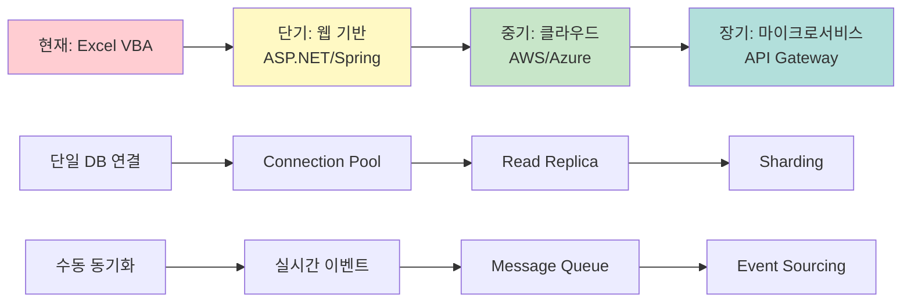
```mermaid
graph LR
    A[현재: Excel VBA] --> B[단기: 웹 기반<br/>ASP.NET/Spring]
    B --> C[중기: 클라우드<br/>AWS/Azure]
    C --> D[장기: 마이크로서비스<br/>API Gateway]

    A1[단일 DB 연결] --> B1[Connection Pool]
    B1 --> C1[Read Replica]
    C1 --> D1[Sharding]

    A2[수동 동기화] --> B2[실시간 이벤트]
    B2 --> C2[Message Queue]
    C2 --> D2[Event Sourcing]

    style A fill:#ffcdd2
    style B fill:#fff9c4
    style C fill:#c8e6c9
    style D fill:#b2dfdb
```

---

## 결론

### 시스템 통합 현황

Knock CRM은 **5개의 독립적인 VBA 파일**이 **단일 Oracle 데이터베이스**를 중심으로 통합된 **분산 시스템**입니다:

1. **마스터 시스템 (v.1.69)**: 전체 데이터 라이프사이클 관리
2. **TM 팀장 시스템 (v.1.62)**: DB 배포 및 TM 성과 관리
3. **마케팅 시스템 (v.1.60)**: 마케팅 DB 및 캠페인 관리
4. **마케팅 분석 (v.1.60_an)**: 광고비/매출 ROI 분석
5. **TM 일반 시스템 (v.0.40)**: 콜 수행 및 CRM 입력

### 핵심 데이터 흐름

```
외부 DB → InputDB → DB 배포 → TM 콜 → 예약 → 내원 → 통계 → ROI 분석
```

### 주요 통합 포인트

- **공통 DB**: knock_crm_real (Oracle)
- **공통 클래스**: DB_Agent (ADODB 연결)
- **공통 함수**: make_SQL (파라미터 바인딩)
- **공통 테이블**: INPUT_DB, DB_DIST_HIS, TM_CALL_LOG

### 시스템 성숙도

| 영역              | 성숙도 | 비고                    |
| ----------------- | ------ | ----------------------- |
| **기능 완성도**   | ★★★★☆  | 주요 업무 프로세스 완비 |
| **데이터 무결성** | ★★★★☆  | 트랜잭션 관리 양호      |
| **보안**          | ★★☆☆☆  | DB 비밀번호 노출        |
| **성능**          | ★★★☆☆  | Excel 제약으로 제한적   |
| **확장성**        | ★★☆☆☆  | 단일 사용자 제한        |
| **유지보수성**    | ★★★☆☆  | 하드코딩 많음           |

---

**문서 작성일**: 2026-03-18
**분석 대상**: Knock CRM 전체 시스템 (5개 파일)
**총 VBA 라인 수**: 35,085+ lines
**총 함수 수**: 303+ 개
**데이터베이스**: Oracle (knock_crm_real), SQL Server (DentWeb)
